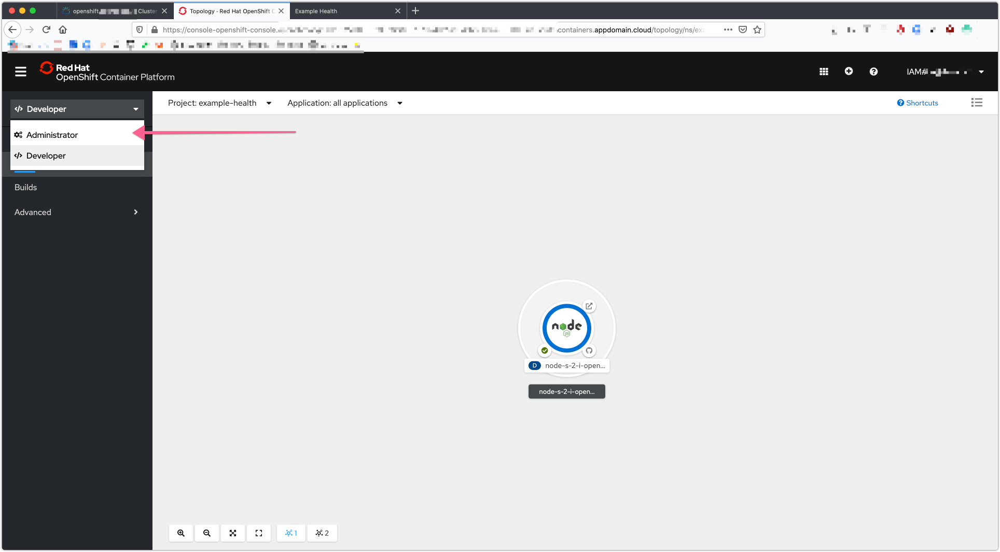
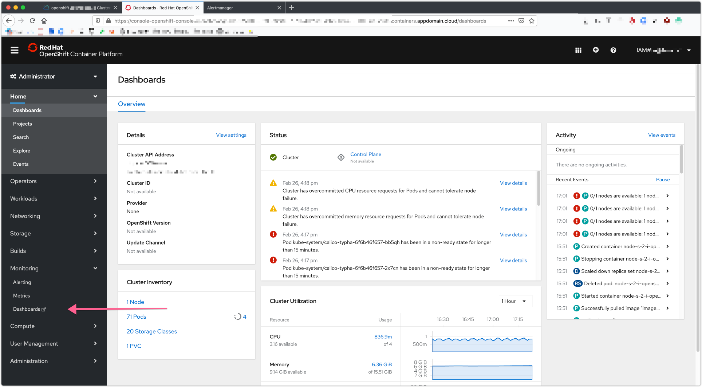
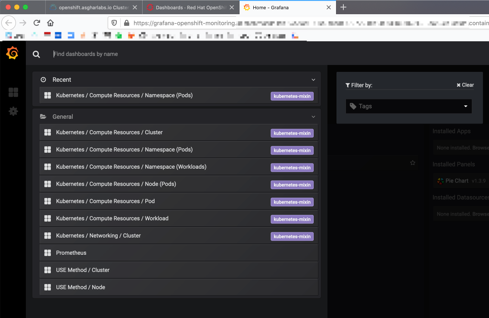
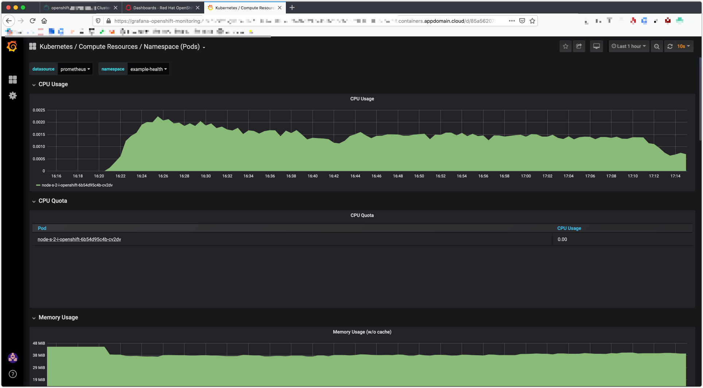
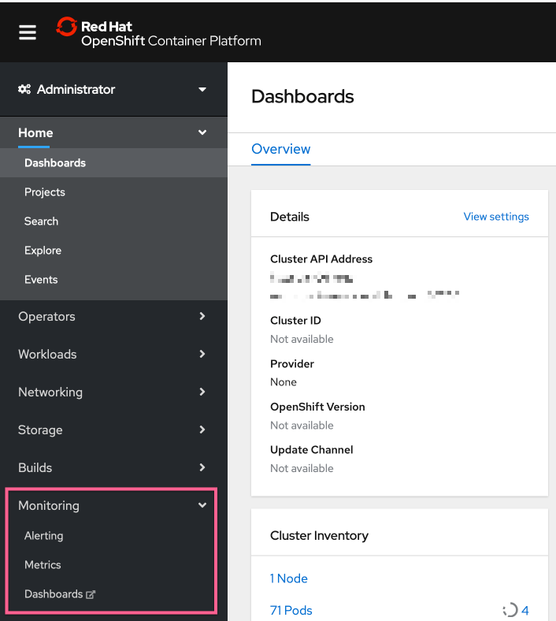
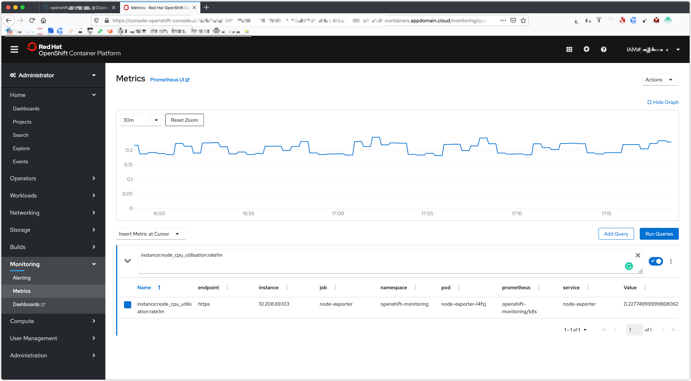
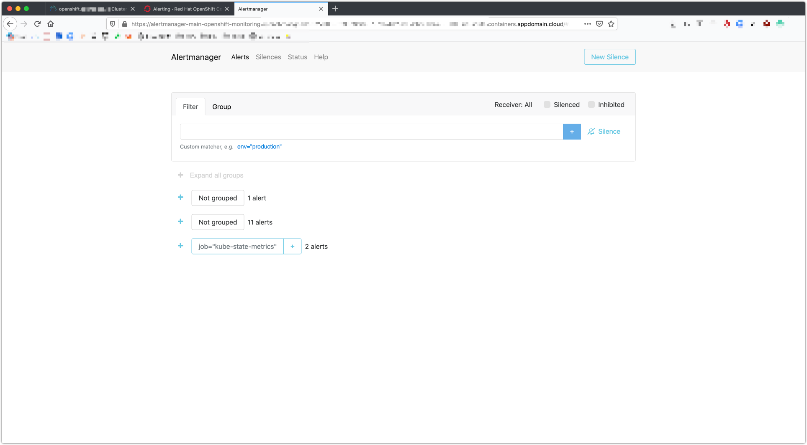

# Exercise 3: Metrics and dashboards

In this exercise, we'll explore the third-party monitoring and metrics dashboards that are installed for free with OpenShift!

## Grafana

Red Hat OpenShift on IBM Cloud comes with [Grafana](https://grafana.com/) preinstalled. Get started by switching to the Administrator view:

Then Navigate to `Monitoring > Dashboards` in the left-hand bar. Then click on `Grafana UI` next to the title. You'll be asked to login with OpenShift and then click through some permissions.

This will open up another proxy page, click `Log in with OpenShift`.

Next, it will ask you for `Authorize Access`, take the default which is both checkboxes, and click `Allow selected permissions`.

You should then see your Grafana dashboard. Hit `Home` on the top left, and choose `Kubernetes / Compute Resources / Namespace (Pods)`.

Under `namespace`, choose the name of the project you created in [Step 1](../exercise-02/README.md#deploy-example-health) - the same one that your application is running inside.

You should be able to see the CPU and Memory usage for your application. In production environments, this is helpful for identifying the average amount of CPU or Memory your application uses, especially as it can fluctuate through the day. We'll use this information in the next exercise to set up auto-scaling for our pods.

## Prometheus and Alert Manager

Navigating back to the cluster console, you can also launch Alerting and Metrics UIs

* **[Prometheus](https://prometheus.io/)** - a monitoring system with an efficient time series database
* **[Alertmanager](https://prometheus.io/docs/alerting/alertmanager/)** - an extension of Prometheus focused on managing alerts

## Prometheus

## Alertmanager

