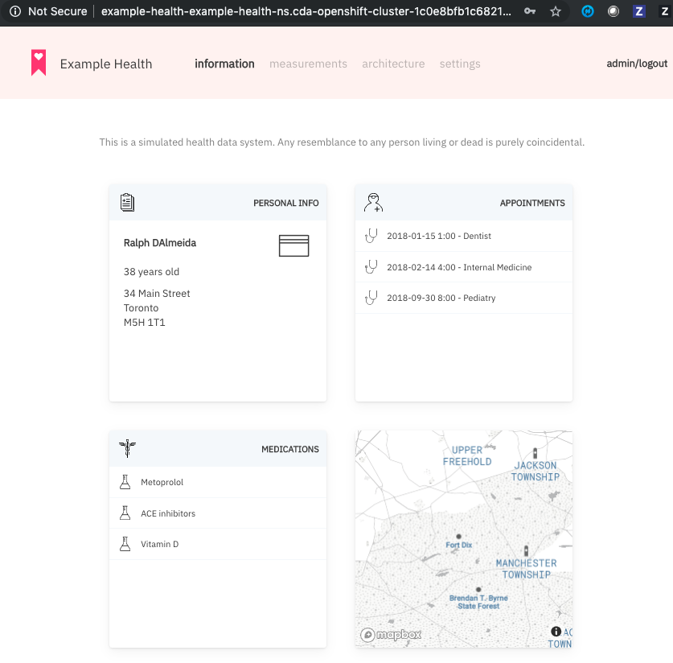

# Exercise 6: Deploy a Node application with Build Config (CLI version)

In this exercise we'll revisit the application from exercise 1, except we'll use equivalent CLI commands to deploy our "Example Health" application.

From the IBM Cloud console launch the IBM Cloud Shell. Refer to our [Getting Starting](../pre-work/CLOUD_SHELL.md) material to learn how to access the IBM Cloud Shell.

## Deploy Example Health (CLI version)

First, clone the *Example Health* source code and change to that directory.

```bash
git clone https://github.com/IBM/node-build-config-openshift
cd node-build-config-openshift
```

Take note of the new `Dockerfile` in the application's root directory. We've pre-written it for you. But we've copied it here too, go through each line and read the corresponding comment.

```Dockerfile
# Use the official Node 10 image
FROM node:10

# Change directory to /usr/src/app
WORKDIR /usr/src/app

# Copy the application source code
COPY . .

# Change directory to site/
WORKDIR site/

# Install dependencies
RUN npm install

# Allow traffic on port 8080
EXPOSE 8080

# Start the application
CMD [ "npm", "start" ]
```

From the OpenShift console click the user name in the top right corner and select *Copy Login Command*.

The login command will be copied to the clipboard, in the IBM Cloud Shell, paste that command. For example:

```bash
oc login https://c100-e.us-south.containers.cloud.ibm.com:30403 --token=jWX7a04tRgpdhW_iofWuHqb_Ygp8fFsUkRjOK7_QyFQ
```

Create a new OpenShift project to deploy our application, call it `example-health-ns`.

```bash
oc new-project example-health-ns
```

Build your application's image by running the `oc new-build` command from your source code root directory. This will create a Build and an ImageStream of the app.

```bash
oc new-build --strategy docker --binary --docker-image node:10 --name example-health
```

The output should look like below:

```bash
oc new-build --strategy docker --binary --docker-image node:10 --name example-health
--> Found Docker image aa64327 (3 weeks old) from Docker Hub for "node:10"

    * An image stream tag will be created as "node:10" that will track the source image
    * A Docker build using binary input will be created
      * The resulting image will be pushed to image stream tag "example-health:latest"
      * A binary build was created, use 'start-build --from-dir' to trigger a new build

--> Creating resources with label build=example-health ...
    imagestream.image.openshift.io "node" created
    imagestream.image.openshift.io "example-health" created
    buildconfig.build.openshift.io "example-health" created
--> Success
```

Start a new build using the `oc start-build` command.

```bash
oc start-build example-health --from-dir . --follow
```

The output should look like below:

```bash
oc start-build example-health --from-dir . --follow
Uploading directory "." as binary input for the build ...
.
Uploading finished
build.build.openshift.io/example-health-1 started
Receiving source from STDIN as archive ...
Replaced Dockerfile FROM image node:10
...
Successfully built 11bff161eb8e

Pushing image docker-registry.default.svc:5000/example-health-ns/example-health:latest ...
Pushed 0/12 layers, 17% complete
Pushed 1/12 layers, 42% complete
...
Pushed 11/12 layers, 100% complete
Pushed 12/12 layers, 100% complete
```

Finally, deploy the application by running `oc new-app`.

```bash
oc new-app -i example-health
```

The output should look like below:

```bash
$ oc new-app -i example-health
--> Found image 11bff16 (8 minutes old) in image stream "example-health-ns/example-health" under tag "latest" for "example-health"

    * This image will be deployed in deployment config "example-health"
    * Port 8080/tcp will be load balanced by service "example-health"
      * Other containers can access this service through the hostname "example-health"
    * WARNING: Image "example-health-ns/example-health:latest" runs as the 'root' user which may not be permitted by your cluster administrator

--> Creating resources ...
    deploymentconfig.apps.openshift.io "example-health" created
    service "example-health" created
--> Success
    Application is not exposed. You can expose services to the outside world by executing one or more of the commands below:
     'oc expose svc/example-health'
    Run 'oc status' to view your app.
```

Expose the service using `oc expose`, a route will be created.

```bash
oc expose svc/example-health
```

Find the application's route by running `oc get routes`.

```bash
oc get routes
```

The output should look like below:

```bash
$ oc get routes

NAME             HOST/PORT                                                                                                                        PATH      SERVICES         PORT       TERMINATION   WILDCARD
example-health   example-health-example-health-ns.aida-dev-apps-10-30-f2c6cdc6801be85fd188b09d006f13e3-0001.us-south.containers.appdomain.cloud             example-health   8080-tcp                 None
```

Copy the URL into a browser and log into the site with `admin`:`test`.



**Congratulations** on completing this exercise!
