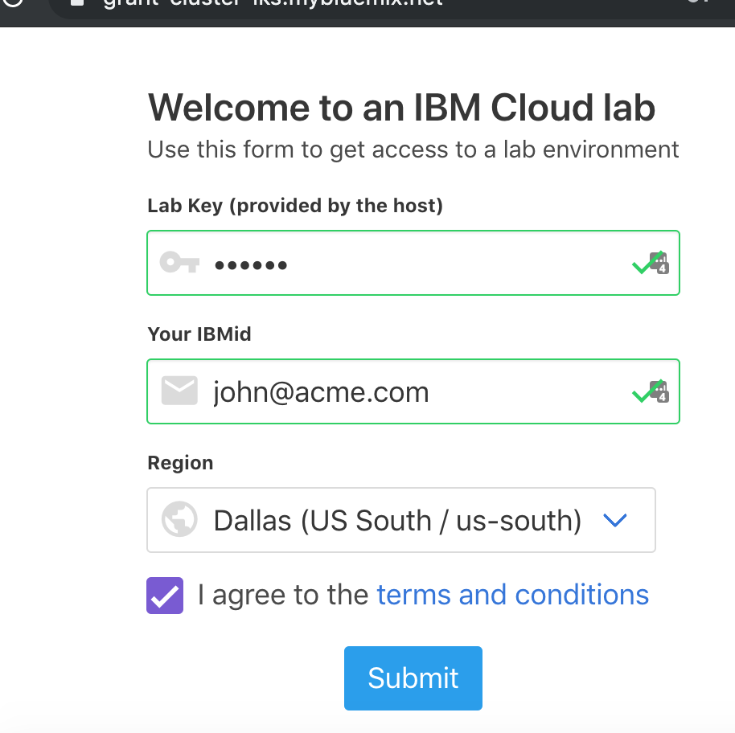
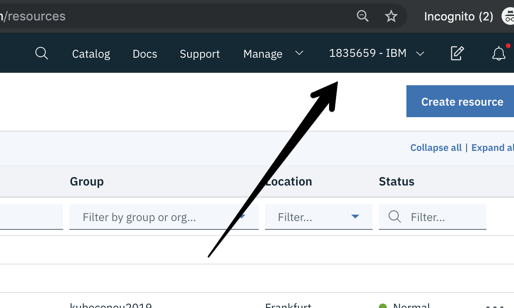
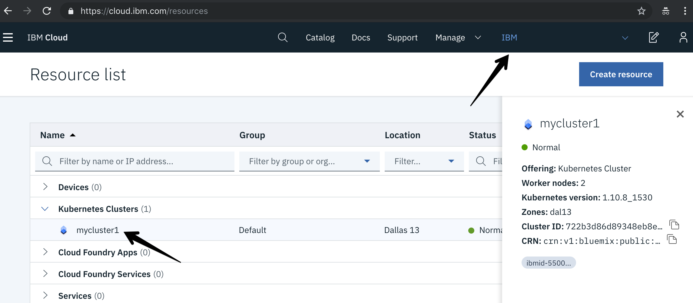

# Get Started
In this section, you will login to your own IBM Cloud account, and then get access to a IBM Cloud Lab account which contains pre-provisioned clusters. Each lab attendee will be granted access to one cluster.

1. You should already have a federated IBM Cloud account using your company email address, confirm by logging in to https://cloud.ibm.com

1. If you do not have an account, you could create your own [IBM Cloud account](https://ibm.biz/Bdzybn).

1. Go to [Grant Cluster](http://grant-cluster-iks.mybluemix.net) web page and enter your IBM ID (the email you used to sign up), the lab key from the instructor, and select the `Frankfurt (EU-Central / eu-de)` region.

    

1. You will be added to the IBM Lab account and granted access to a cluster. Note the name of your cluster. It will be something like: `myclusterXXX`.

1. Refresh your [IBM Cloud Dashboard](https://cloud.ibm.com)

1. Switch to the **183569-IBM** account by clicking on the account selection drop down in the top nav bar.

   

1. Click on **Kubernetes Clusters** in the Resource Summary tile.

    

1.  Under **Kubernetes Clusters**, click on the cluster that has been assigned to you.

1. Launch the **Kubernetes Dashboard** and have a look around! You can come back to this dashboard throughout your lab.

### [Continue to Exercise 1](/workshop/exercise-1/README.md)
