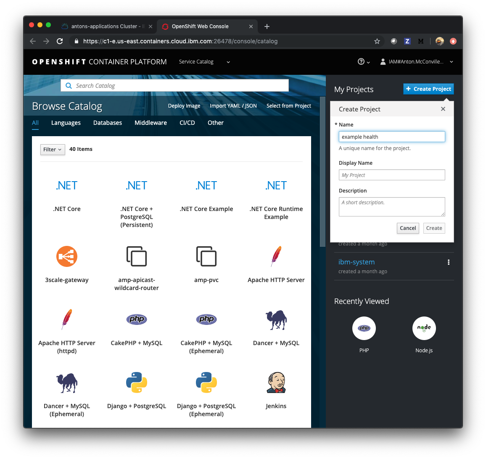

<!-- TODO: Remove the `Git Webhooks` part of use GHE -->

# Exercise 1: Deploying an application

In this exercise, you'll deploy a simple Node.js Express application - "Example Health". Example Health is a simple UI for a patient health records system. We'll use this example to demonstrate key OpenShift features throughout this workshop. You can find the sample application GitHub repository here: [https://github.com/IBM/node-s2i-openshift](https://github.com/IBM/node-s2i-openshift)

## Deploy Example Health

Access your cluster on the [IBM Cloud clusters dashboard](https://cloud.ibm.com/kubernetes/clusters). Click the `OpenShift web console` button on the top-right. (This is a pop-up so you'll need to white list this site.)

Create a project, you can title it whatever you like, we suggest "example-health."



Click on your new project. You should see a view that looks like this:


to update...

```
stevemar@cloudshell:~$ git clone https://github.com/stevemar/node-s2i-openshift
Cloning into 'node-s2i-openshift'...
remote: Enumerating objects: 3, done.
remote: Counting objects: 100% (3/3), done.
remote: Compressing objects: 100% (3/3), done.
remote: Total 522 (delta 0), reused 0 (delta 0), pack-reused 519
Receiving objects: 100% (522/522), 7.25 MiB | 12.18 MiB/s, done.
Resolving deltas: 100% (304/304), done.
Checking connectivity... done.
stevemar@cloudshell:~$ ls
node-s2i-openshift
stevemar@cloudshell:~$ cd node-s2i-openshift/
stevemar@cloudshell:~/node-s2i-openshift$ ls
Jenkinsfile  LICENSE  README.md  design  images  package-lock.json  site
stevemar@cloudshell:~/node-s2i-openshift$ nano site/
app.js         backendApi.js  manifest.yml   package.json   public/        
stevemar@cloudshell:~/node-s2i-openshift$ nano site/public/
.DS_Store          admin.html         index.html         labs.html          measurements.html  src/               
about.html         images/            jee.html           login.html         settings.html      style/             
stevemar@cloudshell:~/node-s2i-openshift$ nano site/public/about.html 
stevemar@cloudshell:~/node-s2i-openshift$ vi site/public/about.html 
stevemar@cloudshell:~/node-s2i-openshift$ vi Dockerfile
stevemar@cloudshell:~/node-s2i-openshift$ cat Dockerfile 
FROM node:10

# Create app directory
WORKDIR /usr/src/app

# Install app dependencies
# A wildcard is used to ensure both package.json AND package-lock.json are copied
# where available (npm@5+)
COPY . .
WORKDIR /site/

RUN npm install
# If you are building your code for production
# RUN npm ci --only=production

EXPOSE 8080
CMD [ "node", "server.js" ]

stevemar@cloudshell:~/node-s2i-openshift$ ls
Dockerfile  Jenkinsfile  LICENSE  README.md  design  images  package-lock.json  site
stevemar@cloudshell:~/node-s2i-openshift$ git pull
remote: Enumerating objects: 6, done.
remote: Counting objects: 100% (6/6), done.
remote: Compressing objects: 100% (4/4), done.
remote: Total 6 (delta 2), reused 5 (delta 2), pack-reused 0
Unpacking objects: 100% (6/6), done.
From https://github.com/stevemar/node-s2i-openshift
   9309b1e..3f47d90  master     -> origin/master
Updating 9309b1e..3f47d90
error: The following untracked working tree files would be overwritten by merge:
        Dockerfile
Please move or remove them before you can merge.
Aborting
stevemar@cloudshell:~/node-s2i-openshift$ git status
On branch master
Your branch is behind 'origin/master' by 2 commits, and can be fast-forwarded.
  (use "git pull" to update your local branch)
Changes not staged for commit:
  (use "git add <file>..." to update what will be committed)
  (use "git checkout -- <file>..." to discard changes in working directory)

        modified:   site/public/about.html

Untracked files:
  (use "git add <file>..." to include in what will be committed)

        Dockerfile

no changes added to commit (use "git add" and/or "git commit -a")
stevemar@cloudshell:~/node-s2i-openshift$ rm Dockerfile 
stevemar@cloudshell:~/node-s2i-openshift$ git pull
Updating 9309b1e..3f47d90
Fast-forward
 Dockerfile        | 17 +++++++++++++++++
 package-lock.json |  3 ---
 2 files changed, 17 insertions(+), 3 deletions(-)
 create mode 100644 Dockerfile
 delete mode 100644 package-lock.json
stevemar@cloudshell:~/node-s2i-openshift$ ls
Dockerfile  Jenkinsfile  LICENSE  README.md  design  images  site
stevemar@cloudshell:~/node-s2i-openshift$ oc new-build --strategy docker --binary --docker-image node:10 --name myapp 
error: Missing or incomplete configuration info.  Please login or point to an existing, complete config file:

  1. Via the command-line flag --config
  2. Via the KUBECONFIG environment variable
  3. In your home directory as ~/.kube/config

To view or setup config directly use the 'config' command.

oc login

Logged into "https://c100-e.us-south.containers.cloud.ibm.com:31562" as "IAM#stevemar@ca.ibm.com" using the token provided.

You have access to the following projects and can switch between them with 'oc project <projectname>':

  * default
    ibm-cert-store
    ibm-system
    ibp-demo
    ibp-demo2
    kube-proxy-and-dns
    kube-public
    kube-service-catalog
    kube-system
    openshift
    openshift-ansible-service-broker
    openshift-console
    openshift-infra
    openshift-monitoring
    openshift-node
    openshift-template-service-broker
    openshift-web-console
    ravitest
    richh-sandbox
    stevetest

Using project "default".
Welcome! See 'oc help' to get started.
stevemar@cloudshell:~/node-s2i-openshift$ oc new-build --strategy docker --binary --docker-image node:10 --name myapp
--> Found Docker image aa64327 (2 weeks old) from Docker Hub for "node:10"

    * An image stream tag will be created as "node:10" that will track the source image
    * A Docker build using binary input will be created
      * The resulting image will be pushed to image stream tag "myapp:latest"
      * A binary build was created, use 'start-build --from-dir' to trigger a new build

--> Creating resources with label build=myapp ...
    imagestream.image.openshift.io "node" created
    imagestream.image.openshift.io "myapp" created
    buildconfig.build.openshift.io "myapp" created
--> Success
stevemar@cloudshell:~/node-s2i-openshift$ oc start-build myapp --from-dir . --follow
Uploading directory "." as binary input for the build ...
.
Uploading finished
build.build.openshift.io/myapp-1 started
Receiving source from STDIN as archive ...
Replaced Dockerfile FROM image node:10

Pulling image node@sha256:a9d108f82e34c84e6e2a9901fda2048b9f5a40f614c3ea1348cbf276a7c2031c ...
Pulled 0/9 layers, 3% complete
Pulled 1/9 layers, 17% complete
Pulled 2/9 layers, 33% complete
Pulled 3/9 layers, 38% complete
Pulled 4/9 layers, 49% complete
Pulled 5/9 layers, 68% complete
Pulled 6/9 layers, 77% complete
Pulled 7/9 layers, 91% complete
Pulled 8/9 layers, 100% complete
Pulled 9/9 layers, 100% complete
Extracting
Step 1/9 : FROM node@sha256:a9d108f82e34c84e6e2a9901fda2048b9f5a40f614c3ea1348cbf276a7c2031c
 ---> aa6432763c11
Step 2/9 : WORKDIR /usr/src/app
 ---> d4441dc62a24
Removing intermediate container d78b77dd9e9c
Step 3/9 : COPY . .
 ---> 6bcc7ba30ff0
Removing intermediate container abfb8de04f21
Step 4/9 : WORKDIR site/
 ---> d1cb911b9f3f
Removing intermediate container 9fd3b5604640
Step 5/9 : RUN npm install
 ---> Running in b42ebaf41118

npm WARN deprecated request@2.88.2: request has been deprecated, see https://github.com/request/request/issues/3142
npm WARN deprecated circular-json@0.5.9: CircularJSON is in maintenance only, flatted is its successor.
npm notice created a lockfile as package-lock.json. You should commit this file.
added 116 packages from 101 contributors in 13.435s
 ---> 397c02a37b7d
Removing intermediate container b42ebaf41118
Step 6/9 : EXPOSE 8080
 ---> Running in b75f23bc041b
 ---> 1155ade67b1b
Removing intermediate container b75f23bc041b
Step 7/9 : CMD npm start
 ---> Running in 59a731144511
 ---> c28a869599aa
Removing intermediate container 59a731144511
Step 8/9 : ENV "OPENSHIFT_BUILD_NAME" "myapp-1" "OPENSHIFT_BUILD_NAMESPACE" "default"
 ---> Running in 49947896a322
 ---> 53d950aecfa9
Removing intermediate container 49947896a322
Step 9/9 : LABEL "io.openshift.build.name" "myapp-1" "io.openshift.build.namespace" "default"
 ---> Running in b6dc3338a30d
 ---> 66ed10e52dd9
Removing intermediate container b6dc3338a30d
Successfully built 66ed10e52dd9

Pushing image docker-registry.default.svc:5000/default/myapp:latest ...
Pushed 0/12 layers, 2% complete
Pushed 1/12 layers, 42% complete
Pushed 2/12 layers, 42% complete
Pushed 3/12 layers, 42% complete
Pushed 4/12 layers, 36% complete
Pushed 5/12 layers, 55% complete
Pushed 5/12 layers, 72% complete
Pushed 6/12 layers, 83% complete
Pushed 7/12 layers, 92% complete
Pushed 8/12 layers, 92% complete
Pushed 9/12 layers, 97% complete
Pushed 10/12 layers, 88% complete
Pushed 11/12 layers, 94% complete
Pushed 12/12 layers, 100% complete
Push successful
stevemar@cloudshell:~/node-s2i-openshift$ oc deploy
Error: unknown command "deploy" for "oc"
Run 'oc --help' for usage.
stevemar@cloudshell:~/node-s2i-openshift$ oc new-app 
error: You must specify one or more images, image streams, templates, or source code locations to create an application.

To list all local templates and image streams, use:

  oc new-app -L

To search templates, image streams, and Docker images that match the arguments provided, use:

  oc new-app -S php
  oc new-app -S --template=ruby
  oc new-app -S --image-stream=mysql
  oc new-app -S --docker-image=python

See 'oc new-app -h' for help and examples
stevemar@cloudshell:~/node-s2i-openshift$ oc new-app -S --image-stream=myapp  
Image streams (oc new-app --image-stream=<image-stream> [--code=<source>])
-----
myapp
  Project: default
  Tags:    latest

stevemar@cloudshell:~/node-s2i-openshift$ oc new-app -S --docker-image=docker-registry.default.svc:5000/default/myapp
W0312 19:35:26.417678    1565 dockerimagelookup.go:233] Docker registry lookup failed: Get https://docker-registry.default.svc:5000/v2/: dial tcp: lookup docker-registry.default.svc on 172.19.0.10:53: no such host
error: no matches found
stevemar@cloudshell:~/node-s2i-openshift$ 
stevemar@cloudshell:~/node-s2i-openshift$ ^C new-app -S --docker-image=docker-registry.default.svc:5000/default/myapp
stevemar@cloudshell:~/node-s2i-openshift$ oc new-app help
error:  local file access failed with: stat help: no such file or directory
error: unable to locate any images in image streams, templates loaded in accessible projects, template files, local docker images with name "help"

Argument 'help' was classified as an image, image~source, or loaded template reference.

<!doctype html>
The 'oc new-app' command will match arguments to the following types:

  1. Images tagged into image streams in the current project or the 'openshift' project
     - if you don't specify a tag, we'll add ':latest'
  2. Images in the Docker Hub, on remote registries, or on the local Docker engine
  3. Templates in the current project or the 'openshift' project
  4. Git repository URLs or local paths that point to Git repositories

--allow-missing-images can be used to point to an image that does not exist yet.

See 'oc new-app -h' for examples.
stevemar@cloudshell:~/node-s2i-openshift$ oc new-app --docker-image=docker-registry.default.svc:5000/default/myapp                                                                                                              
W0312 19:35:59.292774    1611 dockerimagelookup.go:233] Docker registry lookup failed: Get https://docker-registry.default.svc:5000/v2/: dial tcp: lookup docker-registry.default.svc on 172.19.0.10:53: no such host
error: unable to locate any local docker images with name "docker-registry.default.svc:5000/default/myapp"

The 'oc new-app' command will match arguments to the following types:

  1. Images tagged into image streams in the current project or the 'openshift' project
     - if you don't specify a tag, we'll add ':latest'
  2. Images in the Docker Hub, on remote registries, or on the local Docker engine
  3. Templates in the current project or the 'openshift' project
  4. Git repository URLs or local paths that point to Git repositories

--allow-missing-images can be used to point to an image that does not exist yet.

See 'oc new-app -h' for examples.
stevemar@cloudshell:~/node-s2i-openshift$ oc new-app myapp                                                                                                                                                                      
--> Found image 66ed10e (9 minutes old) in image stream "default/myapp" under tag "latest" for "myapp"

    * This image will be deployed in deployment config "myapp"
    * Port 8080/tcp will be load balanced by service "myapp"
      * Other containers can access this service through the hostname "myapp"
    * WARNING: Image "default/myapp:latest" runs as the 'root' user which may not be permitted by your cluster administrator

--> Creating resources ...
    deploymentconfig.apps.openshift.io "myapp" created
    service "myapp" created
--> Success
    Application is not exposed. You can expose services to the outside world by executing one or more of the commands below:
     'oc expose svc/myapp' 
    Run 'oc status' to view your app.
stevemar@cloudshell:~/node-s2i-openshift$ oc expose svc/myapp
route.route.openshift.io/myapp exposed
stevemar@cloudshell:~/node-s2i-openshift$ oc get routes 
NAME               HOST/PORT                                                                                                                PATH       SERVICES           PORT               TERMINATION   WILDCARD
docker-registry    docker-registry-default.aida-dev-apps-10-30-f2c6cdc6801be85fd188b09d006f13e3-0001.us-south.containers.appdomain.cloud               docker-registry    5000-tcp           reencrypt     None
example            example-default.aida-dev-apps-10-30-f2c6cdc6801be85fd188b09d006f13e3-0001.us-south.containers.appdomain.cloud                       example            5678-tcp                         None
myapp              myapp-default.aida-dev-apps-10-30-f2c6cdc6801be85fd188b09d006f13e3-0001.us-south.containers.appdomain.cloud                         myapp              8080-tcp                         None
registry-console   registry-console-default.aida-dev-apps-10-30-f2c6cdc6801be85fd188b09d006f13e3-0001.us-south.containers.appdomain.cloud              registry-console   registry-console   passthrough   None
router             router-default.aida-dev-apps-10-30-f2c6cdc6801be85fd188b09d006f13e3-0001.us-south.containers.appdomain.cloud             /healthz   routerhealth       1936                             None
stevemar@cloudshell:~/node-s2i-openshift$ 
stevemar@cloudshell:~/node-s2i-openshift$ 
stevemar@cloudshell:~/node-s2i-openshift$ 
stevemar@cloudshell:~/node-s2i-openshift$ ls
Dockerfile  Jenkinsfile  LICENSE  README.md  design  images  site
stevemar@cloudshell:~/node-s2i-openshift$ vi site/public/
.DS_Store          admin.html         index.html         labs.html          measurements.html  src/               
about.html         images/            jee.html           login.html         settings.html      style/             
stevemar@cloudshell:~/node-s2i-openshift$ vi site/public/admin.html 
stevemar@cloudshell:~/node-s2i-openshift$ vi site/public/index.html 
stevemar@cloudshell:~/node-s2i-openshift$ oc new-build --strategy docker --binary --docker-image node:10 --name myapp
--> Found Docker image aa64327 (2 weeks old) from Docker Hub for "node:10"

    * An image stream tag will be created as "node:10" that will track the source image
    * A Docker build using binary input will be created
      * The resulting image will be pushed to image stream tag "myapp:latest"
      * A binary build was created, use 'start-build --from-dir' to trigger a new build

--> Creating resources with label build=myapp ...
    error: buildconfigs.build.openshift.io "myapp" already exists
--> Failed
stevemar@cloudshell:~/node-s2i-openshift$ oc new-build --strategy docker --binary --docker-image node:10 --name myapp:v2
error: invalid name: myapp:v2. Must be an a lower case alphanumeric (a-z, and 0-9) string with a maximum length of 58 characters, where the first character is a letter (a-z), and the '-' character is allowed anywhere except the first or last character.
stevemar@cloudshell:~/node-s2i-openshift$ oc new-build --strategy docker --binary --docker-image node:10 --name myapp --tag v2
Error: unknown flag: --tag


Usage:
  oc new-build (IMAGE | IMAGESTREAM | PATH | URL ...) [flags]

Examples:
  # Create a build config based on the source code in the current git repository (with a public
  # remote) and a Docker image
  oc new-build . --docker-image=repo/langimage
  
  # Create a NodeJS build config based on the provided [image]~[source code] combination
  oc new-build centos/nodejs-8-centos7~https://github.com/sclorg/nodejs-ex.git
  
  # Create a build config from a remote repository using its beta2 branch
  oc new-build https://github.com/openshift/ruby-hello-world#beta2
  
  # Create a build config using a Dockerfile specified as an argument
  oc new-build -D $'FROM centos:7\nRUN yum install -y httpd'
  
  # Create a build config from a remote repository and add custom environment variables
  oc new-build https://github.com/openshift/ruby-hello-world -e RACK_ENV=development
  
  # Create a build config from a remote private repository and specify which existing secret to use
  oc new-build https://github.com/youruser/yourgitrepo --source-secret=yoursecret
  
  # Create a build config from a remote repository and inject the npmrc into a build
  oc new-build https://github.com/openshift/ruby-hello-world --build-secret npmrc:.npmrc
  
  # Create a build config from a remote repository and inject environment data into a build
  oc new-build https://github.com/openshift/ruby-hello-world --build-config-map env:config
  
  # Create a build config that gets its input from a remote repository and another Docker image
  oc new-build https://github.com/openshift/ruby-hello-world --source-image=openshift/jenkins-1-centos7 --source-image-path=/var/lib/jenkins:tmp

Options:
      --allow-missing-images=false: If true, indicates that referenced Docker images that cannot be found locally or in a registry should still be used.
      --allow-missing-imagestream-tags=false: If true, indicates that image stream tags that don't exist should still be used.
      --allow-missing-template-keys=true: If true, ignore any errors in templates when a field or map key is missing in the template. Only applies to golang and jsonpath output formats.
      --binary=false: Instead of expecting a source URL, set the build to expect binary contents. Will disable triggers.
      --build-arg=[]: Specify a key-value pair to pass to Docker during the build.
      --build-config-map=[]: ConfigMap and destination to use as an input for the build.
      --build-secret=[]: Secret and destination to use as an input for the build.
      --code=[]: Source code in the build configuration.
      --context-dir='': Context directory to be used for the build.
      --docker-image=[]: Name of a Docker image to use as a builder.
  -D, --dockerfile='': Specify the contents of a Dockerfile to build directly, implies --strategy=docker. Pass '-' to read from STDIN.
      --dry-run=false: If true, show the result of the operation without performing it.
  -e, --env=[]: Specify a key-value pair for an environment variable to set into resulting image.
      --env-file=[]: File containing key-value pairs of environment variables to set into each container.
  -i, --image-stream=[]: Name of an image stream to to use as a builder.
  -l, --labels='': Label to set in all generated resources.
      --name='': Set name to use for generated build artifacts.
      --no-output=false: If true, the build output will not be pushed anywhere.
  -o, --output='': Output format. One of: json|yaml|name|template|go-template|go-template-file|templatefile|jsonpath-file|jsonpath.
      --output-version='': The preferred API versions of the output objects
      --push-secret='': The name of an existing secret that should be used for pushing the output image.
  -a, --show-all=true: When printing, show all resources (false means hide terminated pods.)
      --show-labels=false: When printing, show all labels as the last column (default hide labels column)
      --sort-by='': If non-empty, sort list types using this field specification.  The field specification is expressed as a JSONPath expression (e.g. '{.metadata.name}'). The field in the API resource specified by this JSONPath expression must be an integer or a string.
      --source-image='': Specify an image to use as source for the build.  You must also specify --source-image-path.
      --source-image-path='': Specify the file or directory to copy from the source image and its destination in the build directory. Format: [source]:[destination-dir].
      --source-secret='': The name of an existing secret that should be used for cloning a private git repository.
      --strategy=: Specify the build strategy to use if you don't want to detect (docker|pipeline|source).
      --template='': Template string or path to template file to use when -o=go-template, -o=go-template-file. The template format is golang templates [http://golang.org/pkg/text/template/#pkg-overview].
      --to='': Push built images to this image stream tag (or Docker image repository if --to-docker is set).
      --to-docker=false: If true, have the build output push to a Docker repository.

Use "oc options" for a list of global command-line options (applies to all commands).

stevemar@cloudshell:~/node-s2i-openshift$ 
stevemar@cloudshell:~/node-s2i-openshift$ oc start-build myapp --from-dir . --follow
Uploading directory "." as binary input for the build ...
.
Uploading finished
build.build.openshift.io/myapp-2 started
Receiving source from STDIN as archive ...
Replaced Dockerfile FROM image node:10
Step 1/9 : FROM node@sha256:a9d108f82e34c84e6e2a9901fda2048b9f5a40f614c3ea1348cbf276a7c2031c
 ---> aa6432763c11
Step 2/9 : WORKDIR /usr/src/app
 ---> 7ce826add727
Removing intermediate container f502c834e3f8
Step 3/9 : COPY . .
 ---> fd450e2f272c
Removing intermediate container 8817b4ac41ac
Step 4/9 : WORKDIR site/
 ---> 20ed382a3a33
Removing intermediate container 5a10ee1cf0c6
Step 5/9 : RUN npm install
 ---> Running in c9196ba24bf9

npm WARN deprecated request@2.88.2: request has been deprecated, see https://github.com/request/request/issues/3142
npm WARN deprecated circular-json@0.5.9: CircularJSON is in maintenance only, flatted is its successor.
npm notice created a lockfile as package-lock.json. You should commit this file.
added 116 packages from 101 contributors and audited 249 packages in 3.348s
found 0 vulnerabilities

 ---> 930756259e76
Removing intermediate container c9196ba24bf9
Step 6/9 : EXPOSE 8080
 ---> Running in 2ee550f74644
 ---> 99745e8139c6
Removing intermediate container 2ee550f74644
Step 7/9 : CMD npm start
 ---> Running in 95984af94b7d
 ---> 6eb0f00ed663
Removing intermediate container 95984af94b7d
Step 8/9 : ENV "OPENSHIFT_BUILD_NAME" "myapp-2" "OPENSHIFT_BUILD_NAMESPACE" "default"
 ---> Running in a927a0af6278
 ---> 8e0e21c15a0a
Removing intermediate container a927a0af6278
Step 9/9 : LABEL "io.openshift.build.name" "myapp-2" "io.openshift.build.namespace" "default"
 ---> Running in aac34998cba8
 ---> 48ea103c7253
Removing intermediate container aac34998cba8
Successfully built 48ea103c7253

Pushing image docker-registry.default.svc:5000/default/myapp:latest ...
Pushed 3/12 layers, 25% complete
Pushed 4/12 layers, 33% complete
Pushed 5/12 layers, 42% complete
Pushed 6/12 layers, 53% complete
Pushed 7/12 layers, 75% complete
Pushed 8/12 layers, 74% complete
Pushed 9/12 layers, 83% complete
Pushed 10/12 layers, 100% complete
Pushed 11/12 layers, 100% complete
Pushed 12/12 layers, 100% complete
Push successful
```
