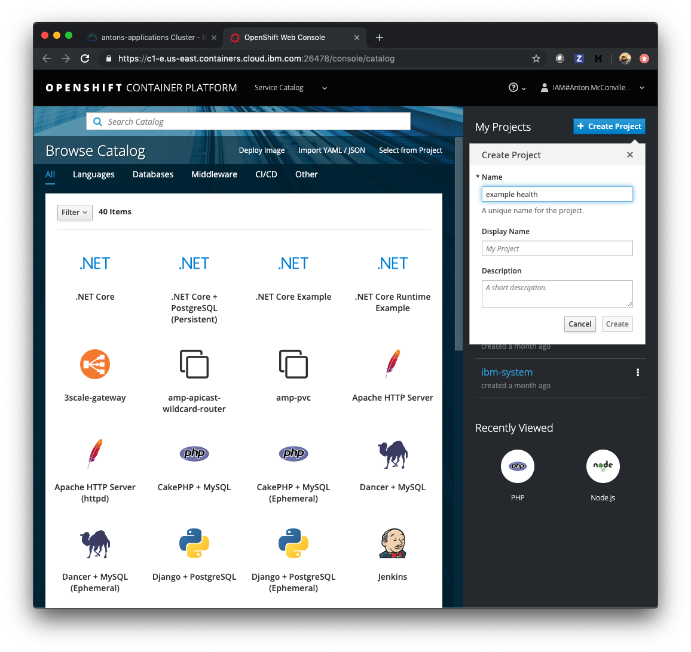
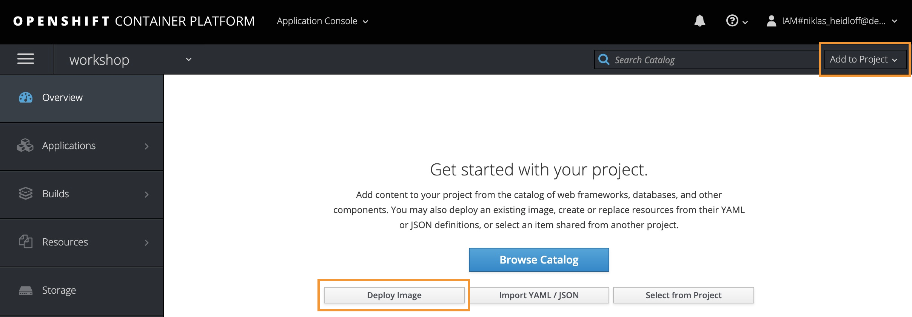
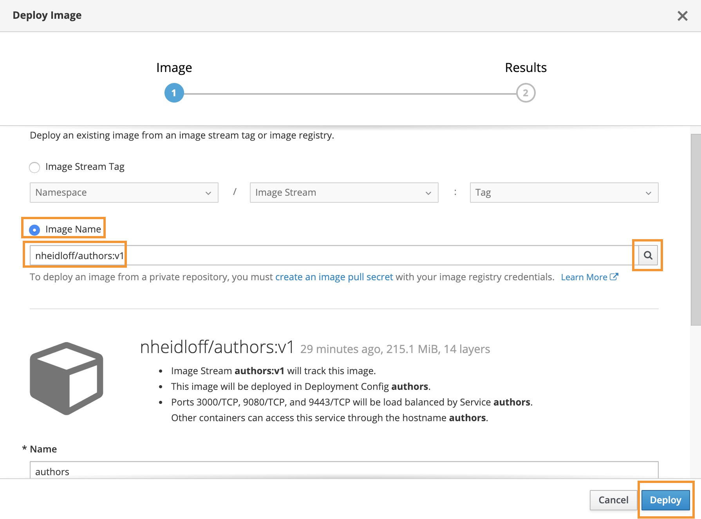
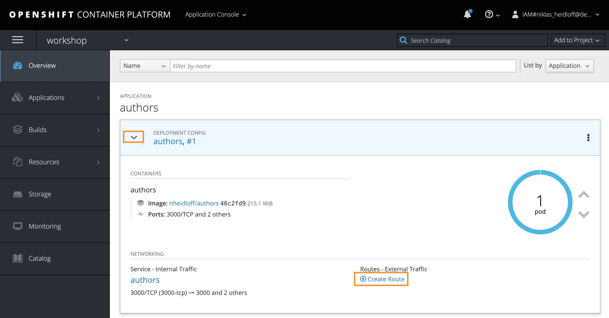
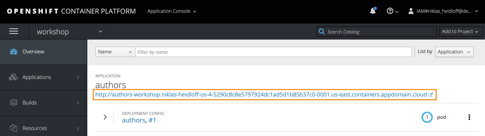
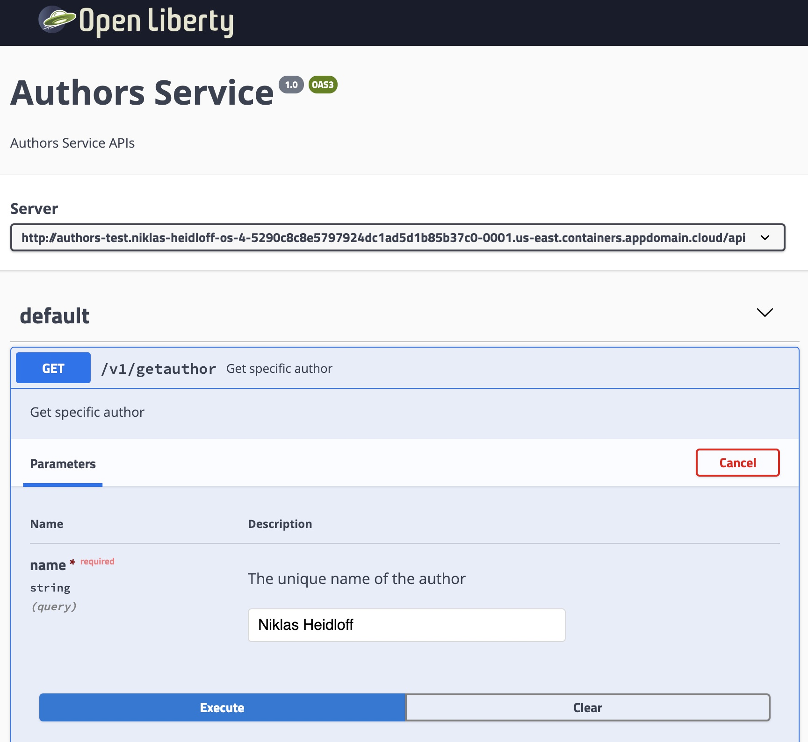

# Exercise 1: Deploy a Java application with a Docker Image

In this exercise, you'll deploy a simple Java microservice - "Authors" from a public image registry to OpenShift. You can find the image on Docker Hub here: [https://hub.docker.com/r/nheidloff/authors](https://hub.docker.com/r/nheidloff/authors)

## Deploy Authors application

Access your cluster on the [IBM Cloud clusters dashboard](https://cloud.ibm.com/kubernetes/clusters). Click the `OpenShift web console` button on the top-right. (This is a pop-up so you'll need to white list this site.)

Create a project, you can title it whatever you like, we suggest "example-authors."

Click on your new project. You should see a view that looks like the image below. Click on the *Deploy Image* button on the main screen, or click on the *Add to Project* button and choose *Deploy Image* from there.

At the pop up, choose the *Image Name* option. Enter `nheidloff/authors:v1` as the image name and click the search icon. Once the image metadata loads click the *Deploy* button.

At the application overview page, click the *Create Route* option. This will give our application an external URL.

The default options are sufficient, scroll down to the bottom and click the *Create* button.

Try to launch the application by copying the route's URL and appending `/openapi/ui`.


Add `/openapi/ui` to the URL!


The Open API user interface for our *Authors* service will load. We can test the application by clicking the **GET /v1/getauthor** API. Choose the *Try it out* button and entering "Niklas Heidloff" as the query.

**Congratulations!** You just deployed an image from a public registry aviable from Docker Hub.
