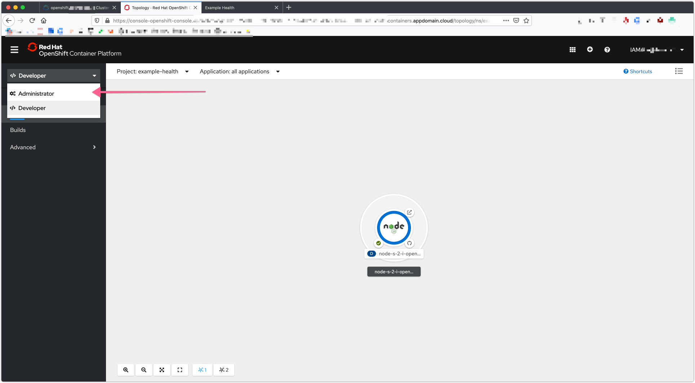
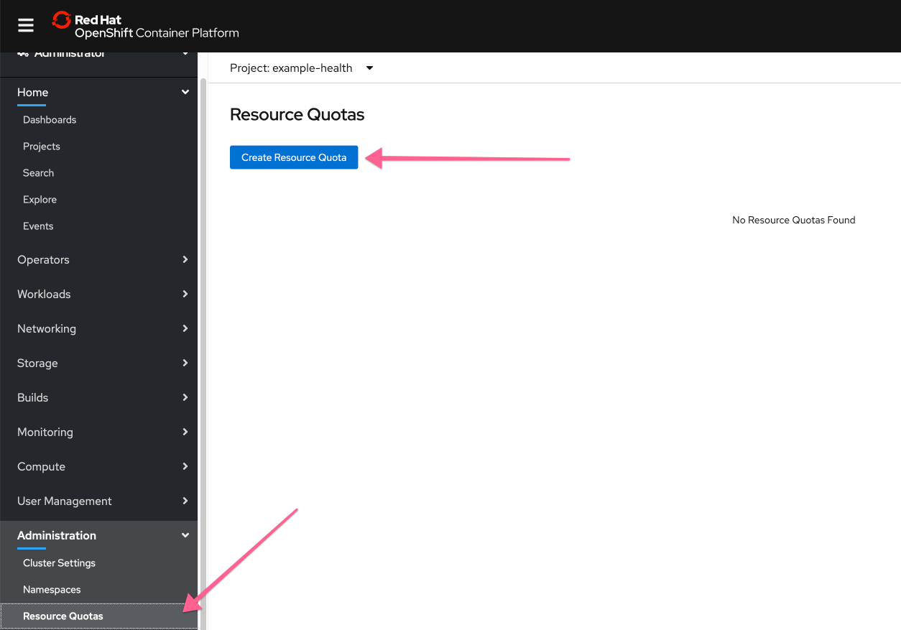
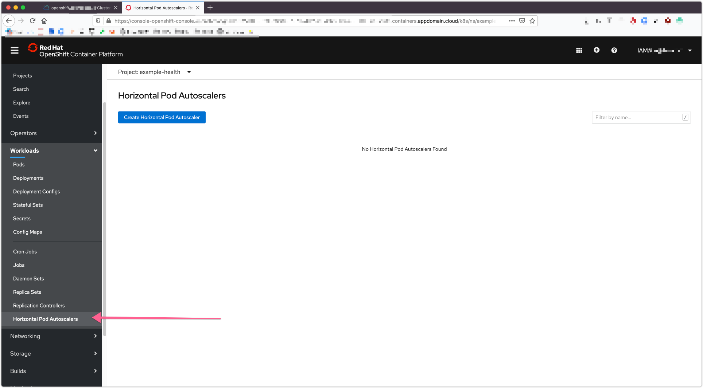
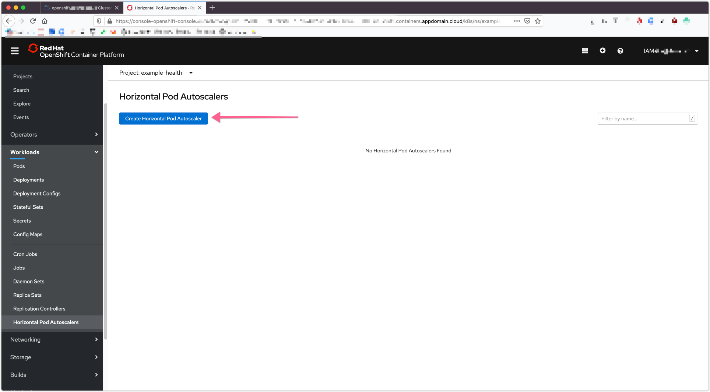
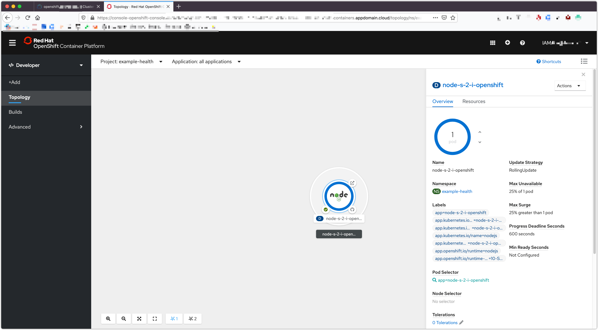
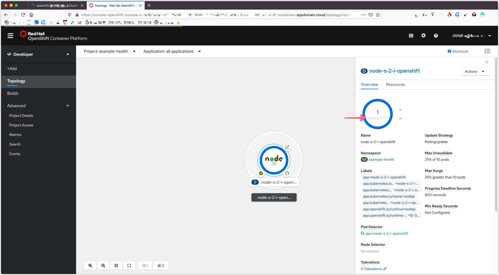

# Exercise 4: Scaling the application

In this exercise, we'll leverage the metrics we've observed in the previous step to automatically scale our UI application in response to load.

## Enable Resource Limits

Before we can setup autoscaling for our pods, we first need to set resource limits on the pods running in our cluster. Limits allows you to choose the minimum and maximum CPU and memory usage for a pod.

First confirm you're in the `Administrator` view:



Scroll down to `Administratation` and click `Resource Quotas`. Then click `Create Resource Quota`.



Hopefully you have your running script simulating load (if not go [here](../exercise-2/README.md#simulate-load-on-the-application)),
Grafana showed you that your application was consuming anywhere between ".002" to
".02" cores. This translates to 2-20 "millicores" or a 1/10th of a CPU. That seems
like a good range for our CPU request, but to be safe, let's bump the higher-end
up to 30 millicores or `.03` CPU. In addition, Grafana showed that the app consumes
about `35` MB of RAM. Set the following resource limits for your deployment now.

```yaml
    pods: '4'
    limits.cpu: 30m
    limits.memory: 35m
    requests.cpu: 30m
    requests.memory: 35m
```


Remember to set the correct unit -- millicores and MB \(not MiB\)


Hit save. If there's an error saying that the deployment has changed, you may need to go back to your deployment, refersh the page, and try again.

## Enable Autoscaler

Now that we have resource limits, let's enable autoscaler. Find the `Workloads > Horizontal Pod Autoscaler` option.



Go ahead and click on `Create Horizontal Pod Autoscaler`.



By default, the autoscaler allows you to scale based on CPU or Memory. The UI allows
you to do CPU only \(for now\). Pods are balanced between the minimum and maximum
number of pods that you specify. With the autoscaler, pods are automatically created
or deleted to ensure that the average CPU usage of the pods is below the CPU request
target as defined. In general, you probably want to start scaling up when you get near
`50`-`90`% of the CPU usage of a pod. In our case, let's make it `1`% to test the autoscaler
since we are generating minimal load.

```yaml
  metrics:
    - type: Resource
      resource:
        name: cpu
        targetAverageUtilization: 1
```

Click `Save`.

## Test Autoscaler

If you're not running the script from the [previous exercise](../exercise-2/README.md#simulate-load-on-the-application), the pods should stay at 1. Check by converting back to `Developer` and looking at the `Overview` page for the Project




Start simulating load by hitting the page several times, or running the script. You'll see that it starts to scale up:



That's it! You now have a highly available and automatically scaled front-end Node.js application. OpenShift is automatically scaling your application pods since the CPU usage of the pods greatly exceeded `1`% of the resource limit, `30` millicores.

### Optional

Find the Autoscaler information in the Deployment.


If you're interested in setting up the CLI, [follow the steps here](../pre-work/SETUP_CLI.md). Then, run the following command in your CLI `oc get hpa` to get information about your horizontal pod autoscaler. Remember to switch to your project first with `oc project <project-name>`.
