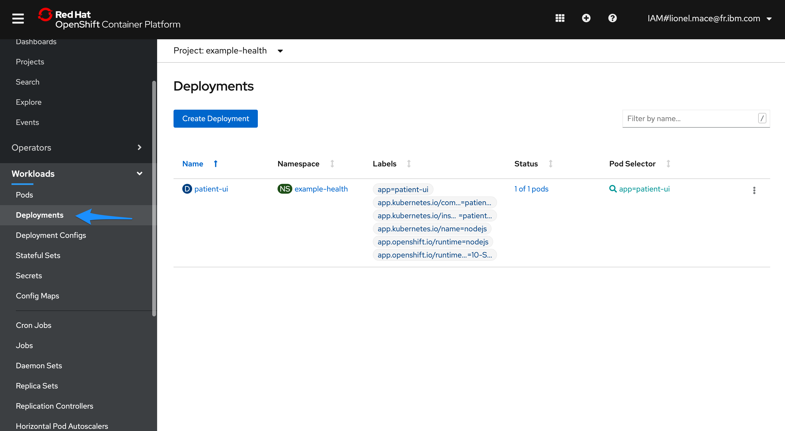
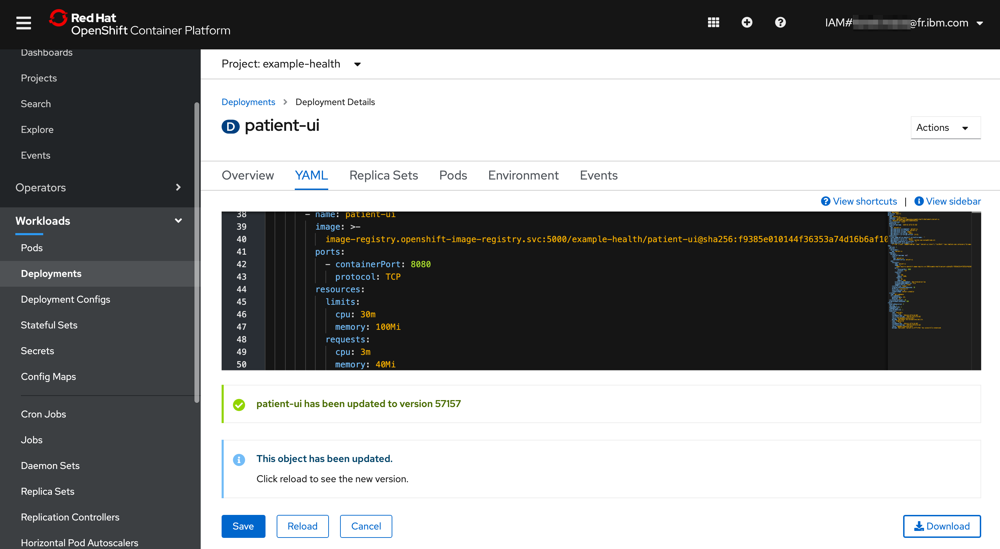
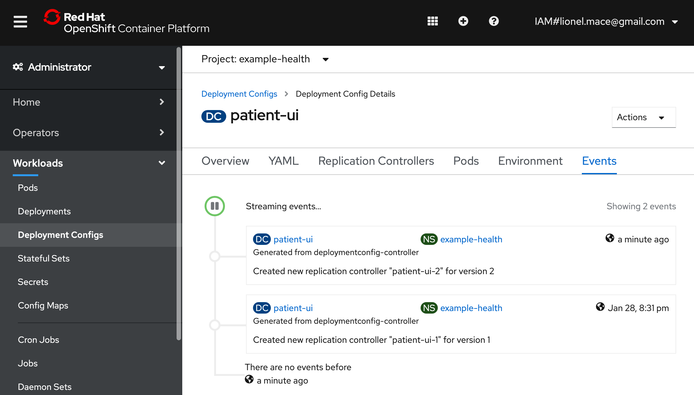
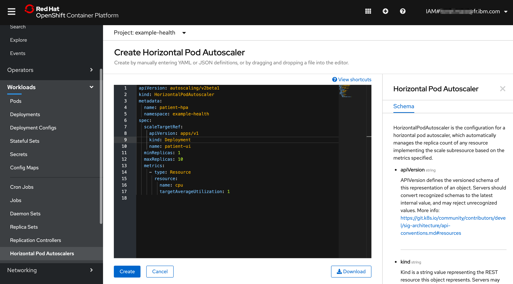
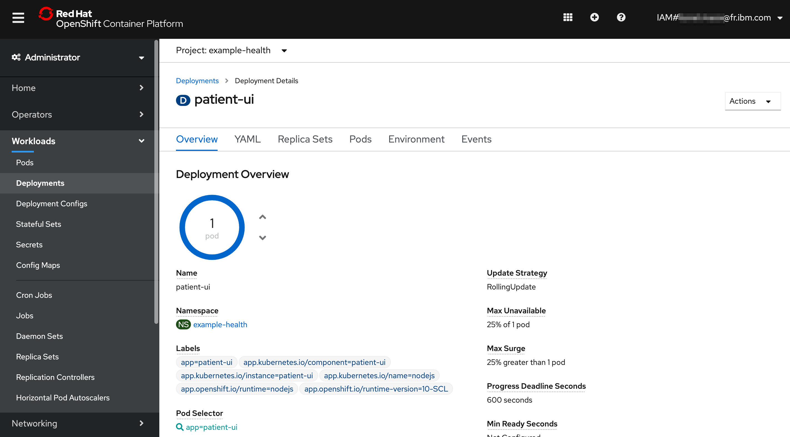
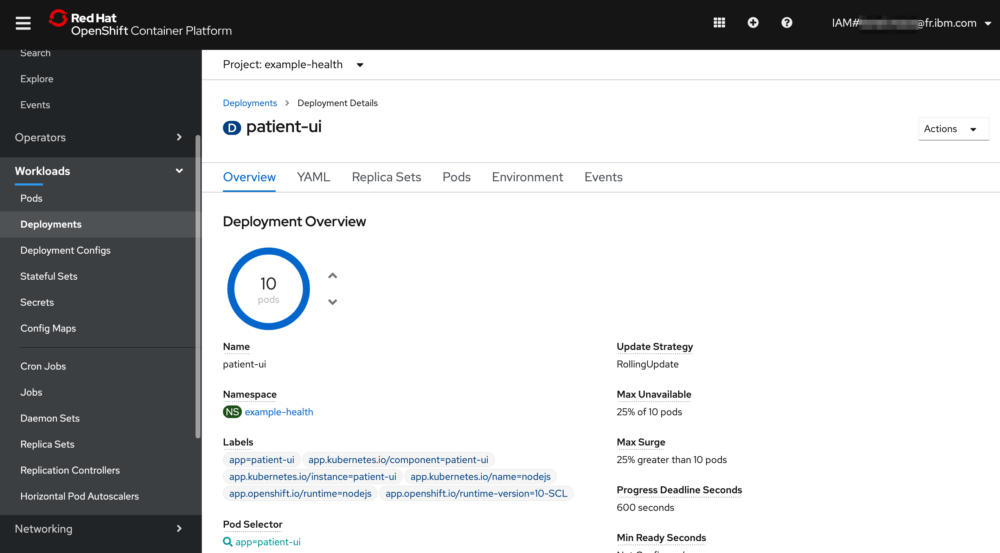

# Exercise 4: Scaling the application

In this exercise, we'll leverage the metrics we've observed in the previous step to automatically scale our UI application in response to load.

## Enable Resource Limits

Before we can setup autoscaling for our pods, we first need to set resource limits on the pods running in our cluster. Limits allows you to choose the minimum and maximum CPU and memory usage for a pod.

Hopefully you have your running script simulating load \(if not go [here](exercise-2.md#simulate-load-on-the-application)\), Grafana showed you that your application was consuming anywhere between ".002" to ".02" cores. This translates to 2-20 "millicores".
That seems like a good range for our CPU request, but to be safe, let's bump the higher-end up to 30 millicores. In addition, Grafana showed that the app consumes about `25`-`35` MB of RAM. Set the following resource limits for your deployment now.

Switch to the **Administrator** view and then navigate to **Workloads > Deployments** in the left-hand bar. Choose the `patient-ui` Deployment, then choose **Actions > Edit Deployment**.



In the YAML editor, go to line 44. In the section **template > spec > containers**, add the following resource limits into the empty resources. Replace the `resources {}`, and ensure the spacing is correct -- YAML uses strict indentation.



  ```yaml
             resources:
               limits:
                 cpu: 30m
                 memory: 100Mi
               requests:
                 cpu: 3m
                 memory: 40Mi
  ```

**Save** and **Reload** to see the new version.

Verify that the replication controller has been changed by navigating to **Events**



## Enable Autoscaler

Now that we have resource limits, let's enable autoscaler.

By default, the autoscaler allows you to scale based on CPU or Memory. The UI allows you to do CPU only \(for now\). Pods are balanced between the minifmum and maximum number of pods that you specify. With the autoscaler, pods are automatically created or deleted to ensure that the average CPU usage of the pods is below the CPU request target as defined.
In general, you probably want to start scaling up when you get near `50`-`90`% of the CPU usage of a pod. In our case, let's make it `1`% to test the autoscaler since we are generating minimal load.

1. Navigate to **Workloads > Horizontal Pod Autoscalers**, then hit **Create Horizontal Pod Autoscaler**.



```yaml
apiVersion: autoscaling/v2beta1
kind: HorizontalPodAutoscaler
metadata:
  name: patient-hpa
  namespace: example-health
spec:
  scaleTargetRef:
    apiVersion: apps/v1
    kind: Deployment
    name: patient-ui
  minReplicas: 1
  maxReplicas: 10
  metrics:
    - type: Resource
      resource:
        name: cpu
        targetAverageUtilization: 1
```

Hit **Create**.

## Test Autoscaler

If you're not running the script from the [previous exercise](exercise-2.md#simulate-load-on-the-application), the number of pods should stay at 1.

Check by going to the **Overview** page of **Deployments**.



Start simulating load by hitting the page several times, or running the script. You'll see that it starts to scale up:



That's it! You now have a highly available and automatically scaled front-end Node.js application. OpenShift is automatically scaling your application pods since the CPU usage of the pods greatly exceeded `1`% of the resource limit, `30` millicores.

### Optional

If you're interested in setting up the CLI, [follow the steps here](../getting-started/setup_cli.md). Then, run the following command in your CLI `oc get hpa` to get information about your horizontal pod autoscaler. Remember to switch to your project first with `oc project <project-name>`.

You could have created the autoscaler with the command `oc autoscale deployment/patient-ui --min 1 --max 10 --cpu-percent=1`.
