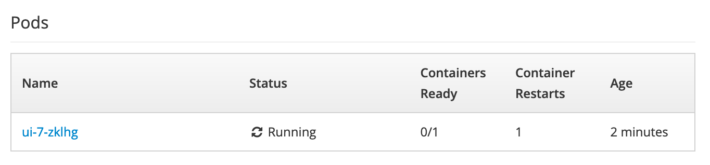
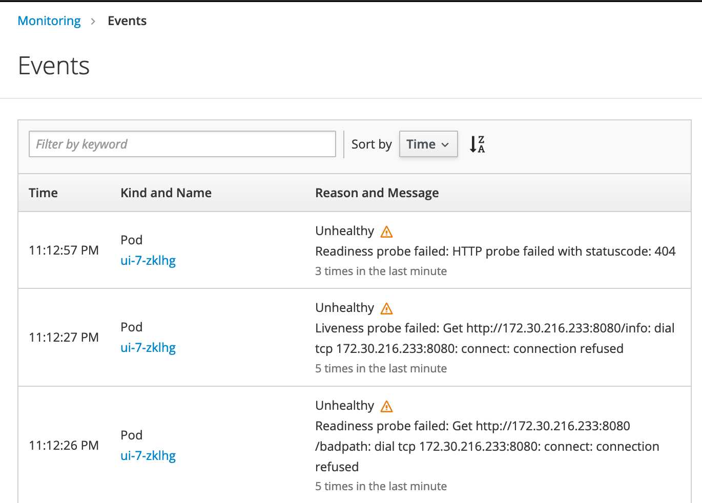

# Exercise 5: Health checks

In Kubernetes, liveness and readiness probes are essential for smoothly running applications.
A probe is generally a REST `GET` call, but there are other types of probes available.
Liveness probes are used to determine when to restart a container. For example, an
application that is unhealthy and no longer responding to an API call would be
restarted by OpenShift. Readiness probes determine when a container is ready to
start receiving traffic. If a readiness probe fails, then the load balancer
would deregister that service.

## Create Readiness and Liveness Probes

The `/info` endpoint on the Example Health application is a great way to check
whether the application is running and responding to API calls -- it responds
with a simple JSON payload.

Go ahead and click on the deployment view. You should see something like `node-s-2-i-openshift`. Click `Actions > Edit Deployment`. Find the `containers` line probably line _38_. Under the `resources` line, so line **46** past the following `yaml`. This will add a liveness probe to your deployment!

```yaml
    livenessProbe:
      initialDelaySeconds: 5
      periodSeconds: 2
      httpGet:
        path: /info
        port: 8080
```

Now, next step is to add a readiness probe. Luckly it's on the same page, imediatly under the `livenessProbe` stanza you entered, paste the following:

```yaml
    readinessProbe:
    initialDelaySeconds: 5
    timeoutSeconds: 2
    httpGet:
      path: /info
      port: 8080
```

This will make sure when a new deployment happens that it won't start until the `/info` path is available.

If you want to verify it, you can run the following command to check the status, you should see something like this in the output:

```bash
oc describe deployment node-s-2-i-openshift
```

```console
Liveness:     http-get http://:8080/info delay=5s timeout=1s period=2s #success=1 #failure=3
Readiness:    http-get http://:8080/info delay=5s timeout=2s period=10s #success=1 #failure=3
```

If all works, everything should be the same. Let's check that the probes are really working though.

## Inject Failure

Let's edit the probe with a typo to see what happens when it fails. Edit the health check and change the path for the readiness probe to `/badpath`. Wait a few minutes and check your deployment - you'll notice that `0/1` containers are ready:



Dive into your events and you'll see that the probe is failing, causing the platform to try and repeatedly restart your pod.



Using health checks gives your OpenShift service layer better reliability and helps you start with a strong foundation.
