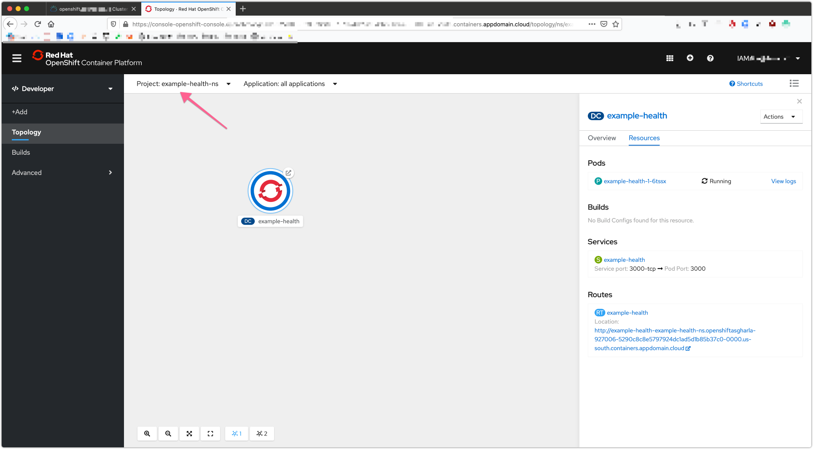

# Exercise 6: Deploying the app using the CLI

Now that you've gone through the GUI to learn how to click around OpenShift,
we are going to use the CLI to build and deploy an application. It's safe to
say that most of the time you will find youself using the `oc` commands and the CLI in the future.

## Building Your Contanier Locally

1. Get the source code for the `Example Health` app
  * Fork the repository `https://github.com/IBM/node-s2i-openshift` to your own organization,
  * Clone the forked repo in your own organization `<username>` to your localhost,

```bash
git clone https://github.com/<username>/node-s2i-openshift

Cloning into 'node-s2i-openshift'...
remote: Enumerating objects: 94, done.
remote: Counting objects: 100% (94/94), done.
remote: Compressing objects: 100% (82/82), done.
remote: Total 509 (delta 27), reused 54 (delta 12), pack-reused 415
Receiving objects: 100% (509/509), 7.27 MiB | 3.12 MiB/s, done.
Resolving deltas: 100% (276/276), done.
```

* Run the `Health Example` app on your localhost to make sure it's running correctly,

```bash
cd node-s2i-openshift
cd site
npm install
npm start
open http://localhost:8080/
```

2. Run the Example Health app with Docker,

  * In the directory `./site` create a new file `Dockerfile`,

```bash
touch Dockerfile
```

  * Edit the `Dockerfile` and add the following commands,

```console
FROM node:10-slim

USER node

RUN mkdir -p /home/node/app
WORKDIR /home/node/app

COPY --chown=node package*.json ./
RUN npm install
COPY --chown=node . .

ENV HOST=0.0.0.0 PORT=3000

EXPOSE ${PORT}
CMD [ "node", "app.js" ]
```

  * Run the app with Docker,

```bash
docker stop example-health
docker rm example-health
docker build --no-cache -t example-health ./
Sending build context to Docker daemon  8.231MB
Step 1/10 : FROM node:10-slim
10-slim: Pulling from library/node
6d28e14ab8c8: Pull complete
467f76cd7b76: Pull complete
b94da5c651ba: Pull complete
4b1d9b3a1ca9: Pull complete
957cf4a5dafa: Pull complete
Digest: sha256:ce0b8ec37c669bb12da1683a265a2aa6f85cdd7a692d959f7c48e8c26cc37585
Status: Downloaded newer image for node:10-slim
 ---> 000100717b61
Step 2/10 : USER node

[-- snip --]

Removing intermediate container 65265b990e5b
 ---> 621fd6ab6cc7
Successfully built 621fd6ab6cc7
Successfully tagged example-health:latest
docker run -d --restart always --name example-health -p 3000:3000 example-health
```

3. Build and Push the Image to your public Docker Hub Registry.

  * Make sure to change the `<username>` by the username of your Docker Hub account,

```bash
docker tag example-health:latest <username>/example-health:1.0.0
```

```bash
docker login -u <username>
Password:
Login Succeeded
```

```bash
docker push <username>/example-health:1.0.0

The push refers to repository [docker.io/<username>/example-health]
b33f2248b6f9: Pushed
195f723f9ebb: Pushed
0912774a40f4: Pushed
3558c6f90d27: Pushed
4d1d690b5181: Mounted from <username>/example-health
bc272904b2c4: Mounted from <username>/example-health
784c13bc7926: Mounted from <username>/example-health
0e0d79e2c080: Mounted from <username>/example-health
e9dc98463cd6: Mounted from <username>/example-health
1.0.0: digest: sha256:a329778ce422e3d25ac9ff70b5131a9de26184a1e94b6d08844ea4f361519fd7 size: 2205
```

## Pushing Your Container to OpenShift

1. Login to the Remote OpenShift Cluster
  * Login to the OpenShift cluster web console,
  * From the logged in user drop down in the top right of the web console, select `Copy Login Command`,
  * The login command will be copied to the clipboard,
  * In your terminal, paste the login command, e.g.

```bash
oc login --token=h7oLVXrxW_A_REALLY_LONG_TOKEN_HERE_G8Qwx6w0emw3yZWnPqA0 --server=https://c106-e.us-south.containers.cloud.ibm.com:30260
```

2. Create a new Project

  * Create a new project `example-health-ns`,

```bash
oc new-project example-health-ns

Now using project "example-health-ns" on server "https://c106-e.us-south.containers.cloud.ibm.com:30260".

You can add applications to this project with the 'new-app' command. For example, try:

    oc new-app django-psql-example

to build a new example application in Python. Or use kubectl to deploy a simple Kubernetes application:

    kubectl create deployment hello-node --image=gcr.io/hello-minikube-zero-install/hello-node
```

  * Use the `example-health-ns` project,

```bash
oc project example-health-ns
Already on project "example-health-ns" on server "https://c106-e.us-south.containers.cloud.ibm.com:30260".
oc project
Using project "example-health-ns" on server "https://c106-e.us-south.containers.cloud.ibm.com:30260".n
```

3. Deploy the `Example Health` app using the Docker image,
  * Create the application, and replace `<username>` by the username of your Docker Hub account,

```
oc new-app <username>/example-health:1.0.0
--> Found Docker image 621fd6a (About an hour old) from Docker Hub for "<username>/example-health:1.0.0"

    * An image stream tag will be created as "example-health:1.0.0" that will track this image
    * This image will be deployed in deployment config "example-health"
    * Port 3000/tcp will be load balanced by service "example-health"
      * Other containers can access this service through the hostname "example-health"

--> Creating resources ...
    imagestream.image.openshift.io "example-health" created
    deploymentconfig.apps.openshift.io "example-health" created
    service "example-health" created
--> Success
    Application is not exposed. You can expose services to the outside world by executing one or more of the commands below:
     'oc expose svc/example-health'
    Run 'oc status' to view your app.
```

  * This will create an ImageStream, Deployment, a Pod, and a Service resource for the `Example-Health` app.

4. Expose the `Example-Health` service,
  * The last thing to do is to create a route. By default, services on OpenShift are not publically available. A route will expose the service publically to external traffic.

```bash
oc expose svc/example-health
route.route.openshift.io/example-health exposed
```

  * View the status,

```bash
In project example-health-ns on server https://c106-e.us-south.containers.cloud.ibm.com:30260

http://example-health-example-health-ns.A-LONG-NAME-HERE.us-south.containers.appdomain.cloud to pod port 3000-tcp (svc/example-health)
  dc/example-health deploys istag/example-health:1.0.0
    deployment #1 deployed about a minute ago - 1 pod

1 info identified, use 'oc status --suggest' to see details.
```

5. Review the `Example-Health` app in the web console,

  * Confirm you are logged in as `Developer`

  

  * Select the project `example-health-ns`

  

  * In the `Routes` section, click the `Location` link, e.g. `http://example-health-example-health-ns.A-LONG-NAME-HERE.us-south.containers.appdomain.cloud`
  * This opens the Example Health app in a new tab of your browser,
  * Login with `admin:test`,

  
