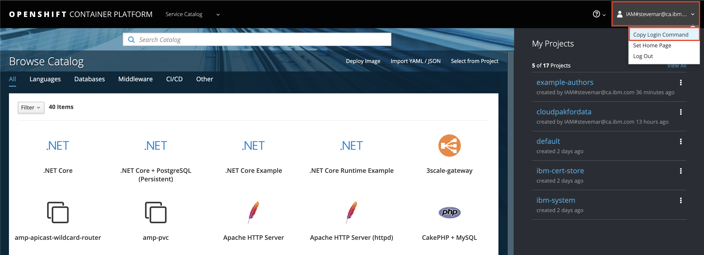
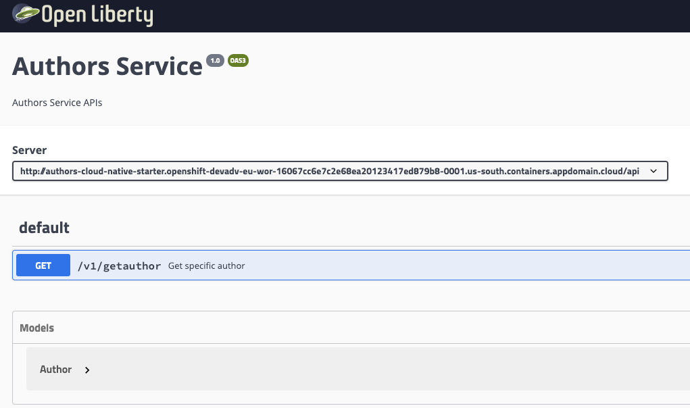

# Exercise 6b: Deploy a Java application with Build Config (CLI version)

In this exercise we'll revisit the application from exercise 1, except we'll use equivalent CLI commands to deploy our "Authors" application.

From the IBM Cloud console launch the IBM Cloud Shell. Refer to our [Getting Starting](../pre-work/CLOUD_SHELL.md) material to learn how to access the IBM Cloud Shell.

## Deploy Authors application (CLI version)

First, clone the *Authors* source code and change to that directory.

```bash
git clone https://github.com/IBM/openshift-on-ibm-cloud-workshops
cd openshift-on-ibm-cloud-workshops
cd deploying-to-openshift
```

Take note of the new `Dockerfile` in the application's directory. We've pre-written it for you. But we've copied it here too, go through each line and read the corresponding comment.

```Dockerfile
# Use an official JDK image
FROM maven:3.5-jdk-8 as BUILD

# Copy the application source code
COPY src /usr/src/app/src
COPY pom.xml /usr/src/app

# Run maven to build the application
RUN mvn -f /usr/src/app/pom.xml clean package

FROM open-liberty:microProfile2-java11

COPY liberty/server.xml /config/

COPY --from=BUILD /usr/src/app/target/authors.war /config/apps/

# Allow traffic on port 3000
EXPOSE 3000
```

From the OpenShift console click the user name in the top right corner and select *Copy Login Command*.



The login command will be copied to the clipboard, in the IBM Cloud Shell, paste that command. For example:

```bash
oc login https://c100-e.us-south.containers.cloud.ibm.com:30403 --token=jWX7a04tRgpdhW_iofWuHqb_Ygp8fFsUkRjOK7_QyFQ
```

Create a new OpenShift project to deploy our application, call it `cloud-native-starter`.

```bash
oc new-project cloud-native-starter
```

Build your application's image by running the `oc new-build` command from your source code root directory. This will create a Build and an ImageStream of the app.

```bash
oc new-build --name authors --binary --strategy docker
```

The output should look like below:

```bash
$ oc new-build --name authors --binary --strategy docker
    * A Docker build using binary input will be created
      * The resulting image will be pushed to image stream tag "authors:latest"
      * A binary build was created, use 'start-build --from-dir' to trigger a new build

--> Creating resources with label build=authors ...
    imagestream.image.openshift.io "authors" created
    buildconfig.build.openshift.io "authors" created
--> Success
```

Start a new build using the `oc start-build` command.

```bash
oc start-build authors --from-dir . --follow
```

The output should look like below:

```bash
$ oc start-build authors --from-dir . --follow

Uploading directory "." as binary input for the build ...
.
Uploading finished
build.build.openshift.io/authors-1 started
Receiving source from STDIN as archive ...

Pulling image maven:3.5-jdk-8 ...
Pulling image open-liberty:microProfile2-java11 ...

Extracting
--> FROM maven:3.5-jdk-8 as BUILD
--> COPY src /usr/src/app/src
--> COPY pom.xml /usr/src/app
--> RUN mvn -f /usr/src/app/pom.xml clean package
...
Downloading from central: https://repo.maven.apache.org/maven2/org/apache/maven/plugins/maven-clean-plugin/2.5/maven-clean-plugin-2.5.pom
...
--> FROM open-liberty:microProfile2-java11 as 1
--> COPY liberty/server.xml /config/
--> COPY --from=BUILD /usr/src/app/target/authors.war /config/apps/
--> EXPOSE 3000
--> ENV "OPENSHIFT_BUILD_NAME"="authors-1" "OPENSHIFT_BUILD_NAMESPACE"="cloud-native-starter"
--> LABEL "io.openshift.build.name"="authors-1" "io.openshift.build.namespace"="cloud-native-starter"
--> Committing changes to temp.builder.openshift.io/cloud-native-starter/authors-1:534cb12a ...
--> Done

Pushing image docker-registry.default.svc:5000/cloud-native-starter/authors:latest ...
Pushed 0/13 layers, 8% complete
Pushed 1/13 layers, 38% complete
...
Pushed 12/13 layers, 100% complete
Pushed 13/13 layers, 100% complete
```

View the build logs by running the `oc logs` command.

```bash
oc logs bc/authors
```

Finally, deploy the application by running `oc new-app`.

```bash
oc new-app -i authors
```

The output should look like below:

```bash
$ oc new-app -i authors
--> Found image d3dfc36 (5 minutes old) in image stream "cloud-native-starter/authors" under tag "latest" for "authors"

    * This image will be deployed in deployment config "authors"
    * Ports 3000/tcp, 9080/tcp, 9443/tcp will be load balanced by service "authors"
      * Other containers can access this service through the hostname "authors"

--> Creating resources ...
    deploymentconfig.apps.openshift.io "authors" created
    service "authors" created
--> Success
    Application is not exposed. You can expose services to the outside world by executing one or more of the commands below:
     'oc expose svc/authors'
    Run 'oc status' to view your app
```

View the deployment logs by running the `oc logs` command.

```bash
oc logs dc/authors
```

The output should look like:

```bash
$ oc logs dc/authors

Launching defaultServer (Open Liberty 19.0.0.10/wlp-1.0.33.cl191020191002-0300) on Eclipse OpenJ9 VM, version 11.0.4+11 (en_US)
[AUDIT   ] CWWKE0001I: The server defaultServer has been launched.
[AUDIT   ] CWWKG0093A: Processing configuration drop-ins resource: /opt/ol/wlp/usr/servers/defaultServer/configDropins/defaults/keystore.xml
[AUDIT   ] CWWKG0093A: Processing configuration drop-ins resource: /opt/ol/wlp/usr/servers/defaultServer/configDropins/defaults/open-default-port.xml
[AUDIT   ] CWWKZ0058I: Monitoring dropins for applications.
[AUDIT   ] CWWKS4104A: LTPA keys created in 2.099 seconds. LTPA key file: /opt/ol/wlp/output/defaultServer/resources/security/ltpa.keys
[AUDIT   ] CWPKI0803A: SSL certificate created in 4.881 seconds. SSL key file: /opt/ol/wlp/output/defaultServer/resources/security/key.p12
```

Expose the service using `oc expose`, a route will be created.

```bash
oc expose svc/authors
```

Find the application's route by running `oc get routes`.

```bash
oc get routes
```

The output should look like below:

```bash
$ oc get routes

NAME      HOST/PORT                                                                                                                    PATH      SERVICES   PORT       TERMINATION   WILDCARD
authors   authors-cloud-native-starter.aida-dev-apps-10-30-f2c6cdc6801be85fd188b09d006f13e3-0001.us-south.containers.appdomain.cloud             authors    3000-tcp                 None
```

Copy the URL into a browser and append `/openapi/ui`.



Also verify this works with `curl` by running

```bash
curl -X GET "http://$(oc get route authors -o jsonpath={.spec.host})/api/v1/getauthor?name=Niklas%20Heidloff" -H "accept: application/json"
```

The output should look like the following:

```bash
{"name":"Niklas Heidloff","twitter":"https://twitter.com/nheidloff","blog":"http://heidloff.net"}
```

**Congratulations** on completing this exercise!
