# Lab 3 - Deploying a Project to Red Hat OpenShift Kubernetes Cluster

This is a description of the Lab 3

Lab 3 consits of two parts:

- Setting up the environment for Lab 3
- Creating a Red Hat OpenShift project

Below please find the architecture of the project.

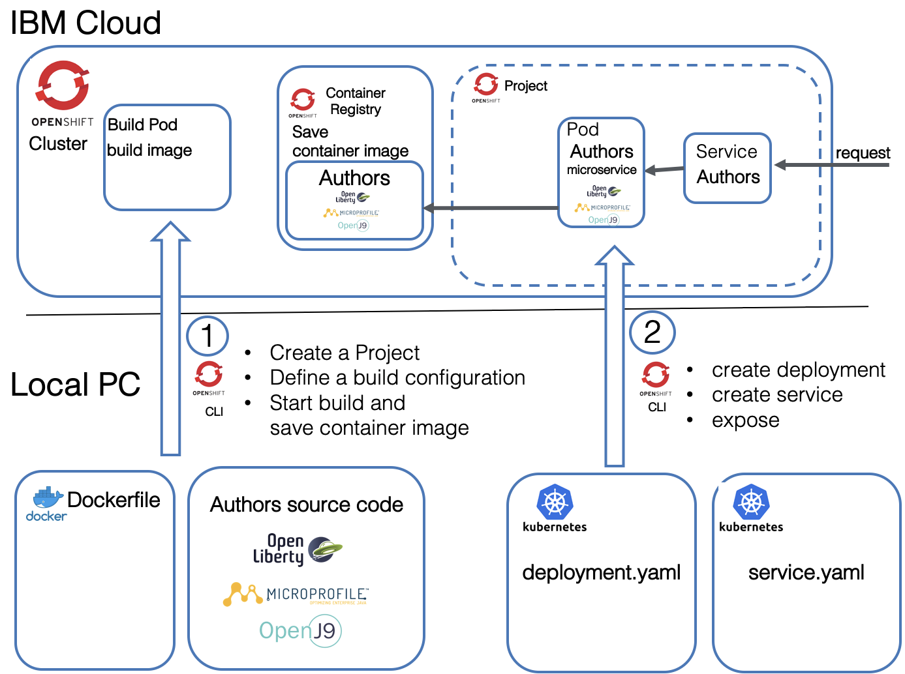

## Lab 3 - Setting up

During this Lab you will use recently created project and deploy it to your cluster.

### Tools

Find the option for the tools most suitable for you

#### Prebuilding an Image with local Code

There is an image on DockerHub with all required tools. In order to use local IDEs and editors to modify code and configuraton files a Docker volume is used. This option works only for Mac and Linux.

#### Step 1: Run these commands in a terminal

```bash
$ git clone https://github.com/IBM/openshift-on-ibm-cloud-workshops.git
$ cd openshift-on-ibm-cloud-workshops
$ ROOT_FOLDER=$(pwd)
$ docker run -v $ROOT_FOLDER/:/cloud-native-starter -it --rm nheidloff/openshift-workshop-tools:v1
```

#### Step 2: Inside your running Docker image you can access your the local project

You should see the prompt like this `root@3f46c41f7303:/usr/local/bin#`, now run the following instructions:

```bash
$ cd /cloud-native-starter/
$ ls
$ ROOT_FOLDER=$(pwd)
```

Note: With the `--rm` option in the docker run command the container is deleted once you exit. This is intended.

#### Step 3: Move on with Verify Access to OpenShift on the IBM Cloud

##### Option 1

(prefered for Windows): Prebuilt Image with Code in Container There is an image on DockerHub with all required tools. This option works for Mac, Linux and Windows. To get started as quickly as possible, use this image.

Step 1: Run this command in a terminal

```bash
$ docker run -ti nheidloff/openshift-workshop-tools:v1
```
Step 2: After the container has been started, run these commands inside your running Docker image to get the lastest version of the workshop: You should see the prompt like this

```bash
root@3f46c41f7303:/usr/local/bin#
```
now run the following instructions:

```bash
$ cd
$ git clone https://github.com/IBM/openshift-on-ibm-cloud-workshops.git$ cd openshift-on-ibm-cloud-workshops
$ ROOT_FOLDER=$(pwd)
```
*Note:* If you using Windows you also need to download or clone the project to your local workstation for the upcoming Docker and Java lab, because you can't use Docker in the 'openshift-workshop-tools' Docker image.

Step 3: Move on with Verify Access to OpenShift on the IBM Cloud

#### Option 2

Install Tools locally on your desktop computer This approach works only for Mac and Linux.

Step 1: Install the following tools: oc kubectl git curl Optional: IBM Cloud CLI Optional: Editor, for example Visual Studio Code

Step 2: Get the code:

```bash
$ git clone https://github.com/IBM/openshift-on-ibm-cloud-workshops.git
$ cd openshift-on-ibm-cloud-workshops
$ ROOT_FOLDER=$(pwd)
```

Step 3: Move on with Verify Access to OpenShift on the IBM Cloud

## Verify Access to OpenShift on the IBM Cloud

### Step 1: After you've created a new cluster, open the OpenShift console.

- Logon to the IBM Cloud web console - and choose the IBM organization
- Select OpenShift in the menu
- Chose Clusters and click on your OpenShift cluster
- Open the OpenShift web console


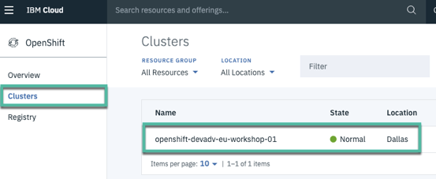

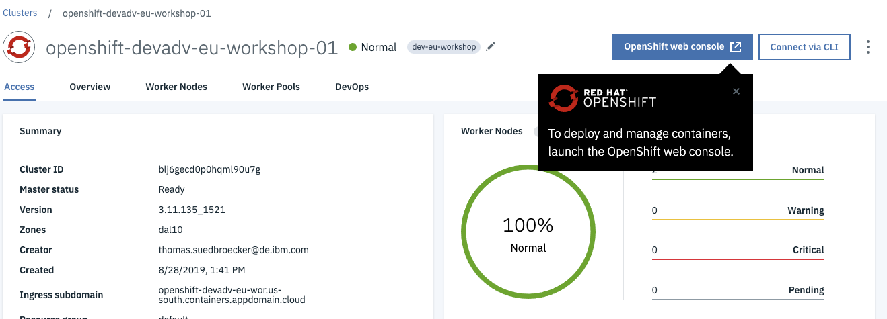

###  Step 2: Get our access token for the 'oc' CLI.

- From the dropdown menu in the upper right of the page, click 'Copy Login Command'. Paste the copied command into your terminal.

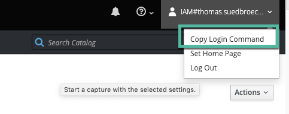

- Verify 'oc' CLI

```bash
$ oc login https://c1-e.us-east.containers.cloud.ibm.com:23967 --token=xxxxxx'
$ oc get istag
```
- Verify 'kubectl' CLI

```bash
$ kubectl get pods
```

## Deploying to OpenShift

### Overview

In this lab we will work in the OpenShift Web Console and with the OpenShift CLI. The following image is a simplified overview of the topics of that lab. Have in mind that OpenShift is a Kubernetes platform.

This lab has two parts:

1. Build and save the container image to OpenShift internal Container Repository

- We will create a OpenShift project
- We will define a build config for OpenShift
- We will build with the build Pod inside OpenShift and save container image to the internal OpenShift container registry

2. Deploy the application to the cluster and expose the service

- You will define and apply a deployment configuration (yaml) to create a Pod with your microservice
- You will define a service which routes requests to the Pod with your microservice
- You will expose the service

The following gif is an animation of the simplified steps above in a sequence.


### Steps

#### Step 1 - creating and pushing image to the internal registry

##### Create an Open Shift project

We need an OpenShift project, this is simply put equivalent to a Kubernetes namespace plus OpenShift security. Let us create one.

*Note:* A project allows a community of users to organize and manage their content in isolation from other communities.

```bash
$ cd ${ROOT_FOLDER}/2-deploying-to-openshift
$ oc new-project cloud-native-starter
```

Make sure you are logged on to your OpenShift cluster. See here.

##### Build and save the container image in the Open Shift Container Registry

Now we want to build and save a container image in the OpenShift Container Registry. We use these commands to do that:

Defining a new build using 'binary build' and the Docker strategy (more details and oc new-build documentation)

```bash
$ oc new-build --name authors --binary --strategy docker
```

Starting the build process on OpenShift with our defined build configuration. (oc start-build documentation)

```bash
$ oc start-build authors --from-dir=.
```

Verify the build in the OpenShift web console

- Select the 'cloud-native-starter' project in 'My Projects'
- Open 'Builds' in the menu and then click 'Builds'
- Select 'Last Build' (#1)
- Open 'Logs'
- Inspect the logs

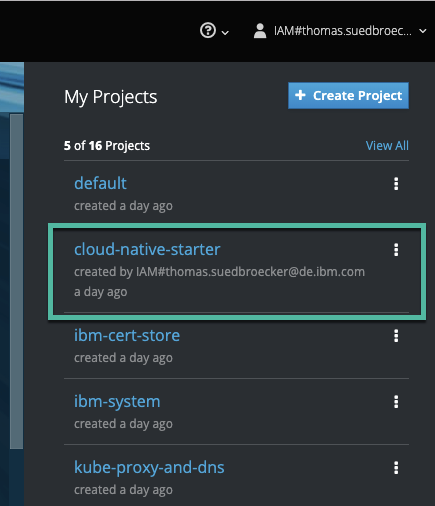


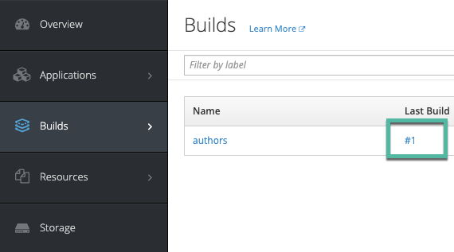

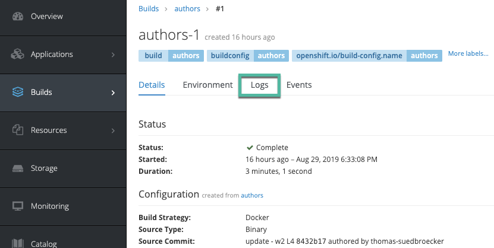

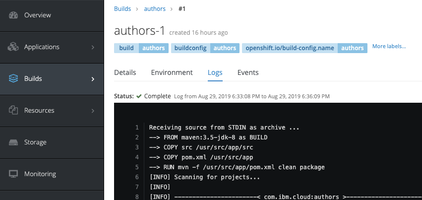

Verify the container image in the Open Shift Container Registry UI

- Select the 'default' project
- Expand DEPLOYMENT 'registry-console' in 'Overview' and click on the URL in 'Routes - External Traffic'
- In the container registry you will find the 'authors' image and you can click on the latest label.

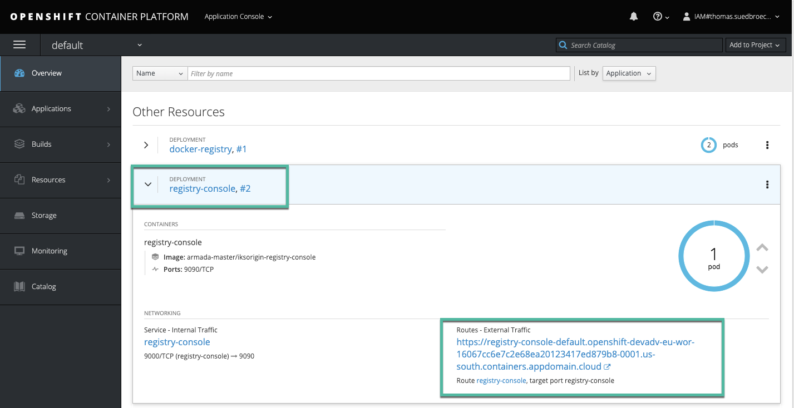

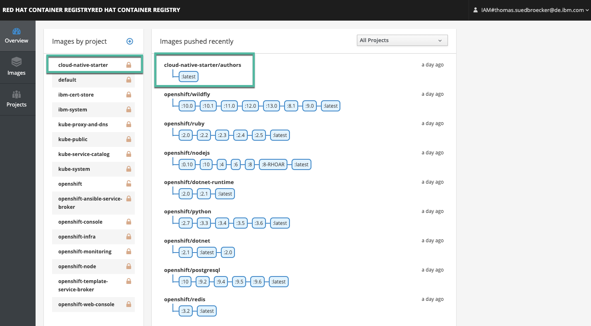

#### 2. Creating deployment and a service

##### Apply the deployment.yaml

This deployment will deploy a container to a Pod in Kubernetes. For more details we use the Kubernetes documentation for Pods.

> A Pod is the basic building block of Kubernetes–the smallest and simplest unit in the Kubernetes object model that you create or deploy. A Pod represents processes running on your Cluster .

Here is a simplified image for that topic. The deployment.yaml file points to the container image that needs to be instantiated in the pod.

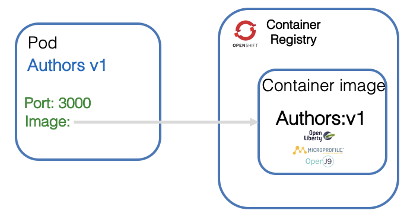

Let's start with the deployment yaml. For more details see the Kubernetes documentation for deployments.

Definition of `kind` defines this as a `Deployment` configuration.

```yaml
kind: Deployment
apiVersion: apps/v1beta1
metadata:
  name: authors
```

Inside the spec section we specify an app name and version label.

```yaml
spec:
  ...
  template:
    metadata:
      labels:
        app: authors
        version: v1
```

Then we define a name for the container and we provide the container image location, e.g. where the container can be found in the Container Registry.

The containerPort depends on the port definition inside our Dockerfile and in our server.xml.

We have previously talked about the usage of the HealthEndpoint class for our Authors service and here we see it the livenessProbe definition.

```yaml
spec:
      containers:
      - name: authors
        image: authors:1
        ports:
        - containerPort: 3000
        livenessProbe:
```

This is the full deployment.yaml file.

```yaml
kind: Deployment
apiVersion: apps/v1beta1
metadata:
  name: authors
spec:
  replicas: 1
  template:
    metadata:
      labels:
        app: authors
        version: v1
    spec:
      containers:
      - name: authors
        image: docker-registry.default.svc:5000/cloud-native-starter/authors:latest
        ports:
        - containerPort: 3000
        livenessProbe:
          exec:
            command: ["sh", "-c", "curl -s http://localhost:3000/"]
          initialDelaySeconds: 20
        readinessProbe:
          exec:
            command: ["sh", "-c", "curl -s http://localhost:3000/health | grep -q authors"]
          initialDelaySeconds: 40
      restartPolicy: Always
```

#### Step 1: Apply the deployment

1. Ensure you are in the {ROOT_FOLDER}/2-deploying-to-openshift/deployment

```bash
$ cd ${ROOT_FOLDER}/2-deploying-to-openshift/deployment
```

2. Apply the deployment to OpenShift

```bash
$ oc apply -f deployment.yaml
```

#### Step 2: Verify the deployment in OpenShift

- Open your OpenShift Web Console
- Select the Cloud-Native-Starter project and examine the deployment
- Click on #1 to open the details of the deployment
- In the details you find the 'health check' we defined before

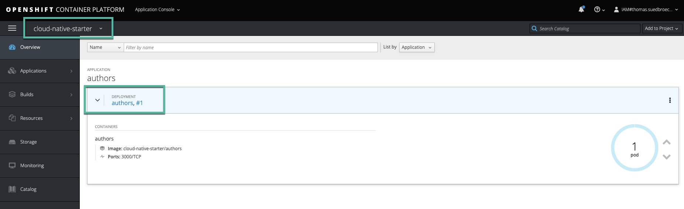
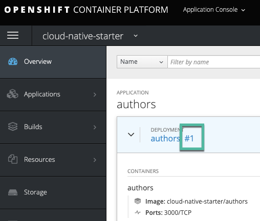
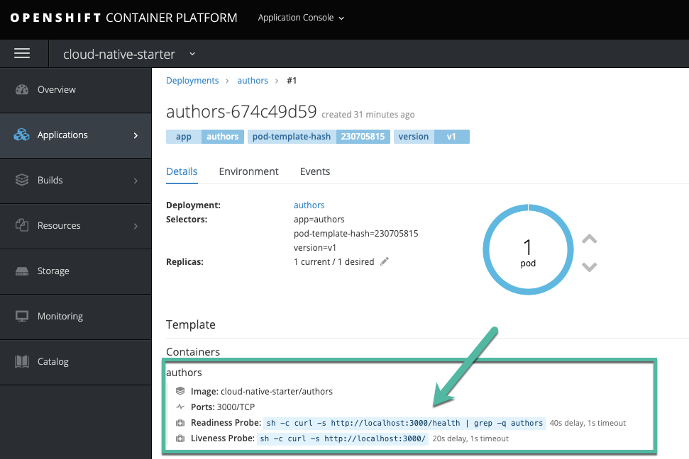

#### Apply the service.yaml

After the definition of the Pod we need to define how to access the Pod. For this we use a service in Kubernetes. For more details see the Kubernetes documentation for service.

> A Kubernetes Service is an abstraction which defines a logical set of Pods and a policy by which to access them - sometimes called a micro-service. The set of Pods targeted by a Service is (usually) determined by a Label Selector.

In the service we map the NodePort of the cluster to the port 3000 of the Authors microservice running in the authors Pod, as we can see in the following picture.

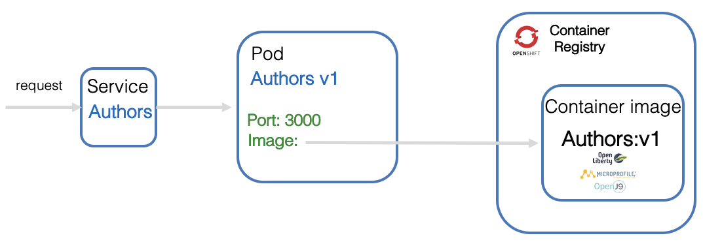

In the service.yaml we see a selector of the pod using the label 'app: authors'.

```yaml
kind: Service
apiVersion: v1
metadata:
  name: authors
  labels:
    app: authors
spec:
  selector:
    app: authors
  ports:
    - port: 3000
      name: http
  type: NodePort
---
```

#### Step 1: Apply the service deployment

- Apply the service to OpenShift

```bash
$ oc apply -f service.yaml
```

Using oc expose we create a Route to our service in the OpenShift cluster. (oc expose documentation)

```bash
$ oc expose svc/authors
```

#### Step 2: Test the microservice

Execute this command, copy the URL to open the Swagger UI in browser

```bash
$ echo http://$(oc get route authors -o jsonpath={.spec.host})/openapi/ui/
$ http://authors-cloud-native-starter.openshift-devadv-eu-wor-160678-0001.us-south.containers.appdomain.cloud/openapi/ui/
```

This is the Swagger UI in your browser:


2. Execute this command to verify the output:

```bash
$ curl -X GET "http://$(oc get route authors -o jsonpath={.spec.host})/api/v1/getauthor?name=Niklas%20Heidloff" -H "accept: application/json"
```

3. Output

```bash
$ {"name":"Niklas Heidloff","twitter":"https://twitter.com/nheidloff","blog":"http://heidloff.net"}
```

Step 3: Inspect the service in OpenShift

- Open your OpenShift Web Console
- Select the Cloud-Native-Starter project
- Chose 'Applications' and then 'Services'
- Click on 'authors'
- Examine the traffic and remember the simplified overview picture.

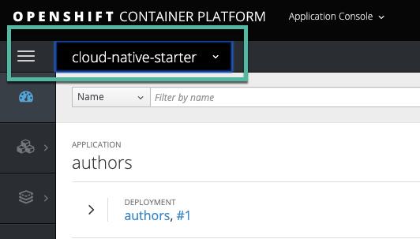

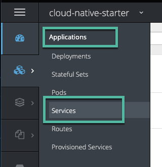

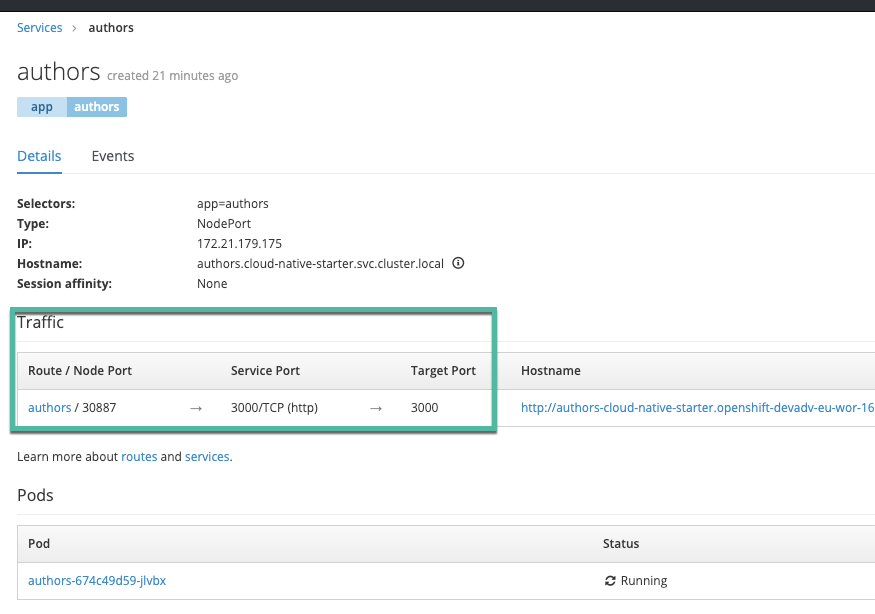

Congratulations! You deployed from a source code, thru container definition, your first project.
