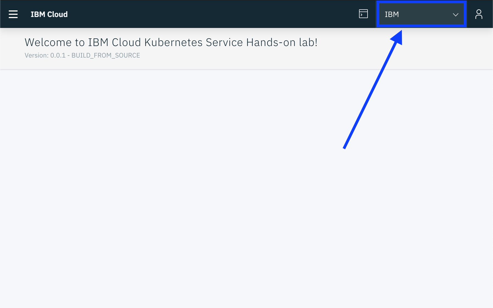
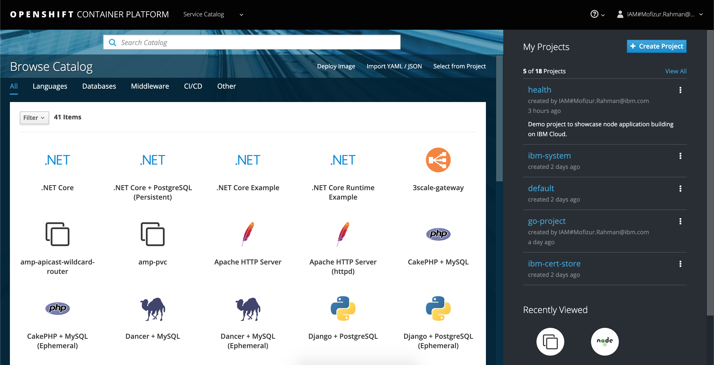
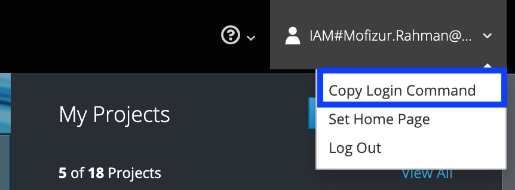

# Exercise 1 - Accessing your Kubernetes Cluster

You must already have an IBM account, with a cluster created or assigned to you as documented in [previous step](../GETSTARTED.md).

## Connect to your cluster using the lab web shell (Cloud Shell)

For this lab, a web shell is provided for you with all the necessary tools. Use this web shell to perform the tasks in this lab. If you are having problems with this web shell, you can use a local docker container and follow the instructions [here](https://github.com/rvennam/istio101/blob/docker-env/workshop/exercise-1/README.md) instead.

1. Using Chrome or Firefox, go to the [Cloud Shell](https://cloudshell-console-ikslab.us-south.cf.cloud.ibm.com/) and login using the Login button.

2. Passcode will be provided by lab instructors.

3. Using the account drop down, choose the **IBM** account.

   

4. Click on the Terminal icon to launch your web shell.

## Install OpenShift cli tools

1. Download and unpack OpenShift cli tools. The `oc` utility is your main gateway into OpenShift. We'll add them to your path in a convenient location.

    a. Download tarball of the tools

    ```shell
    wget https://github.com/openshift/origin/releases/download/v3.11.0/openshift-origin-client-tools-v3.11.0-0cbc58b-linux-64bit.tar.gz
    ```

    b. Unpack

    ```shell
    tar -xvzf openshift-origin-client-tools-v3.11.0-0cbc58b-linux-64bit.tar.gz
    ```

    c. Rename for ease of use

    ```shell
    mv openshift-origin-client-tools-v3.11.0-0cbc58b-linux-64bit ${HOME}/oc-cli
    ```

    d. Set Path. Note that if you restart your cloud shell, you may need to re-run this command.

    ```shell
    export PATH=${PATH}:${HOME}/oc-cli
    ```

    e. Verify the utility is available by using `which` and the help

    ```shell
    which oc
    ```

    ```shell
    oc help
    ```

## Access the OpenShift Web UI

1. Connect to the OpenShift Web UI where you can manage your hosted OpenShift cluster as well as authenticate your cli tooling.

    a. Get the Master URL for your cluster from the `ibmcloud` utility

    ```shell
    ibmcloud ks cluster get $MYCLUSTER  | grep 'Master URL'
    ```

    It will look something like `https://c100-e.us-east.containers.cloud.ibm.com:39813`

2. Construct the console url by appending '/console' to the Master URL.

    a. If your Master URL is `https://c100-e.us-east.containers.cloud.ibm.com:39813`, then your console URL is `https://c100-e.us-east.containers.cloud.ibm.com:39813/console`.

3. Connect to the console with a web browser.

    

4. Select your name/id in the upper right, click. Scroll down to 'Copy Login Command' and click it.

    

## Access your cluster using OpenShift client utils

1. Paste the login command you copied from the Web UI.

    ```shell
    oc login https://c100-e.us-east.containers.cloud.ibm.com:39813 --token=xxxxxxxxxxxxxxxxxxxxxxxxxxxxxxxxxxxxxxxxxxx
    ```

    You should see a success message.

2. Validate access to your cluster.
    a. Get the current status of your cluster

    ```shell
    oc status
    ```

    b.  View nodes in the cluster.

    ```shell
    oc get node
    ```

    c.  View services, deployments, and pods.

    ```shell
    oc get svc,deploy,po --all-namespaces
    ```

    d. View all OpenShift projects

    ```shell
    oc get projects
    ```

## Clone the lab repo

1. From your command line, run:

    ```shell
    git clone https://github.com/IBM/openshift101
    cd openshift101/workshop
    ```

    This is the working directory for the workshop. You will use the `.yaml` files that are located in the `workshop/plans` directory in the following exercises.

### [Continue to Exercise 2 - Create a Sample Node.js Application](../exercise-2/README.md)
