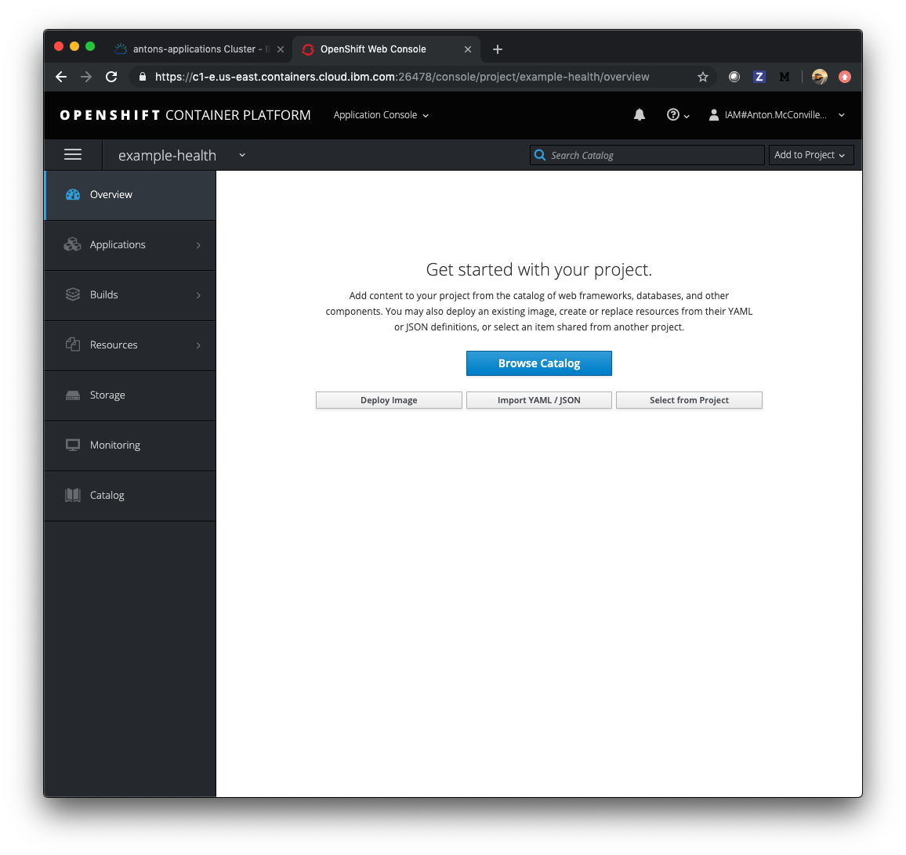
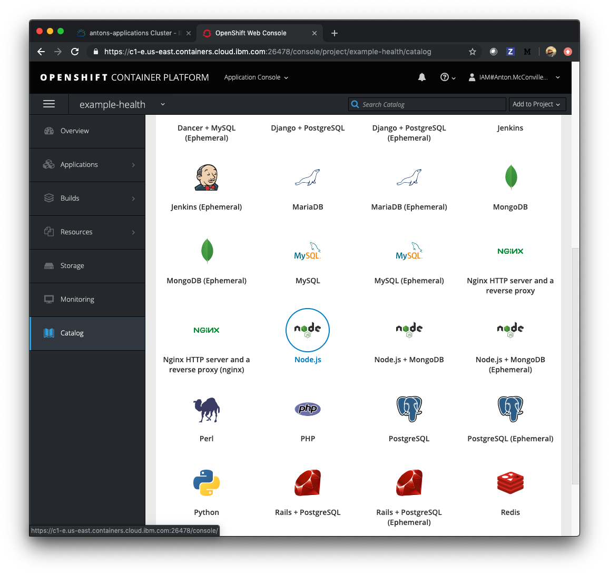
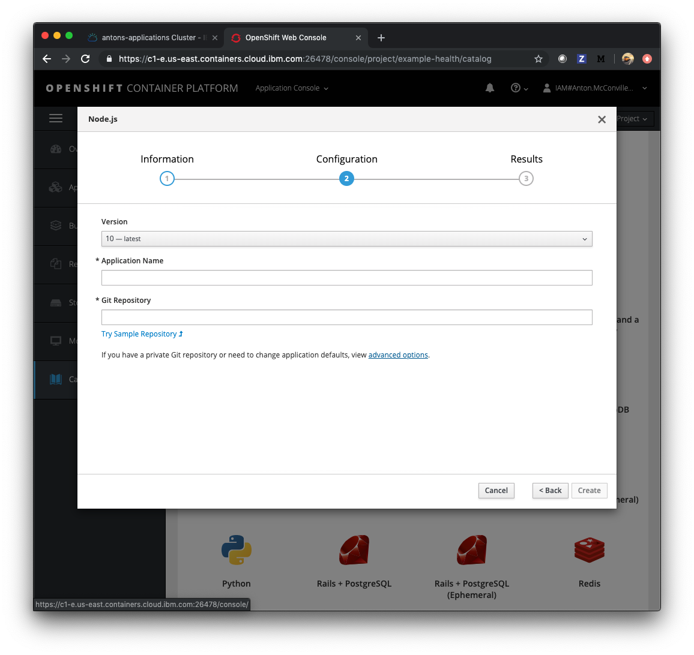
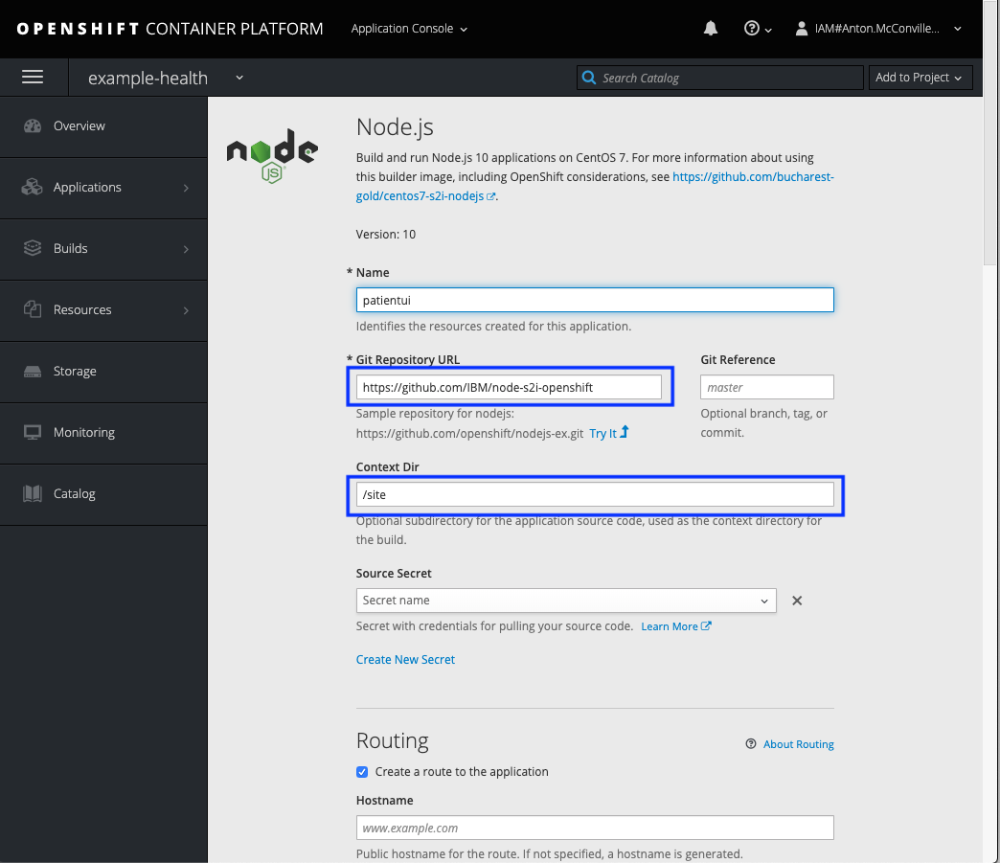
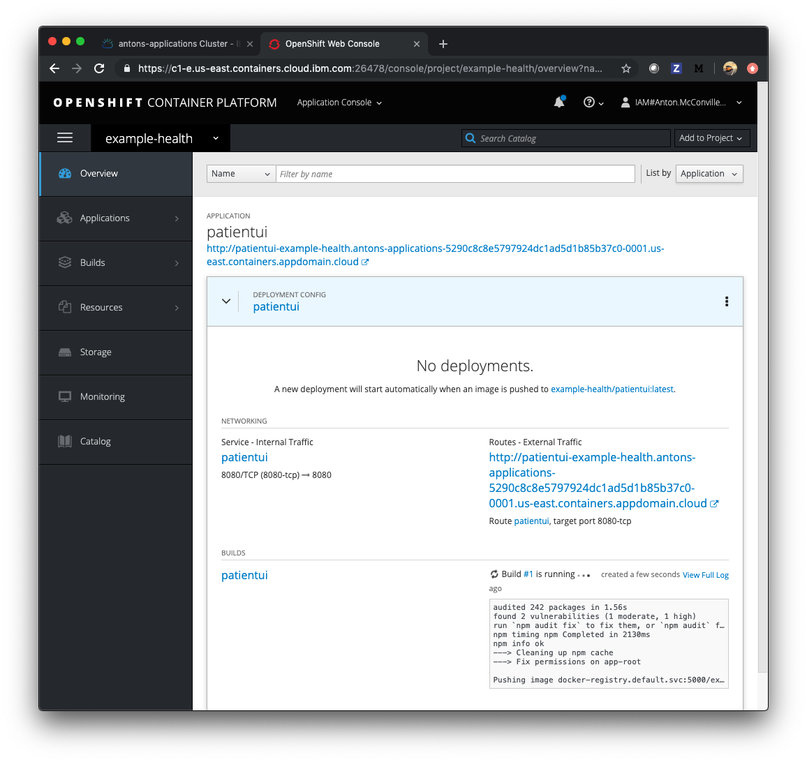

# Exercise 1: Using OpenShift

In this exercise, you'll deploy a simple Node.js Express application - "Example Health". Example Health is a simple UI for a patient health records system. We'll use this example to demonstrate key OpenShift features throughout this workshop. You can find the sample application GitHub repository here: [https://github.com/IBM/node-s2i-openshift](https://github.com/IBM/node-s2i-openshift)

## Deploy Example Health

<!-- Mofi: Put a screen shot here showing off the Dashboard per the cluster -->

Access your cluster on the [IBM Cloud clusters dashboard](https://cloud.ibm.com/kubernetes/clusters). Click the `OpenShift web console` button on the top-right. (This is a pop-up so you'll need to white list this site.)

Create a project, you can title it whatever you like, we suggest "example-health."

Click on your new project. You should see a view that looks like this:

Click on the browse catalog button and scroll down to the `Node.js` image. Click on that catalog button.

Click through to the second step for configuration, and choose `advanced options`. \( a blue hyperlink on the bottom line \)

<!-- Mofi: to add a box around the image -->

You'll see an advanced form like this:

Enter the repository: `https://github.com/IBM/node-s2i-openshift` and `/site` for the 'Context Dir'. Click 'Create' at the bottom of the window to build and deploy the application.

Scroll through to watch the build deploying:

When the build has deployed, click the 'External Traffic Route', and you should see the login screen like the following:

You can enter any strings for username and password, for instance `test:test` because the app is running in demo mode.

Congrats! You've deployed a `Node.js` app to Kubernetes using OpenShift Source-to-Image (S2I).

## Understanding What Happened

[S2I](https://docs.openshift.com/container-platform/3.6/architecture/core_concepts/builds_and_image_streams.html#source-build) is a framework that creates container images from source code, then runs the assembled images as a containers. It allows developers to build reproducible images easily, letting them spend time on what matters most, developing their code!

## [Continue to Exercise 2](exercise-2/README.md)
