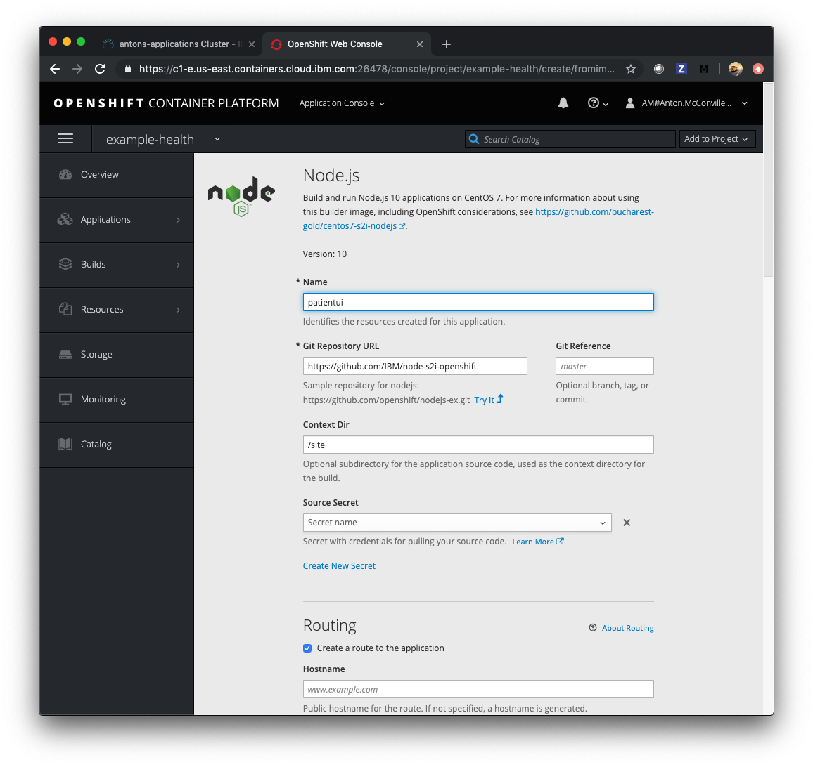
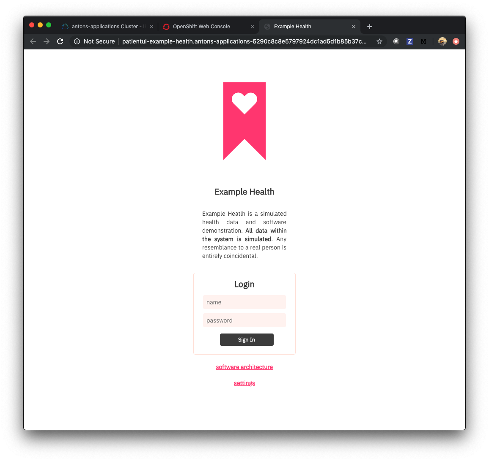
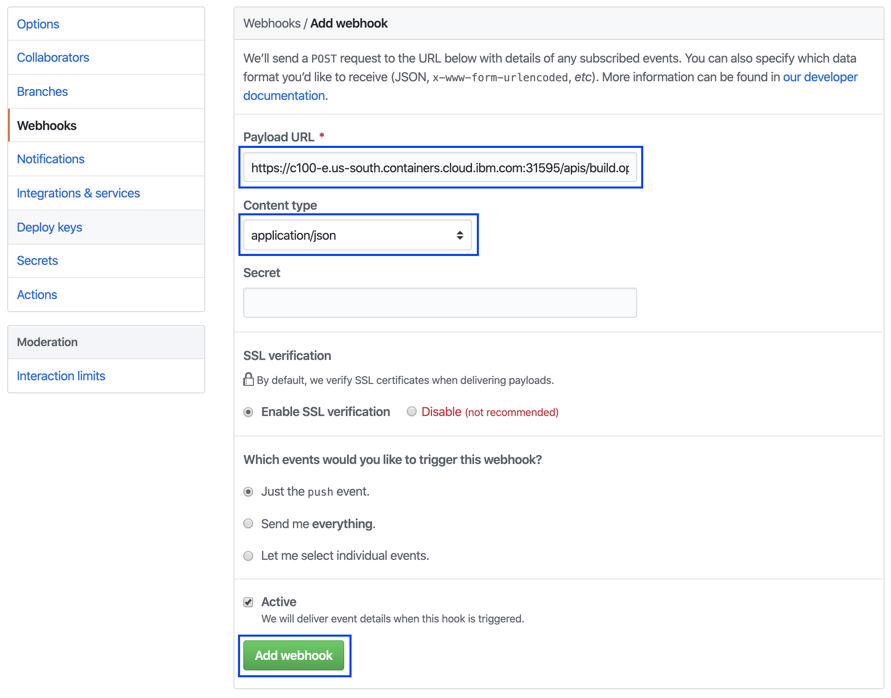

# Exercise 1: Using OpenShift

In this exercise, you'll deploy a simple Node.js Express application - "Example Health". Example Health is a simple UI for a patient health records system. We'll use this example to demonstrate key OpenShift features throughout this workshop. You can find the sample application GitHub repository here: [https://github.com/IBM/node-s2i-openshift](https://github.com/IBM/node-s2i-openshift)

## Deploy Example Health

Access your cluster on the [IBM Cloud clusters dashboard](https://cloud.ibm.com/kubernetes/clusters). Click the `OpenShift web console` button on the top-right. (This is a pop-up so you'll need to white list this site.)

Create a project, you can title it whatever you like, we suggest "example-health."


Click on your new project. You should see a view that looks like this:


Click on the browse catalog button and scroll down to the `Node.js` image. Click on that catalog button.


Click through to the second step for configuration, and choose `advanced options`. \( a blue hyperlink on the bottom line \)


You'll see an advanced form like this:



Enter the repository: `https://github.com/IBM/node-s2i-openshift` and `/site` for the 'Context Dir'. Click 'Create' at the bottom of the window to build and deploy the application.

Scroll through to watch the build deploying:


When the build has deployed, click the 'External Traffic Route', and you should see the login screen like the following:



You can enter any strings for username and password, for instance `test:test` because the app is running in demo mode.

Congrats! You've deployed a `Node.js` app to Kubernetes using OpenShift Source-to-Image (S2I).

## Understanding What Happened

[S2I](https://docs.openshift.com/container-platform/3.6/architecture/core_concepts/builds_and_image_streams.html#source-build) is a framework that creates container images from source code, then runs the assembled images as containers. It allows developers to build reproducible images easily, letting them spend time on what matters most, developing their code!

## Git Webhooks

So far we have been doing alot of manual deployment. In cloud-native world we want to move away from manual work and move toward automation. Wouldn't it be nice if our application rebuilt on git push events? Git webhooks are the way its done and openshift comes bundled in with git webhooks. Let's set it up for our project.

To be able to setup git webhooks, we need to have elevated permission to the project. We don't own the repo we have been using so far. But since its opensource we can easily fork it and make it our own.

Fork the repo at [https://github.com/IBM/node-s2i-openshift](https://github.com/IBM/node-s2i-openshift)


Now that I have forked the repo under my repo I have full admin priviledges. As you can see I now have a settings button that I can change the repo settings with.


We will come back to this page in a moment. Lets change our git source to our repo.

From our openshift dashboard for our project. Select `Builds > Builds`


Select the patientui build. As of now this should be the only build on screen.


Click on `Action` on the right and then select `Edit`


Change the `Git Repository URL` to our forked repository.

Click Save in the bottom.


You will see this will not result in a new build. If you want to start a manual build you can do so by clicking `Start Build`. We will skip this for now and move on to the webhook part.

Click on `Configuration` tab.

Copy the GitHub Webook URL.

The webhook is in the structure

```text
https://c100-e.us-east.containers.cloud.ibm.com:31305/apis/build.openshift.io/v1/namespaces/example-health/buildconfigs/patientui/webhooks/<secret>/github
```

Make note of the secret. (Its the Alpha-Numeric string between `webhooks` and `github`) We will need it in the next step.


> There is also the generic webhook url. This also works for github. But the github webhook captures some additional data from github and is more specific. But if we were using some other git repo like bitbucket or gitlab we would use the generic one.

In our github repo go to `Setting > Webhooks`. Then click `Add Webhook`


In the Add Webhook page fill in the `Payload URL` with the url copied earlier from the build configuration. Change the `Content type` to `application/json` and fill in the secret.

Right now just the push event is being sent which is fine for our use.

Click on `Add webhook`



If the webhook is reachable by github you will see a green check mark.

Back in our openshift console we still would only see one build however. Because we added a webhook that sends us push events and we have no push event happening. Lets make one. The easiest way to do it is probably from the Github UI. Lets change some text in the login page.

Path to this file is `site/public/login.html` from the root of the directory. On Github you can edit any file by clicking the Pencil icon on the top right corner.


Let's change the name our application to `Demo Health` (Line 21, Line 22). Feel free to make any other UI changes you feel like.


Once done go to the bottom and click `commit changes`.

Go to the openshift build page again. This happens quite fast so you might not see the running state. But the moment we made that commit a build was kicked off.


In a moment it will show completed. Navigate to the overview page to find the route.


> You could also go to `Applications > Routes` to find the route for the application.

If you go to your new route you will see your change.


