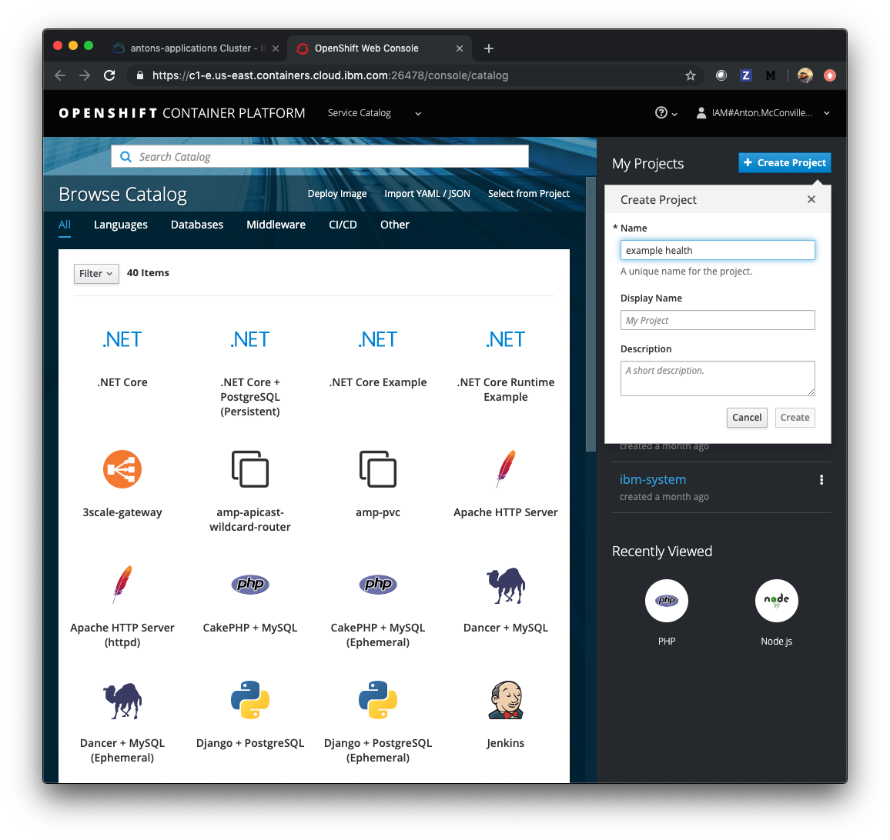
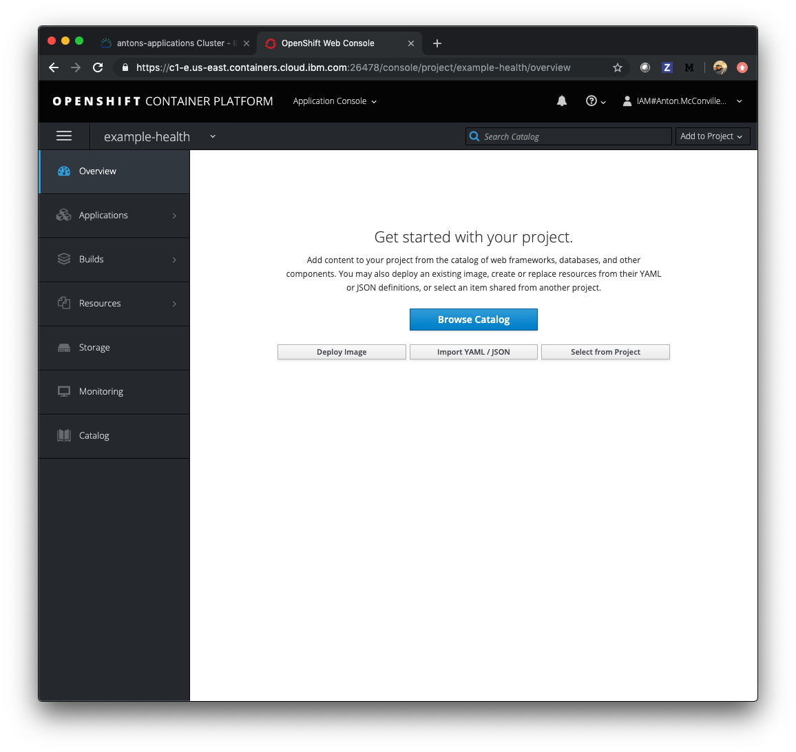
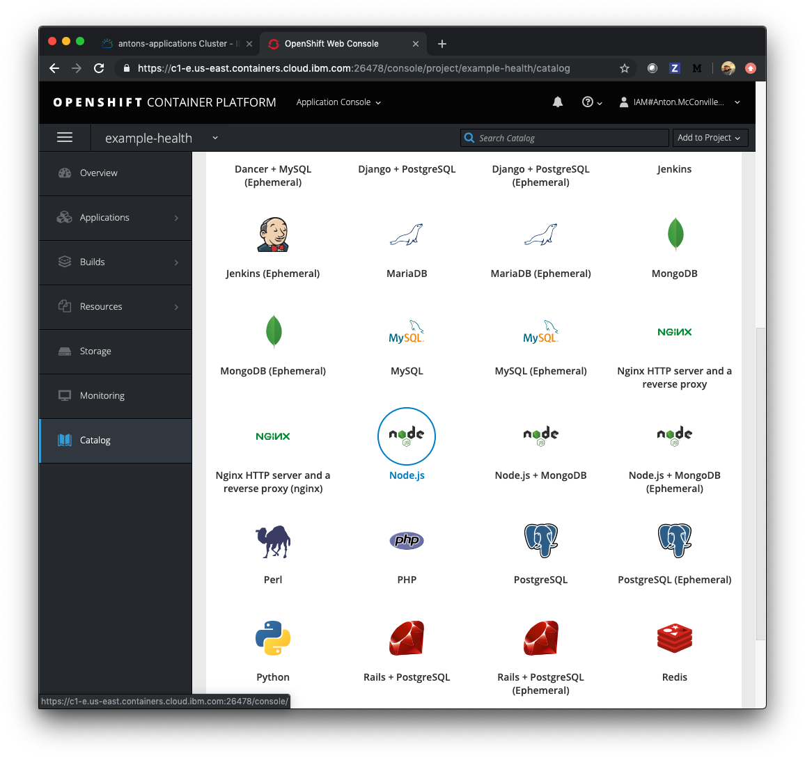
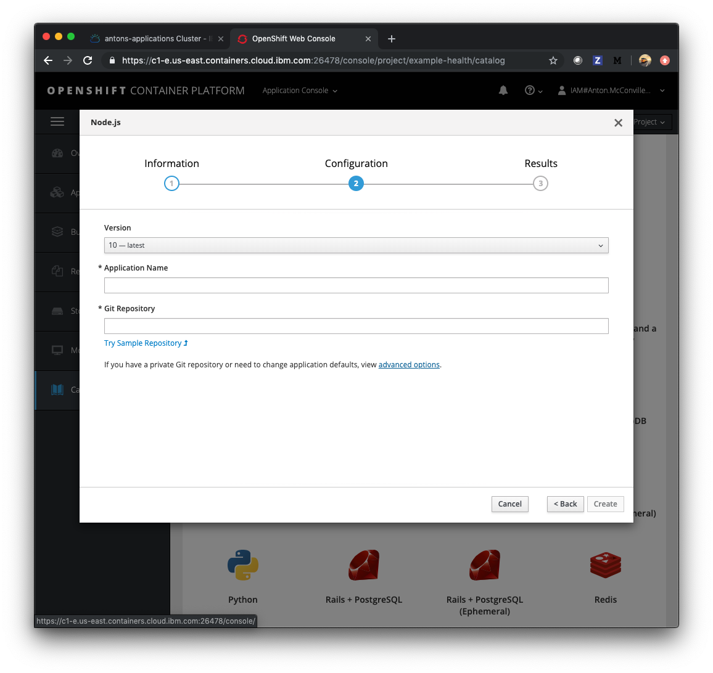
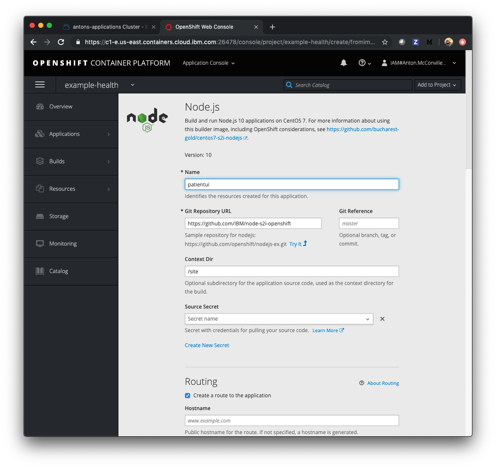
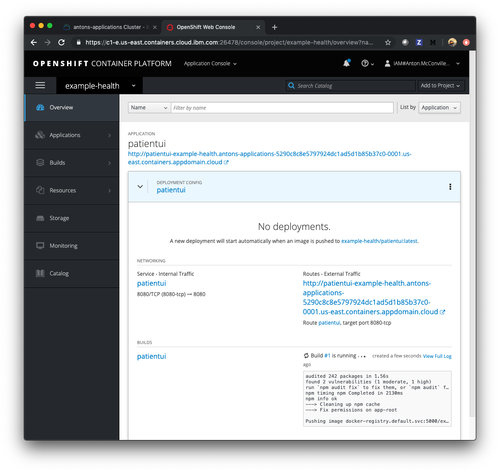
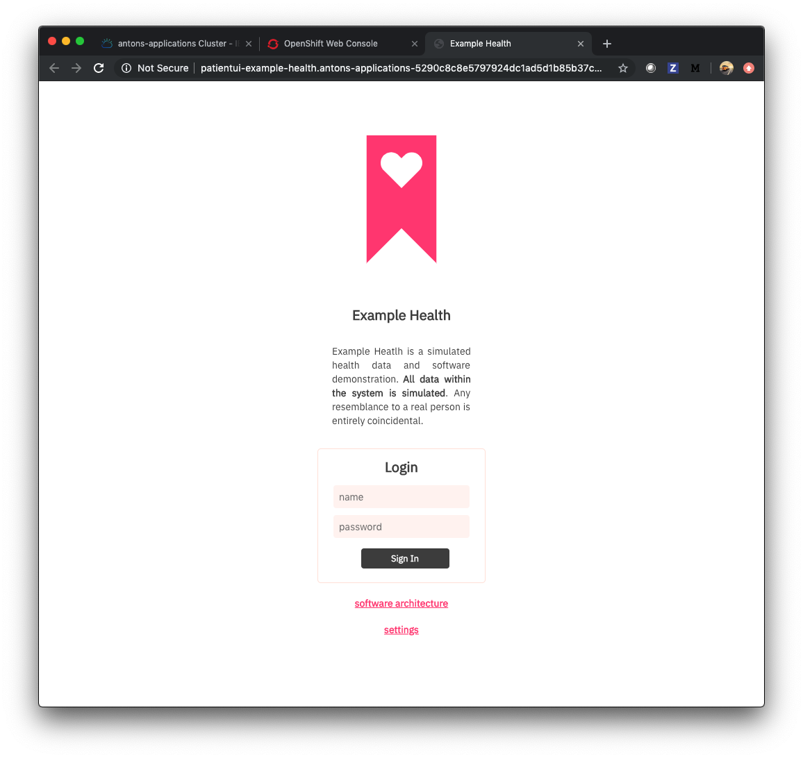

# Exercise 2 - Create a Sample Node.js Application

In this exercise, you'll deploy a simple Node.js Express application - "Example Health". Example health is a simple UI for a patient health records system. We'll use this example to demonstrate key OpenShift features throughout this workshop. You can find the sample application GitHub repository here: [https://github.com/IBM/node-s2i-openshift](https://github.com/IBM/node-s2i-openshift)

## Deploy Example Health

1. Open the Web Console

    Connect to the OpenShift web console. You can find the URL in two ways:

    a. Get the Master URL for your cluster from the `ibmcloud` utility and append `/console` to the URL.

    ```shell
    ibmcloud ks cluster get $MYCLUSTER  | grep 'Master URL'
    ```

    b. Access your cluster on the [IBM Cloud clusters dashboard](https://cloud.ibm.com/kubernetes/clusters). Click the `OpenShift web console` button on the top-right.

1. Create an OpenShift Project

    Go to the Web Console for your OpenShift cluster and create a project:

    

    Click on your new project. You should see a view that looks like this:

    

    Click on the browse catalog button to see the images available to build with and scroll down to the Node image. Click on the 'Node.js' icon.

    

    Click through to the second step for configuration, and choose advanced options ( a hyperlink on the bottom line )

    

    You'll see and advanced form like this:

    

    Enter the repository: `https://github.com/IBM/node-s2i-openshift` and `/site` for the Context Dir. Click 'Create' at the bottom of the window to build and deploy the application.

    Scroll through to watch the build deploying:

    

    When the build has deployed, click the External Traffic Route, and you should see the login screen:

    

    You can enter any strings for username and password, for instance test/test ... because the app is just running in demo mode.

    And you've deployed a node app to kubernetes using OpenShift S2I.

## Understanding What Happened

TODO: Explain OpenShift S2I

### [Continue to Exercise 3 - Scaling the App](../exercise-3/README.md)
