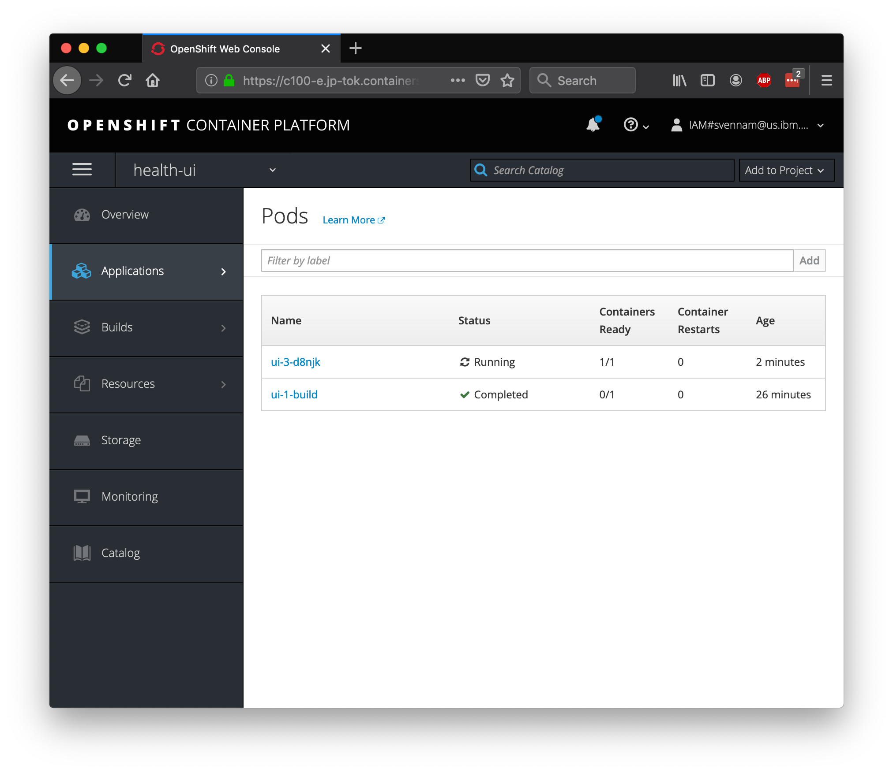
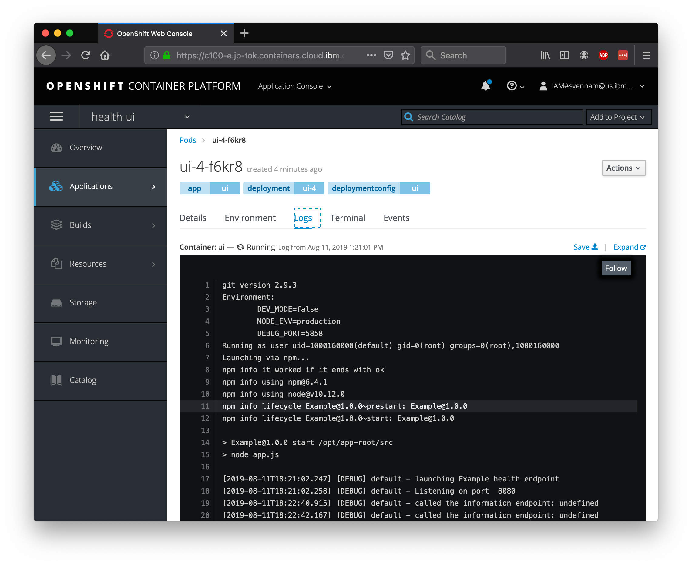
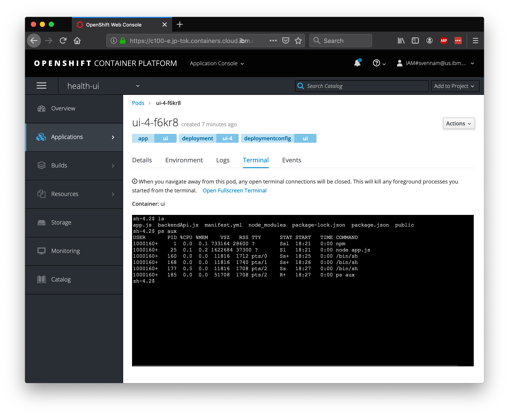
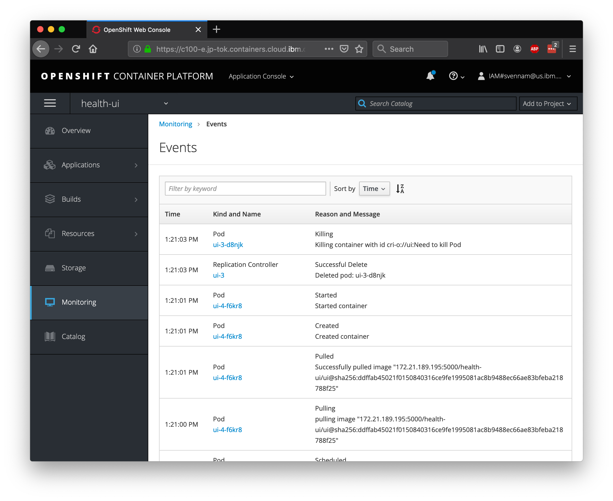

# Exercise 2: Logging and monitoring

In this exercise, we'll explore the out-of-the-box logging and monitoring capabilities that are offered in OpenShift.

## Simulate Load on the Application

First, let's simulate some load on our application. Run the following script which will endlessly spam our app with requests:

> With Linux/MacOS
```bash
while sleep 1; do curl -s <your_app_route>/info; done
```

> With Windows
```bash
while($true){curl <your_app_route>/info}
```


Note: Retrieve the external URL from the OpenShift console, or from the URL of your Example Health application. Note that there may be an `/index.html` at the end that you need to replace with `/info`. We're hitting the /info endpoint which will trigger some logs from our app. For example:

[`http://patientui-health-example.myopenshift-xxx.us-east.containers.appdomain.cloud/info`](http://patientui-health-example.myopenshift-341665-66631af3eb2bd8030c5bb56d415b8851-0001.us-east.containers.appdomain.cloud/jee.html)


## OpenShift Logging

Since we only created one pod, seeing our logs will be straight forward. Navigate to `Applications > Pods` menu on the left on the console. You'll see two pods here, one for the build \(that's already :heavy_check_mark: Completed\), and one for the pod that is running your application.



Click into the `Running` pod and navigate to the `Logs` tab. You should see the Node.js application start-up logs, as well as periodic logs from your curl loop.



## OpenShift Terminal

One of the great things about Kubernetes is the ability to quickly debug your application pods with SSH terminals. This is great for development, but generally is not recommended in production environments. OpenShift makes it even easier by allowing you to launch a terminal directly in the dashboard.

Switch to the `Terminal` tab, and run the following commands.

```bash
# This command shows you the the project files.
ls
```

```bash
# This command shows you the running processes.
ps aux
```



## OpenShift Monitoring

When deploying new apps, making configuration changes, or simply inspecting the state of your cluster, the OpenShift monitoring dashboard gives you an overview of your running assets. Access the Dashboard now by going to the `Monitoring` tab on the left side menu.

You can also dive in a bit deeper - the `Events` view is very useful for identifying the timeline of events and finding potential error messages. Hit the 'View Details' button on the top right.



You'll want to refer to this view throughout the lab. Almost all actions we take in in OpenShift will result in an event being fired in this view. As it is updated real-time, it's a great way to track changes to state.
