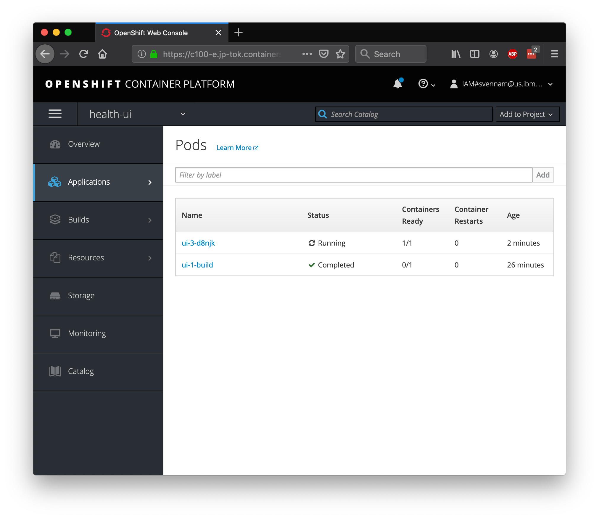
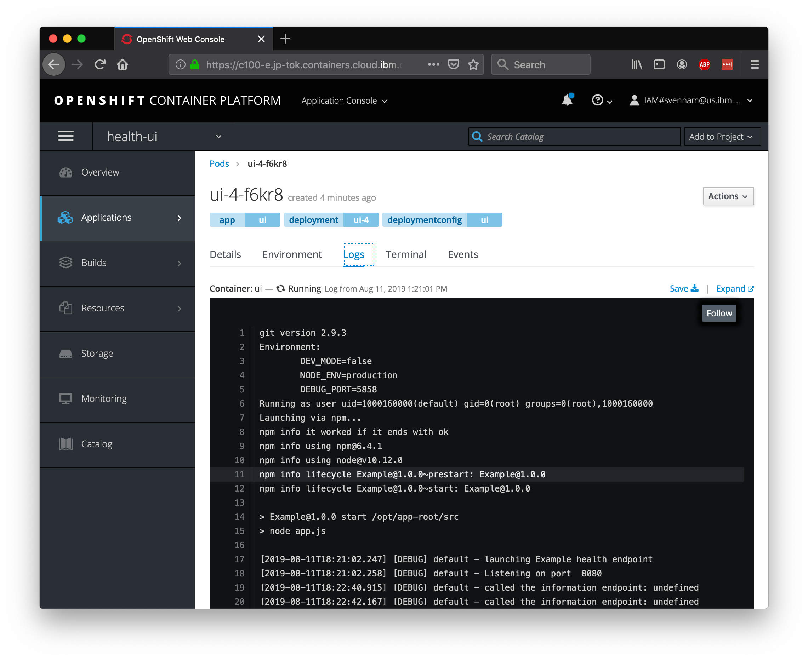
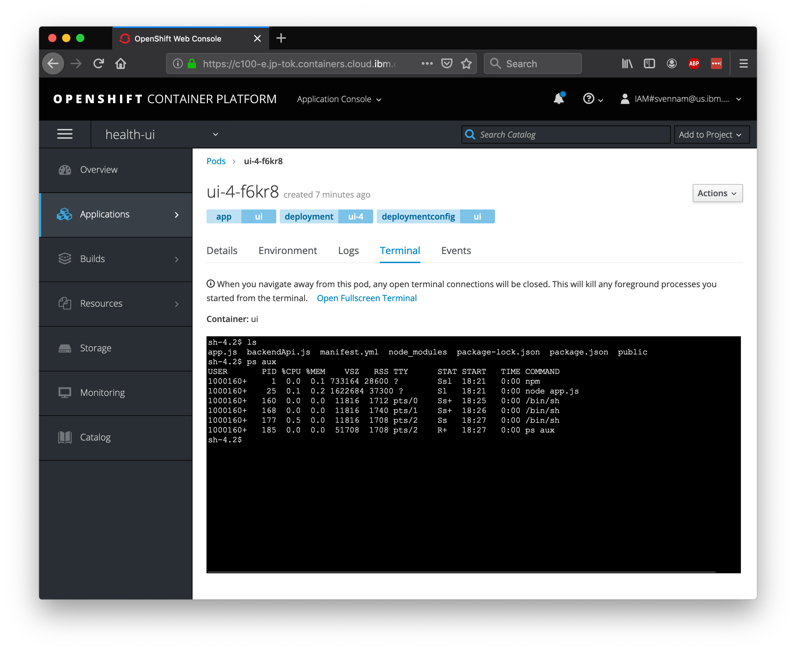
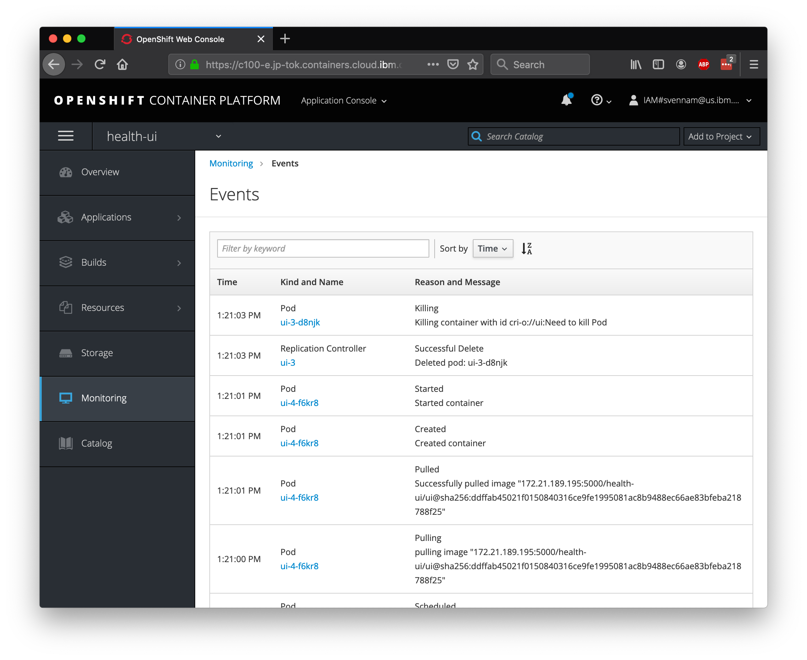
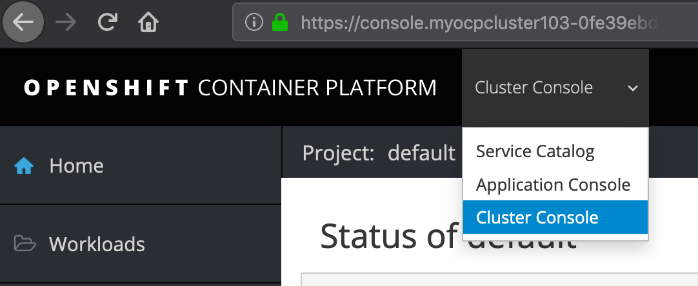
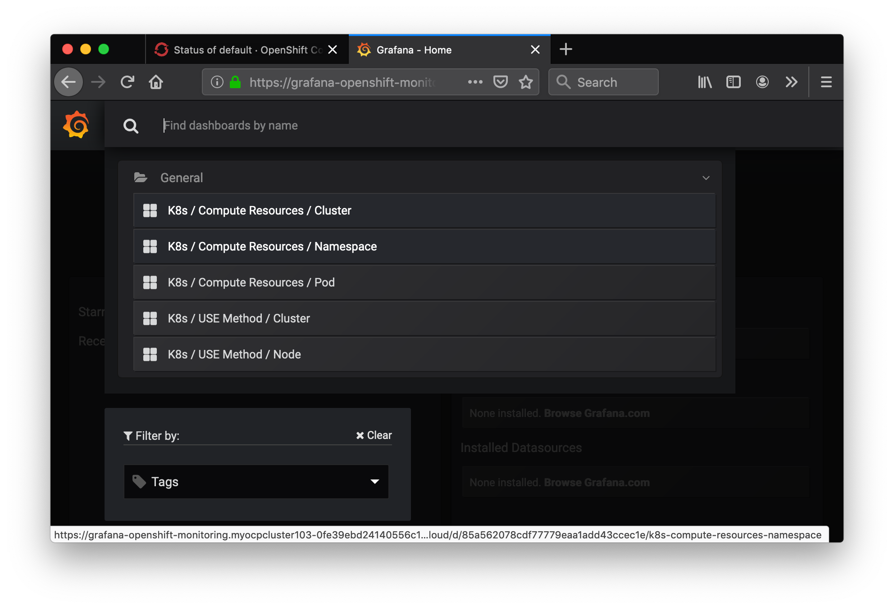
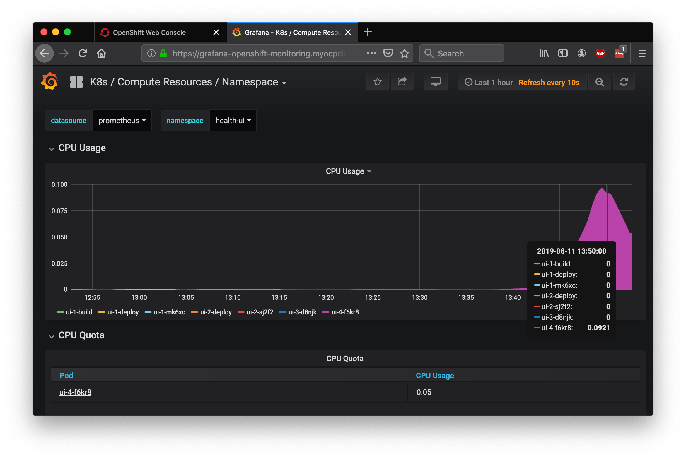

# Exercise 3 - Basic Logging and Monitoring

In this exercise, we'll explore the out-of-the-box logging and monitoring capabilities that are offered in OpenShift.

## Simulate Load on the Application

First, let's simulate some load on our application. Run the following script which will endlessly spam our app with requests:

```shell
while sleep 1; do curl -s <your_app_route>/info; done
```

> Note: We're hitting the /info endpoint will trigger some logs from our app.

## OpenShift Logging

Since we only created one pod, seeing our logs will be straight forward. Navigate to `Applications > Pods`. You'll see two pods here, one for the build (that's already completed), and one for the pod that is running your application.



Click into the `Running` pod and navigate to the `Logs` tab. You should see the Node.js application start-up logs, as well as periodic logs from your curl loop.



## OpenShift Terminal

One of the great things about Kuberentes is the ability to quickly deubg your application pods with SSH terminals. This is great for development, but generally is not recommended in production environments. OpenShift makes it even easier by allowing you to launch a terminal directly in the dashboard.

Switch to the `Terminal` tab, and run the following commands.

```shell
# See the project files
$ ls
# See the running processes
$ ps aux
```



## OpenShift Monitoring

When deploying new apps, making configuration changes, or simply inspecting the state of your cluster, the OpenShift monitoring dashboard gives you an overview of your running assets. Access the Dashboard now by going to the `Monitoring` tab.

You can also dive in a bit deeper - the `Events` view is very useful for identifying the timeline of events and finding potential error messages. Hit the "View Details" button on the top right.



## Grafana

Red Hat OpenShift on IBM Cloud comes with Grafana (and other monitoring dashboards) preinstalled. Go to the `Cluster Console` view:



Then Navigate to `Monitoring > Dashboards` in the left-hand bar. You'll be asked to login with OpenShift and then click through some permissions.

You should then see your Grafana dashboard. Hit `Home` on the top left, and choose `K8s / Compute Resources / Namespace`.



Choose the name of the project you created in `Exercise 2` - the same one that your application is running inside.

You should be able to see the CPU and Memory usage for your application. In production environments, this is helpful for identifying the average amount of CPU or Memory your application uses, especially at certain times of day. We'll use this information in a later exercise, to set up auto-scaling for our pods.



### [Continue to Exercise 4](../exercise-4/README.md)
