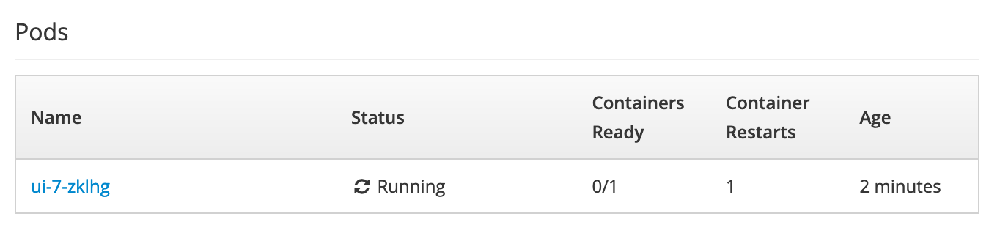
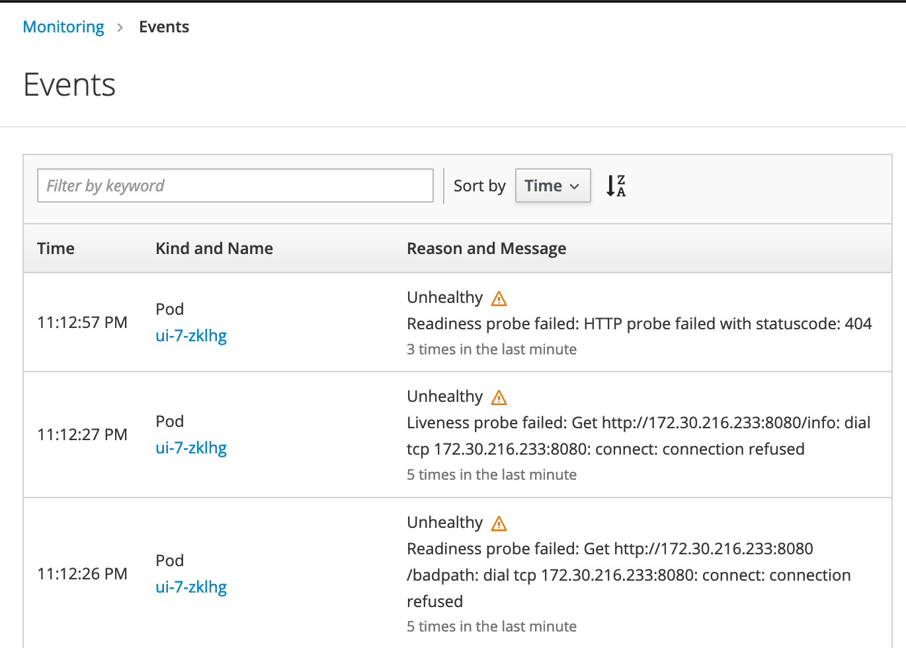

# Exercise 5: Liveness and Readiness Probes

In Kubernetes, liveness and readiness probes are essential for smoothly running applications.
A probe is generally a REST `GET` call, but there are other types of probes available.
Liveness probes are used to determine when to restart a container. For example, an
application that is unhealthy and no longer responding to an API call would be
restarted by OpenShift. Readiness probes determine when a container is ready to
start receiving traffic. If a readiness probe fails, then the load balancer
would deregister that service.

## Create Readiness and Liveness Probes

The `/info` endpoint on the Example Health application is a great way to check
whether the application is running and responding to API calls -- it responds
with a simple JSON payload.

Navigate to your deployment and choose `Actions > Edit Health Checks`.

Add a readiness probe:

Add a liveness probe:

Click Save.

If all works, everything should be the same. Let's check that the probes are really working though.

## Inject Failure

Let's edit the probe with a typo to see what happens when it fails. Edit the health check and change the path for the readiness probe to `/badpath`. Wait a few minutes and check your deployment - you'll notice that `0/1` containers are ready:

Dive into your events and you'll see that the probe is failing, causing the platform to try and repeatedly restart your pod.

Using health checks gives your OpenShift service layer better reliability and helps you start with a strong foundation.

## You're done! What's next?

Congratulations on completing the lab!
