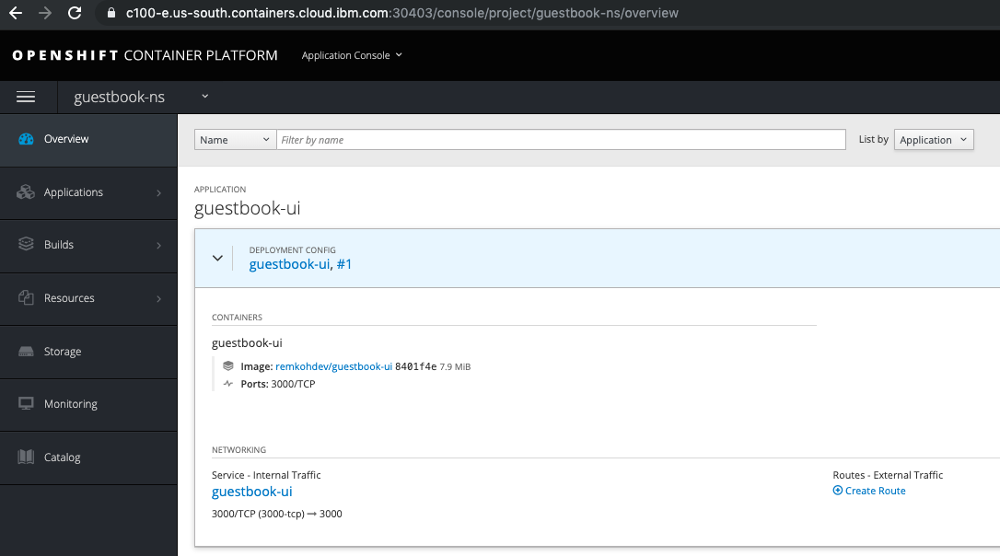
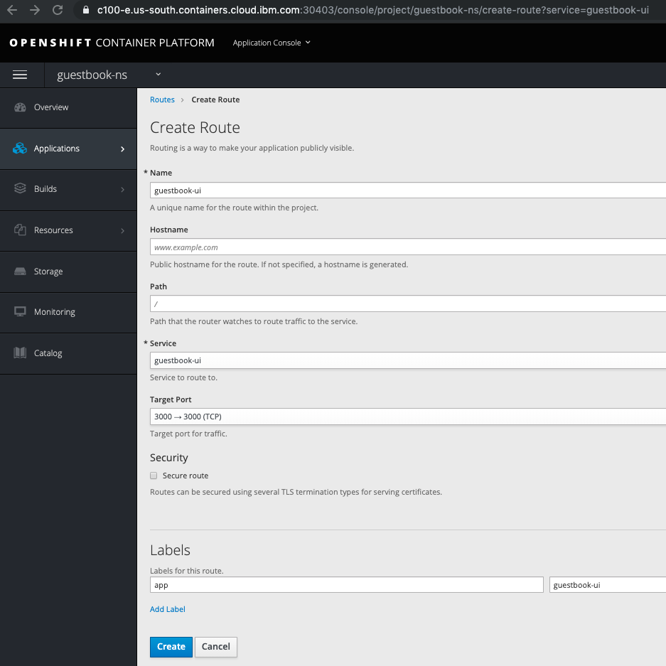
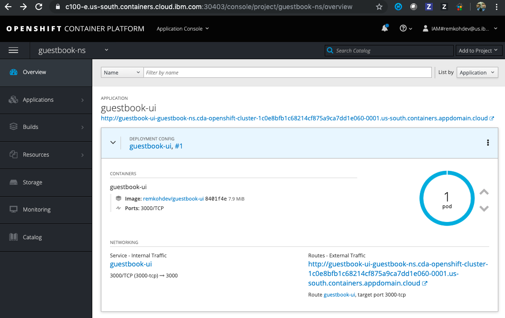
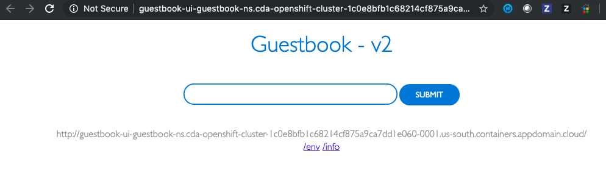

# Exercise 6: Deploying the Guestbook App from CLI

1. Get the source code for the Guestbook app

	* Clone the repo to your localhost,
		```console
		$ git clone https://github.com/IBM/guestbook.git
		Cloning into 'guestbook'...
		remote: Enumerating objects: 40, done.
		remote: Counting objects: 100% (40/40), done.
		remote: Compressing objects: 100% (37/37), done.
		remote: Total 448 (delta 17), reused 11 (delta 3), pack-reused 408
		Receiving objects: 100% (448/448), 207.94 KiB | 2.21 MiB/s, done.
		Resolving deltas: 100% (256/256), done.
		```
	
	* Run the Guestbook app on your localhost to make sure it's running correctly,
		```console
		$ cd guestbook/v2/guestbook
		$ docker build --no-cache -t guestbook-ui .
		$ docker run -d --restart always --name guestbook-ui -p 3000:3000 guestbook-ui
		$ open http://localhost:3000/
		```

2. Build and Push the Image to your public Docker Hub Registry.

	* Make sure to change the <username> by the username of your Docker Hub account,

	```bash
	$ docker build --no-cache -t guestbook-ui .
	$ docker tag guestbook-ui:latest <username>/guestbook-ui:1.0.0
	$ docker login -u <username>
	$ docker push <username>/guestbook-ui:1.0.0
	```

3. Login to the Remote OpenShift Cluster

	* Login to the OpenShift cluster web console,
	* From the logged in user drop down in the top right of the web console, select `Copy Login Command`,
	* The login command will be copied to the clipboard,
	* In your terminal, paste the login command, e.g.

		```console
		$ oc login https://c100-e.us-south.containers.cloud.ibm.com:30403 --token=jWX7a04tRgpdhW_iofWuHqb_Ygp8fFsUkRjOK7_QyFQ
		```

4. Create a new Project

	* Create a new project `guestbook-ns`,

		```console
		$ oc new-project guestbook-ns
		Now using project "guestbook-ns" on server "https://c100-e.us-south.containers.cloud.ibm.com:30403".

		You can add applications to this project with the 'new-app' command. For example, try:

			oc new-app centos/ruby-25-centos7~https://github.com/sclorg/ruby-ex.git

		to build a new example application in Ruby.
		```

	* Use the `guestbook-ns` project,

		```console
		$ oc project guestbook-ns
		$ oc project
		Using project "guestbook-ns" on server "https://c100-e.us-south.containers.cloud.ibm.com:30403".
		```
   
5. Deploy the Guestbook App using the Docker image,

	* Create the application, and replace <username> by the username of your Docker Hub account,
  	
		```console
		$ oc new-app <username>/guestbook-ui:1.0.0
		--> Found Docker image 8476dc8 (16 minutes old) from Docker Hub for "<username>/guestbook-ui:1.0.0"

			* An image stream tag will be created as "guestbook-ui:1.0.0" that will track this image
			* This image will be deployed in deployment config "guestbook-ui"
			* Port 3000/tcp will be load balanced by service "guestbook-ui"
			* Other containers can access this service through the hostname "guestbook-ui"
			* WARNING: Image "<username>/guestbook-ui:1.0.0" runs as the 'root' user which may not be permitted by your cluster administrator

		--> Creating resources ...
			imagestream.image.openshift.io "guestbook-ui" created
			deploymentconfig.apps.openshift.io "guestbook-ui" created
			service "guestbook-ui" created
		--> Success
			Application is not exposed. You can expose services to the outside world by executing one or more of the commands below:
			'oc expose svc/guestbook-ui' 
			Run 'oc status' to view your app.
		```

	* This will create a Deployment, a Pod, and a Service resource for the Guestbook app,

6. Create a Route

	* The last thing to do is to add a route. By default, services are not publically available on OpenShift. A route will make the service publically available to external traffic.

	* Go to `My Projects` via URI `/console/projects`,

		

	* Select the project `guestbook-ns`, unfold the `guestbook-ui` application details,

		

	* Under the `NETWORKING` section, click the `Create Route` link,

		

  	* Accept the default, and click the `Create` button,

		

	* To view the Guestbook app running on OpenShift, click the `Routes - External Traffic` link, e.g. http://guestbook-ui-guestbook-ns.cda-openshift-cluster-1c0e8bfb1c68214cf875a9ca7dd1e060-0001.us-south.containers.appdomain.cloud

		