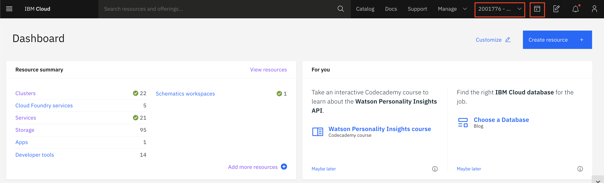
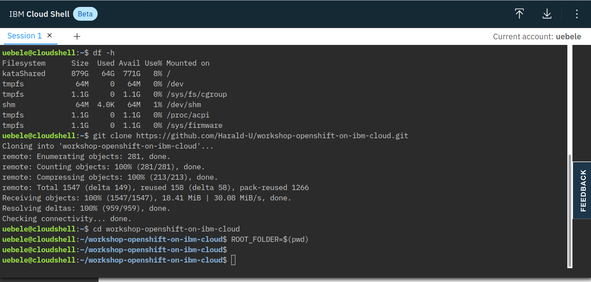

# The IBM Cloud Shell: Using the CLI

For this workshop we'll be using the IBM Cloud Shell. The IBM Cloud Shell is a cloud-based shell workspace that you can access through your browser. It's preconfigured with the full IBM Cloud CLI and tons of plug-ins, and other 3rd party CLIs like OpenShift's `oc`, Helm's `helm` and Kubernetes' `kubectl`.

> Refer to the **[SETUP_CLI](SETUP_CLI.md)** section if you wish to install these CLIs on your local machine.

## Accessing the IBM Cloud Shell

From the IBM Cloud console, click the IBM Cloud Shell icon. A session will start and automatically log you in through the IBM Cloud CLI.

> **NOTE** Make sure you've selected the right account in the account list

From here, you can access pre-installed CLIs like `git`, `kubectl`, and many others.

