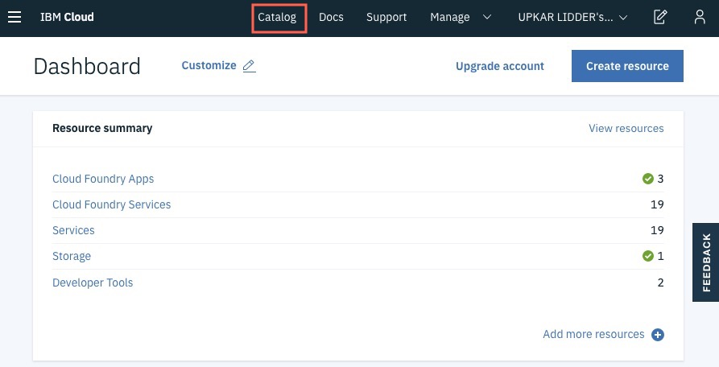
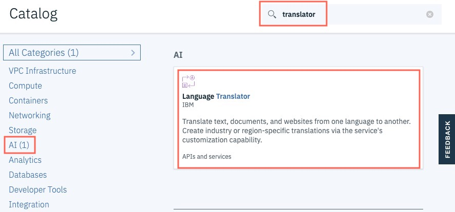
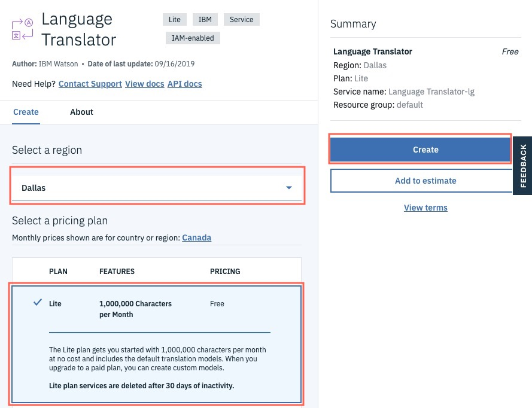
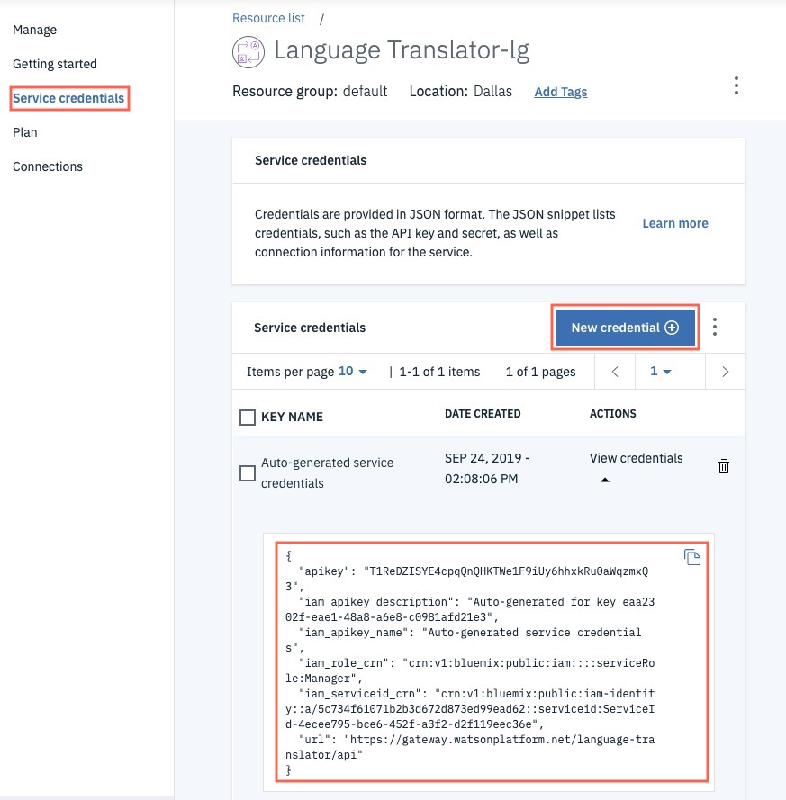

# Exercise 7 - Using Docker Images

This Lab will help you understand basics of Docker technology, you will build, ship, and run a container image.

This workshop is an introduction to Docker, which is a runtime for containers. You will create a containerized Node.js application that provides a service to translate phrases from one language to another. The application uses the IBM Watson in IBM Language Translation service.‌

## Docker

For this Lab you will use Docker.



Docker container technology separates applications from the underlying Operating System and infrastructure, which is an analog to VM technology that is separating an operating systems from the bare metal - server hardware.


Docker technology virtualizes the Operating System (OS), and thanks to it only the application, and specific dependencies like libraries and binaries are being packaged in the image.

Starting such an image is much faster omitting start of an OS. In addition the image now is very portable among various host servers running the Docker engine. And since ther is no OS, there isn't its surface for security vulnerabilities connected to it.

## Steps

The following steps would allow you to create the Watson translation service in the cloud. You will record the API Key to access your service later. You will create a node.js based microservice. This microservice will respond to requests with results of the translations coming from IBM Watson service.

As soon as you are ready with the microservice you will be able to start Build - Ship - Run containerization process. You will build an image, and push it to a public repository - Docker Hub, and run the containerized microservice.


### Step 1 - Create a language translation service

‌Open your IBM Cloud dashboard using your IBM Cloud account with this URL: <https://cloud.ibm.com>



Search translator to find the service. You can also find the service by navigating to the AI section on the left bar.



Click on the service to create a new instance. Pick the Lite **free of charge** plan on the next page and click Create to finish creating the service.



You will be redirected to the service landing page.

### Step 2 - Copy the credentials to be used later

Click on Service Credentials on the left bar.



If you do not see a credential provided for you, you can create a new set of credentials. Save your apikey somewhere for the next section in this workshop.

**Congratulations!** You created your first Language Translator service. The next steps will show you how to build a Docker container for a Node.js application that provides an end point to translate text!

### Step 3 - Clone a demo repository

Open your local terminal or the web terminal provided in the workshop and change to the /data directory.

```bash
mkdir data
cd data
git clone https://github.com/lidderupk/nodejs-docker.git
```

### Step 4 - Build a docker image

Change into the directory you just cloned and build the docker image

```bash
cd nodejs-docker
docker build -t <docker-username>/node-container .
```

The `docker-username` is required if you want to publish your image to Dockerhub. Replace `<docker-username>` in the above command with your docker account name.


If you do not have a Docker account - you would need to create one directly on hub.docker.com - choose sign up button.


Alternatively, you can also build directly from github using the following command without cloning the repository:

```bash
docker build -t <docker-username>/node-container https://github.com/lidderupk/nodejs-docker.git
```

This command uses the Dockerfile to download a Node.js 10 base image and then install our Express.js application on top. Let's explore the contents of this docker file ...

FROM node:10

... builds our image on top of the Node.js 10 image.

WORKDIR /usr/src/app

... creates a working directory for our application to live in.

COPY package*.json ./

... copies the package.json file to our working directory. RUN npm install ... install our dependencies. We just have two dependencies in this application: express and ibm-watson.

COPY . .

... copy the rest of our source code into the docker image

EXPOSE 8080

... expose port 8080. We will still have to forward our local port to this docker container port later.

CMD [ "node", "server.js" ]

... starts the application by running node server.js.

### Step 5 - Run the docker image

```bash
docker run -p 8080:8080 -e "nlp_key=<api_key>" -d <docker-username>/node-container
```

In my case, I would run

```bash
docker run -p 8080:8080 -e "nlp_key=T1ReDZISYE4cpqQnQHKTWe1F9iUy6hhxkRu0aWqzmxQ3" -d upkar/node-container
```

### Step 6 - Test the application

```bash
curl "localhost:8080/translate?text=how%20are%20you"
```

You should see output as follows:

```json
{
  "translations": [
    {
      "translation": "¿Cómo estás?"
    }
  ],
  "word_count": 3,
  "character_count": 11
}%
```

The text is translated to Spanish (en-sp) by default. You can specify the langauge by passing in the lang flag as follows:

```bash
curl "localhost:8080/translate?text=how%20are%20you?&lang=en-de"
```

You should now see the same text translated to German:

```json
{
  "translations": [
    {
      "translation": "Wie geht es Ihnen?"
    }
  ],
  "word_count": 3,
  "character_count": 12
}
```

Another example...

```bash
curl "localhost:8080/translate?text=People+are+suffering.+People+are+dying+and+dying+ecosystems+are+collapsing.+We+are+in+the+beginning+of+a+mass+extinction%2C+and+all+you+can+talk+about+is+the+money+and+fairy+tales+of+eternal+economic+growth"
```

```json
{
  "translations": [
    {
      "translation": "La gente está sufriendo. La gente está muriendo y los ecosistemas moribundos se están derrumbando. Estamos en el principio de una extinción masiva, y todo lo que se puede hablar es el dinero y los cuentos de hadas del crecimiento económico eterno"
    }
  ],
  "word_count": 39,
  "character_count": 204
}
```

in Polish

```bash
curl "localhost:8080/translate?text=People+are+suffering.+People+are+dying+and+dying+ecosystems+are+collapsing.+We+are+in+the+beginning+of+a+mass+extinction%2C+and+all+you+can+talk+about+is+the+money+and+fairy+tales+of+eternal+economic+growth&lang=en-pl"
```

```json
{
  "translations": [
    {
      "translation": "Ludzie cierpią. Ludzie umierają, a umierające ekosystemy się zapadają. Jesteśmy na początku masowego wyginięcia, a wszystko, o czym można rozmawiać, to pieniądze i bajki o wiecznym wzroście gospodarczym"
    }
  ],
  "word_count": 39,
  "character_count": 204
}
```

You can see the supported languages (both from and to) in the Language Translator documentation.

**Congratulations!** You just containerized a Node.js application that provides transation services.

### Step 7 - Cleaning up

You can first stop the container. You need the container tag or the id to stop it. Let's look it up first

```bash
docker ps | grep node-container

419104eff9be        upkar/node-container                           "docker-entrypoint.s…"   3 minutes ago       Up 3 minutes                       0.0.0.0:8080->8080/tcp                            cranky_davinci
```

In my case, the container is called cranky_davinci and has an id of 419104eff9be.

Stop the image with the following command. You can replace the id with your container id.

```bash
docker container stop 419104eff9be
```

Run the following command to remove the container. Replace the id with your container id identified in the step above.

```bash
docker container rm 419104eff9be
```

### Step 8 - Removing the image

You can now delete the image. You again need the image id.

```bash
$ docker images | grep node-container
upkar/node-container                       latest                         8baa6ca9cdac        5 minutes ago       958MB
```

Now, delete the image as follows.

```bash
$ docker image rm 8baa6ca9cdac
Untagged: upkar/node-container:latest
Deleted: sha256:8baa6ca9cdac8868d8e17642e90b433c7aa588a615b59ac9b528fb8635698a6e
Deleted: sha256:8c279f530b3ff260279f9cb8d22d167d748e53df4f6eab91b089b6c90b4da9f2
Deleted: sha256:9845fb86e05aa69c677dc999b6bbdeceafc460e70604092e0247e0f8880ec93e
Deleted: sha256:84ea0148452752e2aba0a1e1ef963355781a3fb87e485e9a440e8e8fc002d045
Deleted: sha256:f4f99031ae0d1cf0079d9981ef6e8dff2231eff670ac7ea4a4f27472282d7ad2
Deleted: sha256:bf579e37b35bb7b20ed0cb3140220118cbbd1d0564a512f21868568b3683a392
Deleted: sha256:07b958722eb2513e88186b2f6eddadcec0b8772001a598244352073ac5caf176
Deleted: sha256:361c46840912a7b9539b6ddf00164492fc594701085f0e2c9d2c1544bca8498c
```

## Troubleshooting

Check container logs

You can check the logs for your container using

```bash
docker logs <container_id>
```

For example...

```bash
root@terminal-5-846448d675-bk75j:/data# docker logs 4450279a9f50

Running on http://0.0.0.0:8080
No language passed to translate to. Converting to Spanish by default.
{
  "translations": [
    {
      "translation": "Hola"
    }
  ],
  "word_count": 1,
  "character_count": 5
}
```

**Congratulations** again on creating your first docker container that hosts a Natural Language Translation service!
