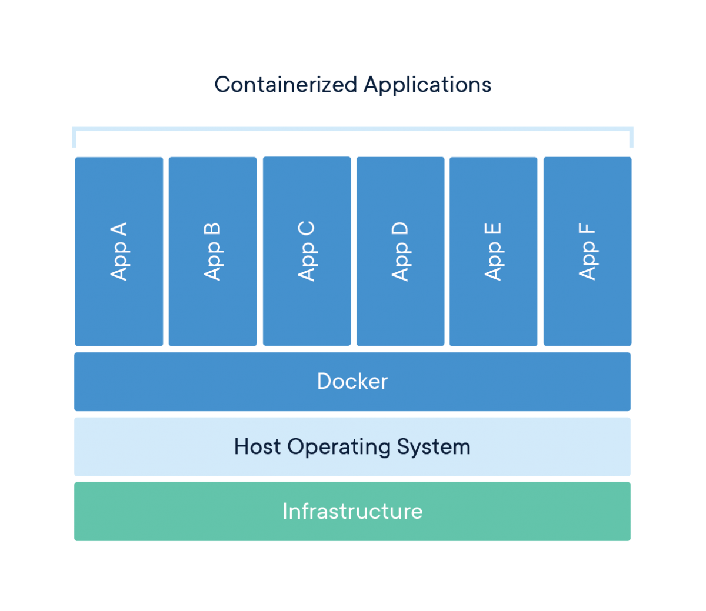
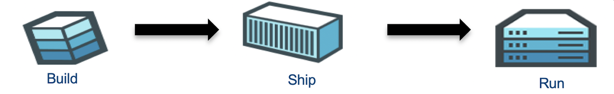
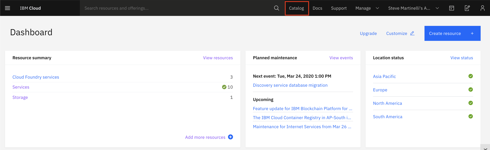
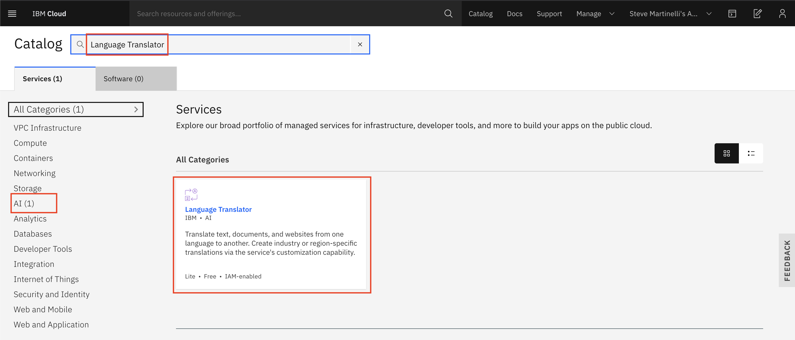
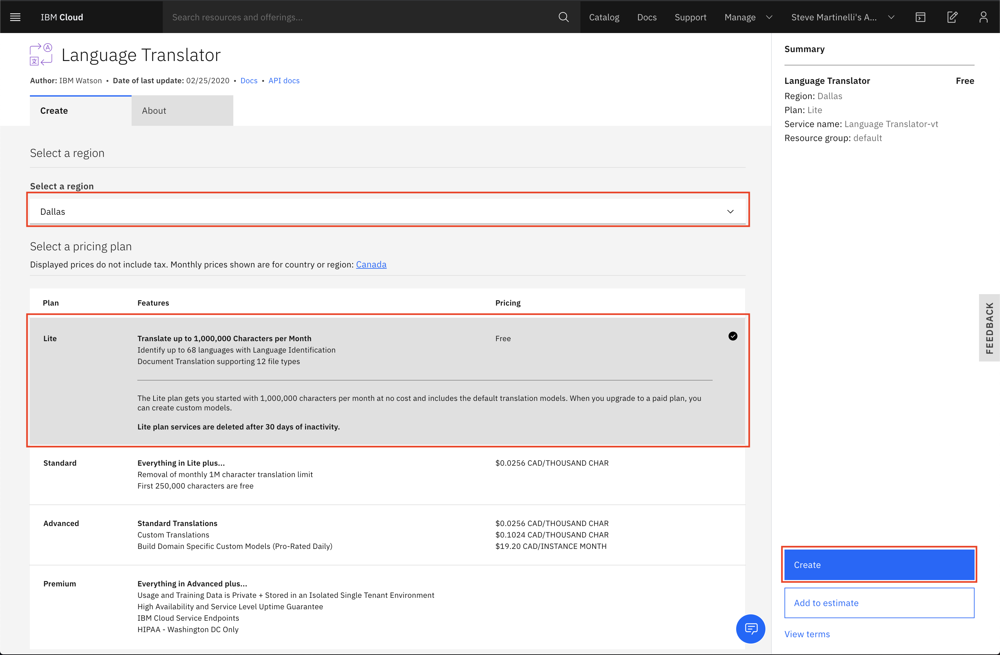
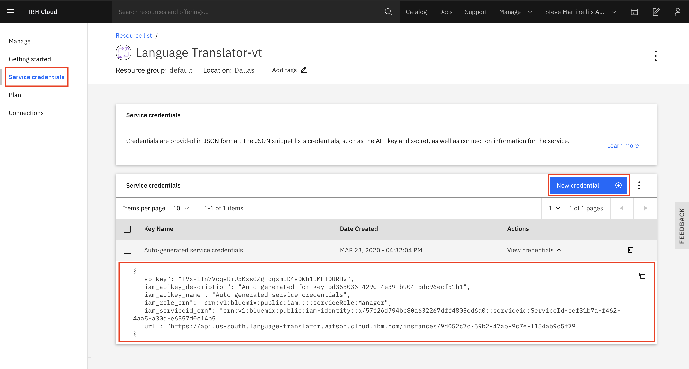

# Docker

To help you understand the basics of Docker technology we have created a tutorial where you will build and run a Node.js application with Docker. The application will translate phrases from one language to another by using Watson's [Language Translator](https://cloud.ibm.com/catalog/services/language-translator) service.




Docker container technology separates applications from the underlying Operating System and infrastructure, which is an analog to VM technology that is separating an operating systems from the bare metal - server hardware.


Docker technology emulates the Operating System (OS), making it possible to containerize only the application and dependencies, like libraries and binaries, by being packaged in an image. Running an image is much faster as now the OS is emulated. In addition, the image is now portable and can be shared between services.

## Creating your first containerized application with Docker

In our tutorial, you'll be given the source code for the sample application, but to make it useful we'll need to provde an API key for the Language Translator service. Once we have have the API key we'll update the source code, containerize the application, run it, and test a few phrases.



Let's get started!

### 0. Install Docker Locally

Navigate to [https://docs.docker.com/get-docker/](https://docs.docker.com/get-docker/) to download and install the lastest version of Docker for your OS of choice. 

### 1. Create a Language Translator service

Navigate to the [IBM Cloud dashboard](https://cloud.ibm.com) and click on "Catalog".



Search for the "Language Translator" service, and click the corresponding tile.



Choose to region and select the "Lite" (free of charge) plan, click the "Create" button.



You will be redirected to the service's overview page.

### 2. Copy the Language Translator API key

From the service's overview page, choose the "Service Credentials" option on the lefthand navigation bar.

A credential containing an API key should be automatically create but if you do not see one, you can create a new credential. Save the API key somewhere for the next section in this workshop.



The next steps will demonstrate on how to build a Dockerized Node.js application that provides an endpoint to translate phrases.

### 3. Clone the source code

Open your local terminal and create a temporary directory to host the source code.

```bash
cd ~
mkdir openshift-workshop
cd openshift-workshop
git clone https://github.com/IBM/node-docker-language-translation
cd node-docker-language-translation
```

### 4. Build the application with Docker

To build the application with Docker run the following:

```bash
docker build . -t translator:v1
```

This command uses the `Dockerfile` in the base directory to download a Node.js 10 base image and install our application on top.

**Let's explore the contents of the Dockerfile ...**

```Dockerfile
FROM node:10
```

... builds our image on top of the official Node.js 10 image.

```Dockerfile
WORKDIR /usr/src/app
```

... creates a working directory for our application to live in.

```Dockerfile
COPY package*.json ./
```

... copies the source's package.json file to our working directory.

```Dockerfile
RUN npm install
```

... installs our dependencies as defined in our `package.json`.

```Dockerfile
COPY . .
```

... copies the rest of our source code into the working directory.

```Dockerfile
EXPOSE 8080
```

... exposes port 8080.

```Dockerfile
CMD [ "node", "server.js" ]
```

... starts the application.

### 5. Run the Docker image

To run our application as a container, issue the following command with your Language Translator API key:

```bash
docker run -p 8080:8080 -e "lt_key=<api_key>" translator:v1
```

For example, here's what I used:

```bash
docker run -p 8080:8080 -e "lt_key=T1ReDZISYE4cpqQnQHKTWe1F9iUy6hhxkRu0aWqzmxQ3" translator:v1
```

### 6. Test the application

```bash
curl "localhost:8080/translate?text=how+are+you"
```

You should the following output:

```json
{
  "translations": [
    {
      "translation": "¿Cómo estás?"
    }
  ],
  "word_count": 3,
  "character_count": 11
}%
```

The text is translated to Spanish by default. You can specify the langauge by passing in other language flags, for example:

```bash
curl "localhost:8080/translate?text=how+are+you?&lang=en-de"
```

You should the following output:

```json
{
  "translations": [
    {
      "translation": "Wie geht es Ihnen?"
    }
  ],
  "word_count": 3,
  "character_count": 12
}
```

in Polish

```bash
curl "localhost:8080/translate?text=Let+us+learn+about+open+technology&lang=en-pl"
```

```json
{
  "translations": [
    {
      "translation": "Dowiedz się więcej o otwartej technologii"
    }
  ],
  "word_count": 6,
  "character_count": 34
}
```

You can see the supported languages (both from and to) in the [Language Translator documentation](https://cloud.ibm.com/docs/services/language-translator?topic=language-translator-translation-models#english).

**Congratulations!** You just containerized a Node.js application that provides transation services.

### 7. Cleaning up

To stop the container you need to first find the container ID, run the following command to find it:

```bash
$ docker ps

CONTAINER ID        IMAGE               COMMAND                  CREATED             STATUS              PORTS                    NAMES
d426e0fac2eb        translator:v1       "docker-entrypoint.s…"   8 minutes ago       Up 8 minutes        0.0.0.0:8080->8080/tcp   strange_northcutt
```

In the example above, the container ID is `d426e0fac2eb`.

Stop the image with the following command, replacing the ID with your own.

```bash
docker container stop d426e0fac2eb
```

Run the following command to remove the container, replacing the ID with your own.

```bash
docker container rm d426e0fac2eb
```

### 8. Removing the image

You can now remove the image by running the following:

```bash
docker image rm translator:v1
```

You should output similar to what is seen below:

```bash
docker image rm translator:v1

Untagged: translator:v1
Deleted: sha256:96afe0ca495e050f1cdabe79969675b3be49f6047525bd0f55061e761b176fed
Deleted: sha256:f9e94a5182f73c90d1ef85d6516e012d5c08bfc5cb2f720862c0a35519aac9b6
Deleted: sha256:e2e85574bc230465e32e61375ec378a2e525042390766f747bf81b2b88e90a99
Deleted: sha256:fcf8c21a74d01e5f40e2ef8cef30237ac806e0f00d0d703499b2d073f3552d16
Deleted: sha256:610798de09748a80456726a693f3ddb019c322b30e144512a15a594a4744d995
Deleted: sha256:896aab822576a1fd8090e7c2586ec4e4d1c1ec680bf370bcfe9390f2c7eebead
Deleted: sha256:0e45a616772f2b2703d6127f27b77d73bec69fdfa1e3cac543d1a17f52e23da8
Deleted: sha256:9b19cb8e4886f8f3c735a549309936de7283b09171ec36ecc6caa498fea2330c
Deleted: sha256:0f00eb5804174d4b42cc70e5e7c412ba52b913d25fd39d66a4b1286486da86d6
Deleted: sha256:2c610224d2f2aeed545ab8dd1377d6cbec5767da84d196e365c21171b380d212
```

**Congratulations** on creating your first containerized application!

## Troubleshooting

You can check your container's logs by running:

```bash
docker logs <container_id>
```

For example...

```bash
$ docker logs 4450279a9f50

Running on http://0.0.0.0:8080
No language passed to translate to. Converting to Spanish by default.
{
  "translations": [
    {
      "translation": "Hola"
    }
  ],
  "word_count": 1,
  "character_count": 5
}
```
