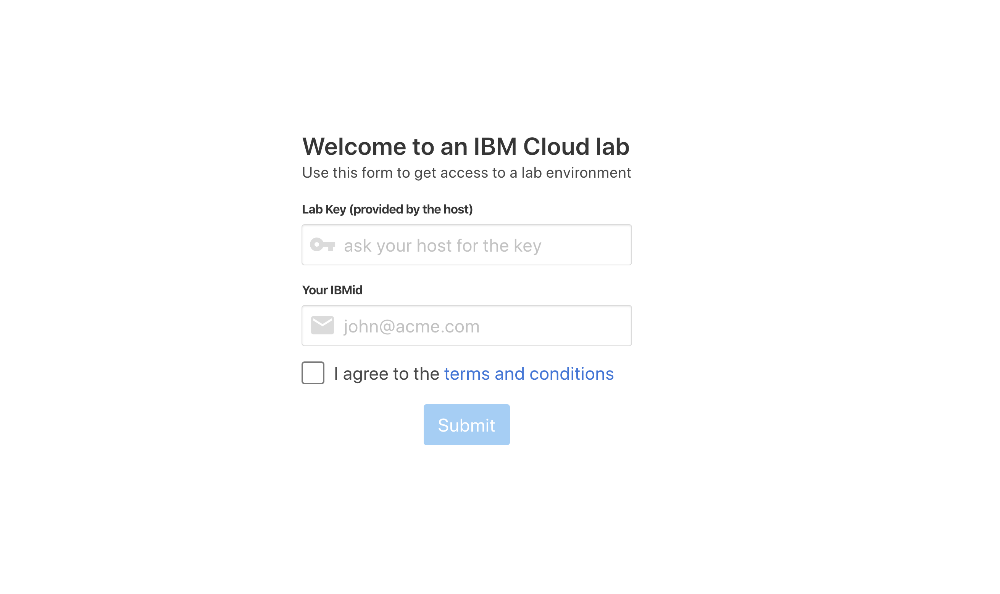
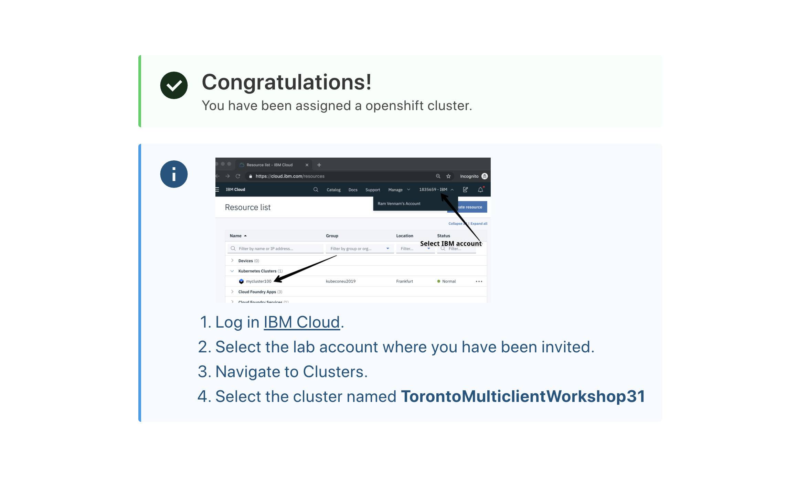
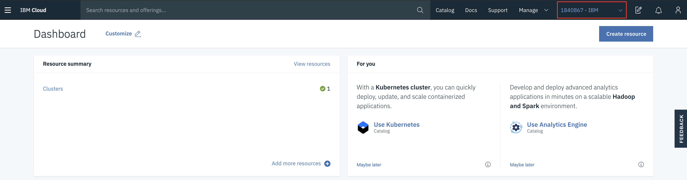
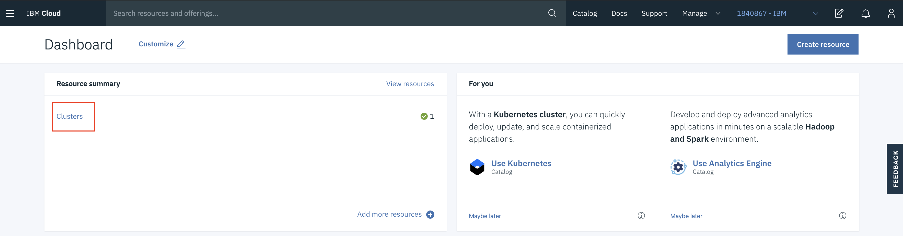
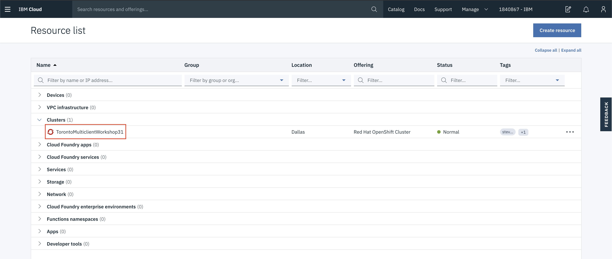

# Creating your IBM account and Accessing your OpenShift cluster

In this section, you will login to your own IBM Cloud account, and then get access to a IBM Cloud Lab account which contains pre-provisioned clusters. Each lab attendee will be granted access to one cluster.

## Setting up your IBM Cloud ID

* Log into IBM Cloud with an existing account: <https://cloud.ibm.com>

OR

* Create your own: <http://cloud.ibm.com/registration>

## Accessing the Cluster

Instructors will provide a URL to a web app. Enter your IBMid (the email you used to sign up) and the lab key (also provided by the instructor).

Follow the instructions on the next page. You will be added to the IBM Workshop account and granted access to a cluster. Note the name of your cluster. In the example below, it's `TorontoMulticlientWorkshop31`.

Back in IBM Cloud, refresh the [IBM Cloud Dashboard](https://cloud.ibm.com). If required, switch to the **1840867-IBM** account by clicking on the account selection drop down in the top nav bar.

Click on **Clusters** in the **Resource Summary** tile.

Under **Clusters**, click on the cluster that has been assigned to you.

Launch the **OpenShift web console** and have a look around! You can come back to this dashboard throughout your lab.

