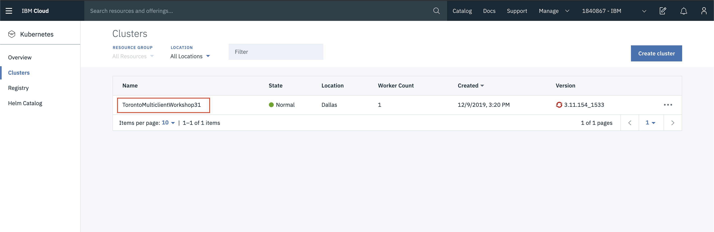

# Setup CLI Access for the cluster

This section documents how to set up CLI access to a cluster. If you do not already have access to a cluster, refer back to the **[Getting Started](GET_STARTED.md)** section.

## Install OpenShift CLI tools

The `oc` CLI will be the main mechanism to interact with your OpenShift cluster. We'll be downloading and installing the CLI, and adding it to your environment path.

> *NOTE*: Check for newer releases on the [OpenShift Origin Releases](https://github.com/openshift/origin/releases/) page.

Download the `oc` tarball.

```bash
wget https://github.com/openshift/origin/releases/download/v3.11.0/openshift-origin-client-tools-v3.11.0-0cbc58b-linux-64bit.tar.gz
```

Unpack the tarball

```bash
tar -xvzf openshift-origin-client-tools-v3.11.0-0cbc58b-linux-64bit.tar.gz
```

Rename it for ease of use

```bash
mv openshift-origin-client-tools-v3.11.0-0cbc58b-linux-64bit ${HOME}/oc-cli
```

Update `PATH`.

> *NOTE*: If you restart your cloud shell, you may need to re-run this command.

```bash
export PATH=${PATH}:${HOME}/oc-cli
```

Verify the utility is available by using `which` and the help command.

```bash
which oc
```

```bash
oc help
```

## Access the OpenShift Web Console

To launch the OpenShift web console, navigate to the [IBM Cloud Clusters Dashboard](https://cloud.ibm.com/kubernetes/clusters), find your cluster, and click on it.



Click on `OpenShift web console` on the top right to launch the web console.


Once in the OpenShift web console, click on the email/ID in the upper right. Choose the *Copy Login Command* option.


## Access your cluster using the `oc` CLI

In a new termimal, paste the login command you copied from the web console.

```bash
oc login https://c100-e.us-south.containers.cloud.ibm.com:30360 --token=NYVkVysxxxxxxxxxxxxxxxxxxxxRQa8tM
```

You should see a success message similar to the one below:

```bash
oc login https://c100-e.us-south.containers.cloud.ibm.com:30360 --token=NYVkVysxxxxxxxxxxxxxxxxxxxxRQa8tM

Logged into "https://c100-e.us-south.containers.cloud.ibm.com:30360" as "IAM#stevemar@ca.ibm.com" using the token provided.

You have access to the following projects and can switch between them with 'oc project <projectname>'
```

## Validate cluster access using `oc` commands

View nodes in the cluster.

```bash
oc get node
```

View services, deployments, and pods.

```bash
oc get svc,deploy,po --all-namespaces
```

View projects

```bash
oc get projects
```
